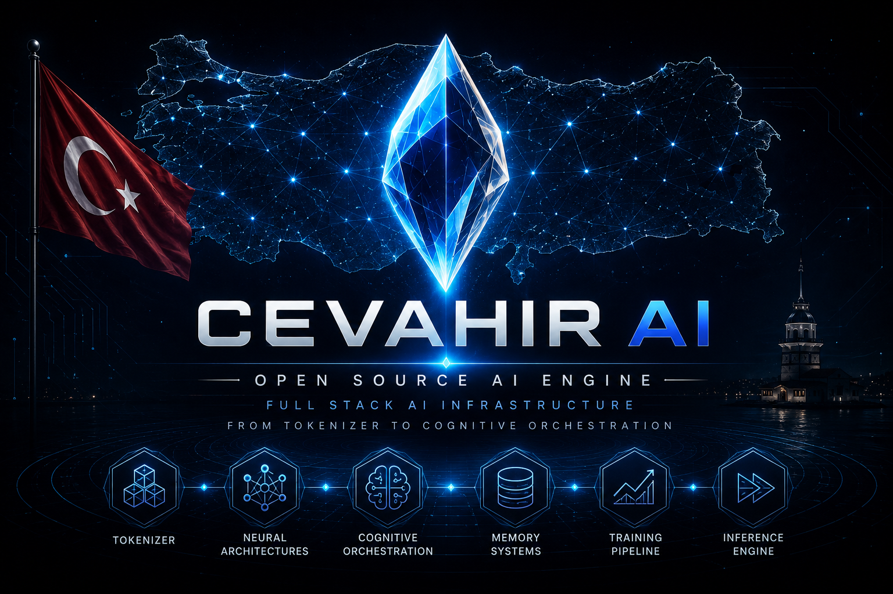
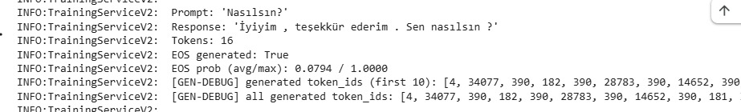
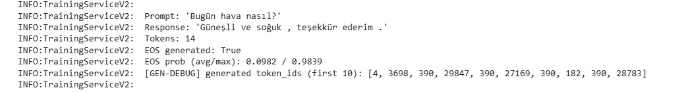
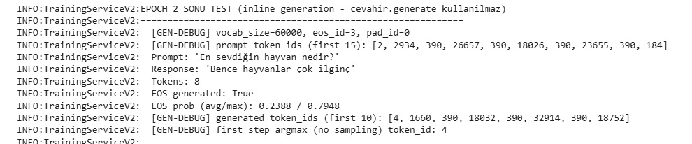
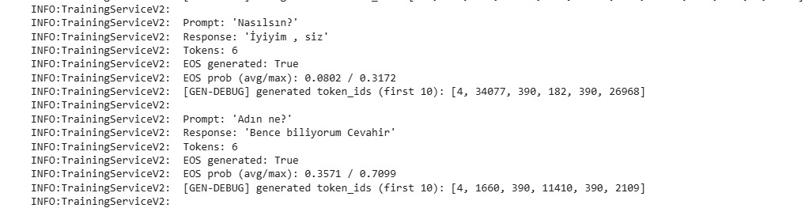
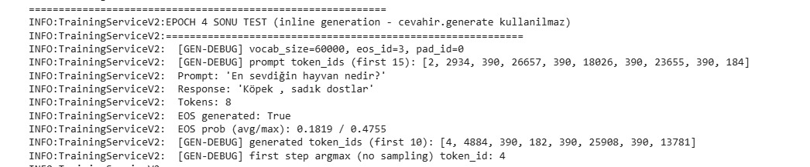
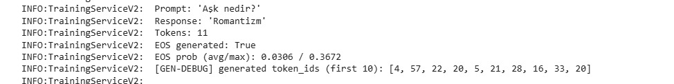

# Cevahir AI & Engine

**Diller:** [English](README.md) · Türkçe

Tek bir depo içinde, **sıfırdan** yazılmış **uçtan uca bir dil modeli (LLM)
motoru.** Cevahir, bir dil modeli inşa etmenin tüm yığınını kapsar: BPE
tokenizer eğitiminden başlayıp, PyTorch ile yazılmış decoder-only bir
Transformer'a, eğitim boru hattına, çıkarım motoruna ve bellek/araç/öz-eleştiri
içeren bilişsel akıl yürütme katmanına kadar. Her katman kaynağı görünür
biçimde, harici bir modelin sarmalayıcısı olarak değil, incelenebilir açık bir
bileşen olarak inşa edilmiştir.

Motor önce Türkçe için ayarlandı (tokenizer, Türkçe morfoloji ve heceleme
kurallarıyla gelir); ancak mimari **dil-agnostiktir**: sözlük, merges ve model
herhangi bir dil ve veri seti için yeniden eğitilebilir.

> **Mimari dokümantasyonu:** Sistemin koddan çıkarılmış, güvenilir ve güncel
> anlatımı [`docs/architecture/`](docs/architecture/) altındadır.
> [`master-architecture.md`](docs/architecture/master-architecture.md) ve
> [arama indeksi](docs/architecture/architecture-search-index.md) ile başlayın;
> birim-içi ayrıntılar
> [`docs/architecture/code-reality/`](docs/architecture/code-reality/) altındadır.

<p align="center">
  
</p>

---

## Teknik olarak ne?

Cevahir, **decoder-only (nedensel/causal) bir dil modeli motorudur.** Bir
fine-tuning betiği ya da barındırılan bir modelin istemcisi değildir — modelin
kendisi ve çevresindeki tüm makineyi doğrudan uygular:

- Türkçe-farkında bir ön-tokenizer, heceleyici ve morfolojik analizciye sahip
  **sıfırdan bir BPE tokenizer**; CPU ve opsiyonel GPU kod yolları.
- PyTorch (`torch.nn`) ile yazılmış bir **Transformer decoder**: RoPE/YaRN
  konumsal kodlama, çok-başlı nedensel dikkat (Flash / PyTorch-SDPA / manuel
  backend'ler), SwiGLU ileri-besleme, RMSNorm, opsiyonel Mixture-of-Experts
  katmanı, kayan-pencere tahliyeli KV cache, weight tying, nicemleme
  (quantization) ve aktivasyon checkpoint'leme.
- Tokenizer, model ve bilişsel katmanı tek bir API arkasında birleştiren; hem
  otoregresif hem beam-search çözümlemeli **birleşik çıkarım motoru**
  (`Cevahir`).
- **İki katmanlı eğitim yığını**: veri cache, split, model init yapan bir
  koşu/servis katmanı; döngü, gradyan/kayıp yönetimi, kararlılık koruması,
  müfredat (curriculum), EMA/SAM/Lookahead ve TensorBoard içeren bir
  eğitim-motoru katmanı.
- Tek bir `generate` çağrısını bir akıl yürütme boru hattına dönüştüren
  **bilişsel katman**: öznitelik çıkarımı, entropi tabanlı politika yönlendirme
  (direct / think / debate / tree-of-thoughts / self-consistency), vektör deposu
  üzerinden RAG bellek, anayasal + gerçek-doğrulamalı öz-eleştiri (self-refine)
  ve araç kullanımı.
- **Servis yüzeyi**: oturum/sohbet yöneticisi ve Flask REST API (JWT kimlik
  doğrulama, sürümlü route'lar); repository tabanlı kalıcılık katmanı.

Kod tabanındaki dahili model mimarisi `V-4` etiketini taşır; bu README onu
bir sürüm etiketiyle değil **gerçek bileşenleriyle** anlatır (kaynak birkaç
dahili sürüm etiketini karışık kullanmaktadır).

---

## Kanonik birimler

Sistem on kanonik birime ayrılır. Her biri doğrudan koddan çıkarılarak
[`docs/architecture/code-reality/`](docs/architecture/code-reality/) altında
derinlemesine belgelenmiştir.

| Birim | Kaynak | Sorumluluk |
|-------|--------|------------|
| **Tokenizer** | `tokenizer_management/` | BPE eğitim + encode/decode; Türkçe morfoloji/heceleme; OOV karakter fallback |
| **Neural Network** | `src/` | Decoder-only Transformer: embedding, RoPE/YaRN, dikkat, SwiGLU, RMSNorm, MoE, KV cache, nicemleme |
| **Model / Engine** | `model/`, `model_management/` | `Cevahir` facade + model yaşam döngüsü (build/init/save/load/update), çözümleme, sağlık, profil |
| **Training Management** | `training_management/` | Eğitim motoru: döngü, gradyan/kayıp/batch, güvenlik dedektörleri, müfredat, optimizer'lar, izleme |
| **Training System** | `training_system/` | Koşu/servis katmanı: veri cache, kaynak-farkında split, model init, epoch QA |
| **Data** | `data_loader_management/`, `data_processing/` | Eğitim-zamanı veri yükleme (akıllı bölme) + offline toplama (Wikipedia/altyazı) |
| **Cognitive** | `cognitive_management/` | Akıl yürütme boru hattı, politika yönlendirme, deliberation, RAG bellek, critic, araçlar, AIOps izleme |
| **Chatting** | `chatting_management/` | Oturum/konuşma/kullanıcı yönetimi, bağlam inşası |
| **API** | `api/` | Flask REST yüzeyi (v3 route'lar, servisler, JWT, middleware) |
| **Database** | `database/` | Repository + Unit-of-Work kalıcılık, tipli modeller |

---

## Mimari

Katmanlı görünüm (bağımlılık yönü yukarıdan aşağıya). Tam anlatım ve akışlar için
[`master-architecture.md`](docs/architecture/master-architecture.md).

```
        ┌──────────────────────────────────────────────┐
        │  Servis: api/ (Flask, JWT)  ·  chatting_mgmt   │
        └───────────────────────┬──────────────────────┘
                                ▼
        ┌──────────────────────────────────────────────┐
        │  Bilişsel: cognitive_management/ (v2)          │
        │  politika · deliberation · RAG · critic        │
        └───────────────────────┬──────────────────────┘
                                ▼
        ┌──────────────────────────────────────────────┐
        │  Motor (facade): model/cevahir.py :: Cevahir   │
        │  CevahirModelAPI adaptörü (model ↔ bilişsel)   │
        └──────────────┬──────────────────┬─────────────┘
                       ▼                  ▼
        ┌──────────────────────┐ ┌────────────────────────┐
        │ Model yaşam döngüsü   │ │ Sinir ağı (src/)       │
        │ model_management/     │ │ CevahirNeuralNetwork   │
        └──────────────┬────────┘ └────────────────────────┘
                       ▼
        ┌──────────────────────────────────────────────┐
        │  Eğitim: training_system/ + training_mgmt/     │
        └───────────────────────┬──────────────────────┘
                                ▼
        ┌──────────────────────┐ ┌────────────────────────┐
        │ Tokenizer             │ │ Data + Database        │
        │ tokenizer_management/ │ │ yükleyiciler · repo'lar │
        └──────────────────────┘ └────────────────────────┘
```

**Kompozisyon:** `Cevahir.__init__` (`model/cevahir.py`) çıkarımın composition
root'udur — tokenizer'ı, modeli (`ModelManager` ile), bir adaptörü
(`CevahirModelAPI`) ve bilişsel yöneticiyi kurup birbirine bağlar. Eğitim bu
facade'dan **geçmez**; kendi giriş noktası (`training_system/train.py`) vardır ve
`ModelManager`'ı paylaşır.

---

## Bileşen ayrıntısı

### Tokenizer (`tokenizer_management/`)
`TokenizerCore`, `BPEManager`'ı sarar; `BPEManager` bir `Pretokenizer` (Unicode
normalizasyonu, Türkçe İ/ı işleme, noktalama/boşluk bölme), opsiyonel bir
`Syllabifier` ve `Morphology` analizciyi, ve BPE
`Encoder`/`Decoder`/`Trainer`'ı orkestre eder. Sözlükte olmayan token'lar
karakter-seviye id'lere, en son `[UNK]`'a düşer. CPU yollarının yanında GPU
batch yolları vardır.

### Sinir ağı (`src/`)
`CevahirNeuralNetwork` şunları montajlar: `LanguageEmbedding` (√d ölçekleme ve
opsiyonel weight tying) → `PositionalEncoding` (sinüzoidal / öğrenilen / RoPE /
YaRN) → N × decoder bloğu (pre-norm: RMSNorm → nedensel çok-başlı dikkat →
residual → RMSNorm → SwiGLU FFN **veya** MoE → residual) → final RMSNorm → çıkış
projeksiyonu. Dikkat, çalışma zamanında Flash, PyTorch-SDPA veya manuel backend
seçer. Kayan-pencere `KVCache` otoregresif çözümlemeyi hızlandırır. Blok sınıfı
tarihsel nedenlerle `TransformerEncoderLayer` adını taşır ama **nedensel bir
decoder** bloğudur.

### Motor (`model/`, `model_management/`)
`Cevahir`, `encode/decode`, `forward`, `generate` (otoregresif ve beam search),
`process` (bilişsel), batch varyantları ve bellek/araç API'lerini sunar.
`ModelManager` model yaşam döngüsüne sahiptir; `CevahirModelAPI` modeli bilişsel
katmanın `ModelAPI` protokolüne uyarlar; böylece bilişsel katman somut ağa
bağımlı olmaz.

### Eğitim (`training_system/`, `training_management/`)
`TrainingService` (servis katmanı) cihazı, veriyi (cache'ten),
kaynak-id-farkında train/val split'i ve model başlatmayı hazırlar; ardından
`TrainingManager`'a (motor katmanı) devreder. Motor, gradyan/kayıp yönetimi,
NaN/loss-spike/divergence koruması, müfredat, optimizer stratejileri (SAM,
Lookahead, EMA) ve TensorBoard izlemesiyle epoch döngüsünü yürütür.

### Bilişsel (`cognitive_management/`)
`CognitiveManager` (facade) → `CognitiveOrchestrator` → 8 aşamalı bir
Chain-of-Responsibility boru hattı: `FeatureExtraction → PolicyRouting →
Deliberation → ContextBuilding → Generation → SelfConsistency → Critic →
MemoryUpdate`. Politika yönlendirme, entropi/uzunluktan bir akıl yürütme modu
seçer; deliberation CoT/debate/ToT/react çalıştırır; bellek, RAM oturumu ile
epizodik bir ChromaDB vektör deposunu birleştirir; critic anayasal ilkeleri ve
opsiyonel gerçek-doğrulamayı öz-revizyonla uygular. Boru hattını middleware, bir
event bus, bir DI container ve AIOps izleme çevreler.

### Servis (`chatting_management/`, `api/`, `database/`)
`ChattingManager`, `Cevahir.process` üzerinden oturum, konuşma ve bağlam
inşasını yönetir. Flask API (`api/app_factory.py` composition root'tur) v3
chat/session/user/health route'larını JWT kimlik doğrulama ve middleware
arkasında sunar. `database/` tipli modellerle Repository + Unit-of-Work
kalıcılığı sağlar.

---

## Kurulum

Depoyu klonlayıp kendi Python ortamınızda çalıştırın. Proje PyTorch ile Python'ı
hedefler (CUDA opsiyonel ama eğitim için önerilir). Bağımlılıklar depo kökünde
sabitlenmemiştir; PyTorch'u ve kullandığınız modüllerin import ettiği
kütüphaneleri kurun (ör. bilişsel bellek katmanı için ChromaDB ve
sentence-transformers, API için Flask, docx veri yükleme için `python-docx`).
Kurulum ayrıntıları platform ve CUDA/PyTorch sürümlerinize göre değişir.

---

## Hızlı başlangıç (çıkarım)

```python
from model.cevahir import Cevahir, CevahirConfig

# 1. Mimariyi tanımlayın (eğitilmiş checkpoint ile eşleşmeli)
config = CevahirConfig(
    device="cuda",  # veya "cpu"
    model={
        "vocab_size": 60000,   # eğitilmiş tokenizer'dan gelir
        "embed_dim": 512,
        "num_layers": 8,
        "num_heads": 8,
    },
)

# 2. Motoru kurun (varsa saved_models/cevahir_model.pth yüklenir)
cevahir = Cevahir(config)

# 3. Bilişsel yanıt — CognitiveOutput döndürür
output = cevahir.process("Merhaba, nasılsın?")
print(output.text)          # DİKKAT: alan adı `text`

# 4. Düz metin üretimi (bilişsel katmanı atlar)
text = cevahir.generate("Türkiye'nin başkenti", max_new_tokens=50, temperature=0.8)
print(text)
```

### Terminal sohbet

```bash
python model_management/chat_pipeline.py
```

`Cevahir` + `ChattingManager` boru hattını kullanır; checkpoint veya kayıtlı
model gerekir.

---

## Sıfırdan eğitim

Adımları **sırayla** çalıştırın. (Komutlar gerçek dosya konumlarını yansıtır.)

**1 — Tokenizer eğit** → sözlük ve merges üretir:
```bash
python tokenizer_management/train_bpe.py
```
Çıktı: `vocab.json`, `merges.txt` (veya config'te tanımlı yollar).

**2 — Eğitim verisi cache'i oluştur** → ham veriyi autoregressive eğitim
formatına çevirir (BOS/EOS/PAD/SEP + input/target dizileri, sabit token
uzunluğunda chunk'lar + padding):
```bash
python training_system/prepare_cache.py
```
Desteklenen girdiler: `docx`, `txt` (ham metin), `json` (soru–cevap). Chunk
uzunluğu veya padding davranışını değiştirmek için
`training_system/prepare_cache.py` düzenleyin.

**3 — Modeli eğit** (hazır cache ile):
```bash
python training_system/train.py
```
Cache otomatik yüklenir. GPU önerilir.

### Model parametrelerini değiştirme

Model boyutu ve hiperparametreleri (`embed_dim`, `num_layers`, `num_heads`,
`lr`, `dropout`, …) şu an **iki yerde** tutarlı tutulmalıdır:

- `model/cevahir.py` — `CevahirConfig` / model default'ları (çıkarım + pipeline).
- `training_system/train.py` — eğitim config'i ve model parametreleri.

Farklılaşırlarsa eğitilmiş checkpoint yüklendiğinde shape/davranış uyuşmazlığı
oluşur. (Bunu tek bir doğruluk kaynağında birleştirmek
[geliştirme yol haritasında](docs/architecture/development-roadmap.md) izlenen
bir maddedir.)

---

## Eğitim sırasında örnek çıktılar

Eğitim / epoch-sonu testlerinde alınan çıkarım örnekleri (prompt, üretilen yanıt,
token sayısı ve EOS bilgisi eğitim logunda görülür):

<p align="center"></p>
<p align="center"></p>
<p align="center"></p>
<p align="center"></p>
<p align="center"></p>
<p align="center"></p>

---

## Eğitim verisi

Referans modelin eğitiminde kullanılan veri seti ~680 bin örnek içerir
(docx, txt, soru–cevap json); `training_system/prepare_cache.py` ile eğitim
formatına dönüştürülebilir.

- **[Eğitim verisi (Google Drive)](https://drive.google.com/drive/folders/19G5uGS5YM3rf42OefjM3KsXRyn0ZEshW?usp=sharing)**

---

## Depo yapısı

```
cevahir-ai/
├── model/                 # Birleşik çıkarım motoru (cevahir.py)
├── model_management/      # Model yaşam döngüsü (build, save/load, forward, health)
├── src/                   # Sinir ağı (CevahirNeuralNetwork + modüller)
├── tokenizer_management/  # BPE tokenizer (core, bpe, tokenization)
├── training_system/       # Eğitim koşu/servis katmanı (train.py, cache, v2/v3)
├── training_management/   # Eğitim motoru (döngü, güvenlik, müfredat, v2/v3)
├── cognitive_management/  # Bilişsel katman (boru hattı, bellek, critic, araçlar)
├── chatting_management/   # Oturum, konuşma, bağlam
├── api/                   # Flask REST API (v3 route'lar, servisler, auth)
├── database/              # Kalıcılık (repository'ler, modeller, unit of work)
├── data_loader_management/# Eğitim-zamanı veri yükleme
├── data_processing/       # Offline veri toplama (Wikipedia, altyazı)
├── scripts/ · tests/      # Yardımcılar ve üst-seviye testler
└── docs/architecture/     # Koddan çıkarılmış mimari dokümantasyonu
```

---

## Dokümantasyon

- **Sistem mimarisi:** [`docs/architecture/master-architecture.md`](docs/architecture/master-architecture.md)
- **Gezinme / kavram indeksi:** [`docs/architecture/architecture-search-index.md`](docs/architecture/architecture-search-index.md)
- **Birim-içi (kod gerçekliği):** [`docs/architecture/code-reality/`](docs/architecture/code-reality/)
- **Geliştirme yol haritası:** [`docs/architecture/development-roadmap.md`](docs/architecture/development-roadmap.md)

`docs/_archive/` klasörü, kod tabanını artık yansıtmayan ve referans olarak
kullanılmaması gereken eski dokümantasyonu içerir.

---

## Durum

Açık kaynak, aktif geliştirme altında. Mimari şu anda belgelenmekte ve yapılandırılmış
bir refactor/geliştirme turuna hazırlanmaktadır; bkz.
[geliştirme yol haritası](docs/architecture/development-roadmap.md).

## Lisans

Apache License 2.0 — bkz. [`LICENSE`](LICENSE). Katkılar fork, feature branch ve
pull request ile memnuniyetle karşılanır.

## Geliştirici

Muhammed Yasin Yılmaz — [@myylogic](https://github.com/myylogic)
