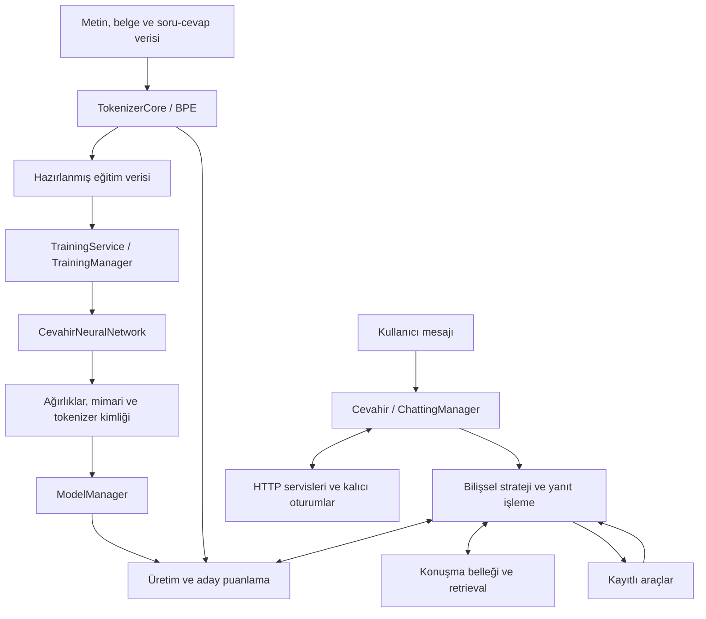

# 🇹🇷 Cevahir AI & Engine

[English](README.md) · [Türkçe](README-TR.md)

[Araştırma arşivi DOI: 10.5281/zenodo.22874751](https://doi.org/10.5281/zenodo.22874751) · [Araştırma yayınları](docs/publications/README.md)

**Türkçeye özel geliştirilmiş tokenizer altyapısı, eğitilebilir dil modeli çekirdeği ve bilişsel sistemleri birleştiren yapay zekâ motoru.**

Ben Muhammed Yasin Yılmaz. Cevahir'i, verinin hazırlanmasından modelin öğrenmesine ve konuşma içinde kullanılmasına kadar bütün sürecini geliştirebildiğim bir yapay zekâ altyapısı olarak kurdum. Kendi BPE hattını, yapılandırılabilir PyTorch Transformer decoder çekirdeğini, eğitim ve checkpoint yönetimini, metin üretimini, bilişsel iş akışlarını, konuşma belleğini ve uygulama servislerini aynı kod tabanında bir araya getirdim.

Bu projeyle özellikle Türkiye'deki gençlerin bir dil modelinin iç işleyişini inceleyebilmesini, kendi verileriyle eğitim yapabilmesini ve kendi fikirlerini çalışan mekanizmalara dönüştürebilmesini istiyorum. Cevahir'i geliştiriyor, modeller eğitiyor ve elde ettiğim çıktıları burada paylaşıyorum. Kaynak kodunu, deneylerimi ve öğrendiklerimi aynı yerde erişilebilir tutmak benim için bu çalışmanın önemli bir parçası.

**Cevahir, Türk Gençlerine Armağanımdır. — Muhammed Yasin Yılmaz**

Cevahir'i bundan sonra **açık kaynak bir araştırma ve eğitim mirası** olarak sürdürüyorum; ürünleşme artık projenin hedefi değil. Mühendislik çalışmalarıyla sistemin çalıştığı süre boyunca öğrenmesine yönelik araştırma birlikte devam ediyor.

## Yapay zeka motorunu kitap olarak okuyun

**[Cevahir AI — Bir Yapay Zeka Motorunun Anatomisi: İçindekiler](docs/book/README.md)**

Modüler kitap, yapay zekanın temellerini gerçek Cevahir koduna bağlar: tokenizer, sinir ağı, Transformer, eğitim, checkpoint, üretim, bellek, bilişsel iş akışları, araçlar ve açık araştırma. Her bölümde çağıran bileşen, girdi/çıktı, yapılandırma ve kanıt zinciri izlenir. [English reading guide](docs/book/README-en.md) · [Kaynak haritası](docs/book/KAYNAK_HARITASI.md) · [Kodla kitabı birlikte güncel tutmak](docs/book/BAKIM.md).

[Araştırma laboratuvarı](docs/book/tr/11-arastirma-laboratuvari.md), başarılı ve olumsuz deneyleri birlikte korur. **[Araştırma yayın dizisi](docs/publications/README.md)**, Muhammed Yasin Yılmaz imzalı dokuz araştırma raporunu özetleri, yöntemleri, kanıtları ve sınırlarıyla sunar. [Son sorgu-durumu deneyi](docs/research/living_learning_query_state_2026_09_21/REPORT_TR.md), gelecekteki sorgu ve düzeltmeler için gereken bilgiyi ayırır. Bu sınırlı sonuçlar genel yaşarken öğrenme probleminin çözümü değildir. [Sürüm ve DOI kaydı](docs/publications/release.json).

<p align="center">
  
</p>

## Cevahir'de neyi bir araya getiriyorum?

Cevahir'de en çok önemsediğim şey, **dil modelinin temsilini, öğrenmesini ve kullanımını aynı geliştirilebilir sistemde birleştirmek.** Bir metnin nasıl tokenlara ayrıldığını, modelin bu tokenlardan nasıl öğrendiğini, nasıl cevap ürettiğini ve geçmişi ya da araç sonuçlarını nasıl kullandığını birlikte inceleyebilmek istiyorum. Bu nedenle akışın her katmanını kaynak kodunda izlenebilir ve değiştirilebilir biçimde geliştiriyorum.

**Dil temsili üzerinde çalışma alanı.** Türkçeye özel geliştirilmiş BPE altyapısı; normalizasyonu, sözlüğü, birleşim kurallarını, isteğe bağlı heceleme ve morfoloji bileşenlerini veri hazırlama ile buluşturur. Böylece dilin nasıl temsil edildiği üzerine yapılan çalışma, model eğitimine aynı token kimlikleriyle taşınabilir.

**Mimari tercihleri eğitilebilir modele dönüştüren altyapı.** Attention başlık düzeni, konum kodlaması, normalizasyon, residual yapısı ve yoğun/uzman tabanlı FFN seçenekleri model kurulumuna bağlanır. Eğitim servisi bu modeli veriyle buluşturur; eğitim yöneticisi kaybı, gradyanları ve optimizasyonu yürütür. Checkpoint ve tokenizer kimliği, geliştirilen modeli daha sonra aynı anlamla kullanmanın temelini oluşturur.

**Öğrenilen modeli kullanan bilişsel katman.** Cevahir, modelin üretim ve aday puanlama yeteneklerini strateji seçimi, çoklu aday üretimi, araç kullanımı, bellekten bilgi getirme ve critic revizyonuyla birleştirir. Bu düzen, ağırlıkları yeniden eğitmeden modelin yanıt oluşturma sürecini araştırmaya ve geliştirmeye alan açar.

**İncelenebilir bir sistemden konuşma uygulamasına geçiş.** Model profilleme, gradyan/ağırlık sağlık kontrolleri ve bilişsel izler sistemin iç davranışını görünür kılar. Birleşik `Cevahir` arayüzü, konuşma yöneticisi ve uygulama servisleri aynı motoru kullanıcı ve oturum geçmişi taşıyan uygulamalara bağlar.

Bu altyapı üzerinde Türkçe dil modelleme çalışmalarımı sürdürüyor, farklı model ve bilişsel sistem fikirlerini araştırıyorum. Parçaların birlikte nasıl çalıştığını [sistem bütünlüğü rehberinde](docs/architecture/SYSTEM_OVERVIEW.md), uygulama sözleşmelerini [mimari belgede](docs/architecture/CEVAHIR_ARCHITECTURE_SPEC.md) anlattım.

## Sistem mimarisi



Ana model yolu `Cevahir → ModelManager → CevahirNeuralNetwork` şeklindedir. Eğitim başlatıcısı, kullanılabildiğinde V3 eğitim servisini seçer; `training_backend="v2"` ile etkin **V2 TrainingManager** üzerinden eğitim yapar. V2 servis yolu da korunur. Eski yorumlardaki V4, V7 ve V8 adları geliştirme geçmişini anlatır. Güncel model, yetenekleri ayarlar üzerinden seçilen yapılandırılabilir bir çekirdektir.

### Sinir ağı çekirdeği

[Decoder](src/neural_network.py); embedding, üst üste Transformer katmanları, çıkış normalizasyonu ve sözlük projeksiyonunu birleştirir. Yapılandırılabilir bileşenleri şunlardır:

- **MHA, MQA ve GQA:** Sorgu başlıkları ile key/value başlıklarının sayısı ayrı belirlenebilir.
- **Konum ve dikkat:** RoPE, linear/YaRN ölçekleme seçenekleri, nedensel dikkat, kayan pencere maskeleri, QK normalizasyonu ve dikkat/çıkış logitleri için soft-cap.
- **İleri beslemeli katmanlar:** SwiGLU/GELU ile yoğun FFN veya top-k Mixture of Experts; router yardımcı kaybı eğitim hedefine katılır.
- **Katman yapısı:** RMSNorm/LayerNorm, pre/post normalizasyon, paralel residual, ağırlık paylaşımı ve stochastic depth.
- **Bellek ve yürütme:** Artımlı KV önbelleği, sink token'larla sınırlı önbellek yönetimi, PyTorch SDPA, isteğe bağlı harici Flash Attention ve gradient checkpointing.

Normal ileri geçişte dikkat ağırlıklarını ayrıca üretmeden SDPA kullanılabilir. `return_attention_weights=True` inceleme için dikkat ağırlıklarını; `collect_diagnostics=True` ayrıntılı tensör istatistiklerini ister. Normal çağrı `(logits, attention_or_none)` döndürür; önbellekli çekirdek çağrısında üçüncü bir cache değeri bulunur. Harici Flash Attention ve uzun bağlam ayarları hedef donanıma bağlıdır ve kendi değerlendirmelerini gerektirir.

### Tokenizer, veri ve eğitim

[TokenizerCore](tokenizer_management/core/tokenizer_core.py), **Türkçeye özel geliştirilmiş tokenizer altyapısının** ortak girişidir. BPE eğitimi, sözlük/merges yönetimi, kodlama ve çözme aynı bileşenlerle yürütülür. Türkçe `I/İ` dönüşümleri, heceleme, kök/ek üzerine kural tabanlı morfoloji yardımcıları ve özel token yönetimi bu altyapının parçalarıdır. Heceleme ve morfoloji ayara bağlıdır; her çıkarım çağrısında zorunlu olarak uygulanmaz.

Bir tokenizer'ın Türkçe için geliştirilmesi, başka bir dilde kullanılması için mutlaka değiştirilmesini gerektirmez. Aynı sözlük ve birleşim kuralları, kapsadıkları metinler üzerinde farklı diller için kullanılabilir. Tokenizer metni temsil eder; dil modelinin o dilde öğrenmesi, eğitim verisi ve ağırlıklarıyla ilgilidir. Cevahir'deki mevcut karakter filtreleri ve kapsam denetimi [tokenizer rehberinde](docs/modules/tokenizer_management/README.md) açıklanır.

[Veri yükleyici](data_loader_management/data_loader_manager.py), belgeleri ve soru-cevap kayıtlarını kaynak bilgisiyle eğitim hattına taşır. [Veri toplama/dönüştürme araçları](data_processing) ile [altyazı işleme](dataset_subtitle/subtitle_processor.py), eğitimde kullanılabilecek metinlerin hazırlanmasına yardımcı olur; çıktıları seçilen veri dizini üzerinden yüklenir.

[Veri hazırlama](training_system/prepare_cache.py), desteklenen TXT, DOCX ve soru-cevap JSON verilerini okuyup token ID'lerinden girdi/hedef kayıtları üretir. Hazırlanan veri epoch'lar boyunca tekrar kullanılabilir. Önbellek kimliği kaynak içeriğini, sözlüğü, birleşim kurallarını ve kodlama ayarlarını kapsar; V3 tüketimi ayrıca önbellek bütünlüğünü kontrol eder.

Eğitim sistemi; kaynağa göre eğitim/doğrulama ayrımını, birebir tekrar kayıtlarının gruplanmasını, uzunluğa göre batch oluşturmayı, dinamik padding'i, gradyan biriktirmeyi, sayısal hassasiyet seçimini, optimizer/scheduler bağlantısını, doğrulamayı ve checkpoint rotasyonunu içerir. Etkin eğitim yöneticisi epoch sınırından devam etmek için optimizer, scheduler, scaler, rastgele sayı üreteci ve döngü durumunu kaydeder. MoE yardımcı kaybı optimizasyonda gerçekten kullanılır.

### Üretim, bilişsel sistem ve konuşmalar

[Birleşik arayüz](model/cevahir.py); kodlama, çözme, metin üretimi ve bilişsel işlem çağrıları sunar. Üretim; sıcaklıkla örnekleme, greedy çözümleme, top-k/top-p, tekrar kontrolü, EOS sınırları, beam search ve artımlı KV önbelleğini kapsar.

[Bilişsel sistem](cognitive_management); direct, think, debate ve Tree of Thoughts iş akışlarını; bağlam oluşturmayı, araç çalıştırmayı, critic aşamalarını, vektör bellek bağlantısını, yanıt önbelleğini ve izlemeyi sağlar. Bunlar eğitilmiş model, araçlar ve retrieval kurulumu üzerinden çalışan düzenleme bileşenleridir; yanıt kalitesi bu bileşenlerin birlikte kullanımına bağlıdır. Dahili calculator sınırlı aritmetik işlemleri yürütür; dış araçlar araç arayüzü üzerinden kaydedilebilir.

Stratejilerin gerçek çalışma biçimi, senkron/asenkron farklar ve açık geliştirme sınırları [bilişsel modül rehberinde](docs/modules/cognitive_management/README.md) açıklanır.

[ChattingManager](chatting_management) konuşma geçmişini ve bağlamı yönetir. Kapsamlandırılmış bilişsel akışta bellek kayıtları, notlar ve özetler kullanıcı/oturumla ilişkilendirilir. [API servisleri](api) ve [veritabanı repository'leri](database), motoru kimlik doğrulanmış oturumlara, saklanan konuşmalara ve kullanıcı verilerine bağlar.

## Yaptığım eğitimlerden çıktılar

**Aşağıdaki ekran görüntüleri, Cevahir ile yaptığım gerçek model eğitimlerinden ve eğitim sırasında gerçekleştirdiğim üretim kontrollerinden alınmıştır.** Kullandığım prompt'ları, modelin ürettiği yanıtları ve eğitim sırasında aldığım çıktıları burada paylaşıyorum. Bunlar Cevahir'i geliştirirken yürüttüğüm eğitim çalışmalarının bir parçası.

<p align="center">
  
  
  
  
  
  
</p>

Paylaştığım [eğitim verisi koleksiyonuna](https://drive.google.com/drive/folders/19G5uGS5YM3rf42OefjM3KsXRyn0ZEshW?usp=sharing) da ulaşabilirsiniz. Kendi çalışmanız için veri yolunu ve hazırlama ayarlarını belirleyin. Çıkarımda eğitilmiş checkpoint'i, o checkpoint'in eğitildiği sözlük, merges ve BPE ayarlarıyla birlikte kullanın.

## V4'ten sonraki gelişim

Çekirdeği V4'ten sonra da geliştirmeye devam ettim. Kaynak kodundaki sürüm notlarında aynı çekirdeğin üzerine eklenen şu yetenekleri görebilirsiniz:

| Kaynaktaki etiket | Güncel koddaki karşılığı |
|---|---|
| V4 | RMSNorm, SwiGLU, KV önbelleği, gelişmiş checkpointing, quantization ve MoE bağlantıları |
| V5 | GQA/MQA başlık düzeni, kayan pencere dikkati ve YaRN RoPE ölçeklemesi |
| V6 | PyTorch SDPA, QK-Norm, paralel residual, dikkat/çıkış logit soft-cap ve residual başlangıç ölçeklemesi |
| V7 | Stochastic depth, birleştirilmiş SwiGLU gate/up projeksiyonu ve sink token'lı KV yönetimi |
| V8 alt katman notları | KV kapasite sınırları ve MoE yardımcı kaybı gibi alt katman düzeltmeleri |

Bu etiketler ayrı ayrı kurulması gereken model paketleri değildir. Eğitim servisinin **V3**, etkin eğitim yöneticisinin **V2** ve bilişsel altyapının **V2** olması da modelin eski kaldığı anlamına gelmez; her biri farklı bileşenin gelişim hattıdır. `config_version=1` ve `architecture_version="cevahir-capabilities-1"` ise yapılandırma uyumluluğunu tanımlar. Ayrıntılı [çekirdek rehberi](docs/modules/neural_network/README.md) ve [mimari sözleşme](docs/architecture/CEVAHIR_ARCHITECTURE_SPEC.md) bu ayrımı açıklar.

## Sistemi incelemek ve geliştirmek

Modelin [profil araçları](model_management/profiler.py) parametre dağılımını, bellek kullanımını ve hesap maliyeti tahminlerini; [sağlık kontrolleri](model_management/health_monitor.py) gradyan, ağırlık ve dikkat istatistiklerini incelemek için kullanılır. Bilişsel katmanın trace ve metrik arayüzleri ise yanıtın hangi aşamalardan geçtiğini gösterir. Bu araçlar, mimari bir tercihin veya bilişsel adımın etkisini gözlemlemeyi sağlar.

Son altyapı çalışmalarımda bu parçaların birlikte çalışmasını güçlendirdim: ortak model yapılandırması, eğitim hedefine katılan MoE kaybı, artımlı dikkat önbelleği, tokenizer ile checkpoint kimliğinin korunması ve kullanıcı/oturum kapsamlı bellek. Teknik ayrıntıları [alt çekirdek sözleşmelerinde](docs/architecture/LOWER_CORE_CONTRACTS.md) ve [yaşam döngüsü belgesinde](docs/architecture/LIFECYCLE_CONSOLIDATION.md) bulabilirsiniz. Açık geliştirme işlerini [bir sonraki tur planında](docs/architecture/NEXT_DEVELOPMENT_ROADMAP.md) takip ediyorum.

### Güncel araştırma çalışmalarım

Ana soru, sistemin çalışırken yaşadığı deneyimlerle gelecekteki hesaplama ve davranış kapasitesini nasıl kalıcı, kontrollü ve genellenebilir biçimde değiştirebileceği. [Kitabın araştırma laboratuvarı](docs/book/tr/11-arastirma-laboratuvari.md), sonraki kural edinimi, temsil büyümesi, interference, durum taşıma, öğrenilmiş güncelleme ve yinelemeli durum araştırmalarını bir araya getiriyor. [Yeni düzeltme durumu deneyi](docs/research/living_learning_correction_2026_09_20/REPORT_TR.md), önceki deneyimleri düzelterek öğrenmeye devam edebilmek için neyin korunması gerektiğini inceliyor. Genel problem hâlâ açık; yeniden sınama ve hesap yönlendirmesi onun alt problemleri.

Cevahir'in bir isteğe ne kadar hesap ayırdığını, dışarıdan doğrulanmış geri bildirimleri nasıl kullandığını ve bilişsel bağlamın sinir ağına nasıl taşındığını deneyebilmek için isteğe bağlı bir araştırma altyapısı ekledim:

- **Ortak istek bütçesi:** Üretim, aday puanlama ve entropi çağrıları aynı sınırları paylaşır; ana yanıt için kaynak ayrılır. Token muhasebesi, ayrılan üst sınırları izler; gerçek token veya FLOP ölçümü değildir.
- **Geri bildirime dayalı strateji tercihi:** Kayıtları kullanıcı/oturum, model ve tokenizer kimliğine göre ayırıyorum. Yeterli dış doğrulama varsa strateji tercihi değişebilir; değerlendirmeler düzeltilebilir, kayıtlar silinebilir ve deneyim ayrı bir dosyada saklanabilir.
- **MoE için açık bağlam girdisi:** Uzman yönlendirmesine sınırlandırılmış bir öncelik tensörü ekledim. Mevcut bağlantı yapılandırılmış alan profillerini kullanır; deneyimden uzman anlamı veya önceliği öğrenmeyi henüz uygulamadım.

Bu araştırma davranışları varsayılan olarak kapalıdır (`research.mode="off"`); MoE önceliği ayrıca etkinleştirilir. Küçük CPU testleri ve sentetik tablo karşılaştırmalarıyla uygulamanın davranışını kontrol ettim. Gerçek görevlerde kalite, hesap tasarrufu ve aktarım kazancını henüz ölçmedim. Mekanizmaları ve deney düzenini [araştırma kaydında](docs/research/EXPERIENCE_CONDITIONED_COMPUTE.md) paylaşıyorum.

Mevcut mimarinin dışına çıkan yetenek sorularını da araştırıyorum. Son keşifte, sistemin kullandığı temsili karşı örneklerle değiştirmesi fikrini inceledim. Küçük karşılaştırmada tanıklarla filtrelenen arama, aynı adayları tamamen inceleyen aramayla aynı temsilleri ve tahminleri buldu. Bazı durumlarda daha az hesap yaptı; bu biçimiyle daha az gözlemle öğrenme iddiasını eledim. [Keşif gerekçelerini](docs/research/FRONTIER_DISCOVERY_2026_09_20.md) ve [tekrar çalıştırılabilir deneyin sonucunu](docs/research/REPRESENTATION_WITNESS_AUDIT.md) birlikte yayımlıyorum.

## Başlangıç

Komutları repo kökünde çalıştırın. Hafif doğrulamaların kayıtlı ortamı **Windows, Python 3.14.3 ve PyTorch 2.10.0+cpu**'dur. Repoda şu anda kök düzeyinde `requirements.txt` veya `pyproject.toml` yoktur; [database/requirements.txt](database/requirements.txt) yalnız veritabanı modülünü kapsar.

Aşağıdaki küçük çekirdek örneği için ortam oluşturup temel bağımlılıkları kurabilirsiniz. PowerShell:

```powershell
python -m venv .venv
.\.venv\Scripts\Activate.ps1
python -m pip install torch numpy
```

Linux/macOS'ta etkinleştirme komutu `source .venv/bin/activate` şeklindedir. Ek bağımlılıklar kullanılan alt sisteme bağlıdır: tokenizer/belge yollarında `tqdm`, `regex`, `python-docx`; eğitim izlemesinde `psutil`, `matplotlib`, `tensorboard`; HTTP servislerinde Flask, Flask-Cors, Flask-Limiter, SQLAlchemy ve PyJWT gibi paketler kullanılır. Bu gruplar yönlendirme içindir; tüm sürümleri sabitlenmiş eksiksiz bir kurulum manifesti değildir.

### CPU'da küçük bir model çalıştırma

Bu örnek küçük bir model kurar ve tek ileri geçiş yapar. Sentetik token ID'leri kullanır; veri seti veya checkpoint gerektirmez. Çekirdeği incelemek için hafif bir başlangıçtır.

```python
import torch
from model_management.config_schema import tiny_model_config
from model_management.model_manager import ModelManager

torch.set_num_threads(1)
torch.manual_seed(42)
manager = ModelManager(tiny_model_config())
manager.initialize(
    build_optimizer=False, build_criterion=False, build_scheduler=False
)
logits, attention = manager.forward(
    torch.tensor([[1, 5, 8, 2]]), inference=True
)
print(logits.shape)  # torch.Size([1, 4, 128])
print(torch.isfinite(logits).all().item())  # True
```

### Eğitilmiş modelinizi yükleme

Eğitimde kullanılan tokenizer dosyalarını ve BPE ayarlarını kullanın. Yeni checkpoint'ler model kurulum bilgisini taşır; bu nedenle modeli henüz kurmamış bir `ModelManager`, kayıtlı ayarlardan modeli oluşturabilir:

```python
from tokenizer_management.core.tokenizer_core import TokenizerCore
from model_management.model_manager import ModelManager

tokenizer = TokenizerCore({
    "vocab_path": "data/vocab_lib/vocab.json",
    "merges_path": "data/merges_lib/merges.txt",
    "use_gpu": False,
    # Eğitimde özel BPE ayarları kullanıldıysa bpe_config'i burada verin.
})
manager = ModelManager({"device": "cpu"}, tokenizer=tokenizer)
manager.load("saved_models/checkpoints/last.pth", weights_only=True)
manager.eval_mode()
```

Checkpoint yolunu kendi dosyanızla değiştirin. Kurulum bilgisi içermeyen ham/eski ağırlık dosyaları için eşleşen model ayarlarını açıkça vermek gerekir. Tokenizer kimliği olmayan eski kayıtlar, tokenizer verildiğinde uyarı üretir; token anlamları otomatik olarak doğrulanamaz.

Tam arayüzde ayarlar `CevahirConfig(model={...}, tokenizer={...}, load_model_path=...)` üzerinden verilir. `Cevahir` modeli yüklemeden önce kurduğu için mimari ayarlarının checkpoint ile eşleşmesi gerekir. `load_model_path=None` varsayılan yolda otomatik aramayı etkinleştirir; `load_model_path=""` açıkça yeni bir model başlatır. Seçilmiş checkpoint yoksa veya uyumsuzsa hata verilir. Terminal sohbet girişi [chat_pipeline.py](model_management/chat_pipeline.py) dosyasıdır; onun ayarları da eğitilmiş modelle eşleşmelidir.

## Kendi verinizle eğitim

1. **Tokenizer'ı seçin.** Mevcut model için onun sözlük/merges dosyalarını kullanın. Yeni tokenizer oluşturuyorsanız [tokenizer yapılandırmasında](tokenizer_management/config.py) yolları ve eğitim seçeneklerini belirleyip çalıştırın:

   ```powershell
   python tokenizer_management/train_bpe.py education
   ```

   Tokenizer'ı yeniden eğitmek token ID'lerini değiştirebilir; mevcut model ağırlıkları ve hazırlanmış önbellekler kendi tokenizer'larıyla birlikte kalmalıdır.

2. **Önbelleği hazırlayın.** Tokenizer seçenekleri ve `max_seq_length` eğitim yapılandırmanızla eşleşsin:

   ```powershell
   python training_system/prepare_cache.py --data-dir education --no-clear-cache
   ```

   `--no-clear-cache` mevcut önbellek dosyalarını korur; aksi hâlde script eski önbellekleri temizler. Dizi uzunluğu ve kodlama seçenekleri için `--help` kullanın. V3 eğitim, uyumlu hazırlanmış önbellek gerektirir.

3. **Eğitimi yapılandırıp başlatın.** [training_system/train.py](training_system/train.py) içindeki `TRAIN_CONFIG` üzerinden yolları, model boyutlarını, optimizer'ı, batch boyutunu, epoch sayısını ve cihazı belirleyin:

   ```powershell
   python training_system/train.py
   ```

   Repodaki hazır ayarlar 100 epoch, 64 batch boyutu ve sekiz katmanlı, 512 boyutlu model içeren kapsamlı bir eğitim koşusuna yöneliktir. Başlatmadan önce donanımınıza göre ayarlayın. Hafif başlangıç için yukarıdaki CPU örneğini kullanın.

Mimari ayarları [config_schema.py](model_management/config_schema.py) tarafından normalleştirilir. Sisteme verdiğiniz yapılandırmayı değiştirin; `model/cevahir.py` içindeki varsayılan sınıf tanımlarını düzenlemek gerekmez. Önbellek hazırlama ve eğitimin giriş ayarları hâlâ ayrı yerlerdedir; bunların birbiriyle eşleşmesi gerekir.

## Uygulama bağlantısı

Birleşik Flask giriş noktası [api.app_factory.create_app](api/app_factory.py) işlevidir. Modeli, ChattingManager'ı, servisleri, kimlik doğrulamayı, sağlık kontrollerini ve veritabanı erişimini bağlar. Uygulamayı başlatmadan önce veritabanını, açık bir `JWT_SECRET_KEY` değerini, model yolunu ve eşleşen tokenizer'ı yapılandırın. Model ayarları factory yapılandırmasındaki `CEVAHIR_MODEL_CONFIG` üzerinden verilebilir. Eski `api/app.py` kaldırılmış bir yapılandırma import'u taşır; önerilen giriş noktası değildir.

## Repo haritası

| Dizin | Sorumluluk |
|---|---|
| [src/](src) | Sinir ağı decoder'ı, dikkat, FFN/MoE, normalizasyon ve KV önbelleği |
| [tokenizer_management/](tokenizer_management) | BPE eğitimi, kodlama/çözme, sözlük ve birleşim yönetimi |
| [data_loader_management/](data_loader_management) | Belge ve soru-cevap okuma, parçalama ve kaynak kimliği |
| [data_processing/](data_processing), [dataset_subtitle/](dataset_subtitle) | Veri toplama, belge dönüştürme ve altyazılardan metin hazırlama araçları |
| [training_system/](training_system) | Veri hazırlama, önbellek, batching ve eğitim servisi |
| [training_management/](training_management) | Eğitim döngüsü, optimizasyon, izleme ve checkpoint'ler |
| [model_management/](model_management) | Ayarlar, kurulum, yükleme, kayıt, profilleme ve çıkarım |
| [model/](model) | Birleşik Cevahir arayüzü ve üretim adaptörü |
| [cognitive_management/](cognitive_management) | Stratejiler, araçlar, critic, kapsamlandırılmış bellek ve middleware |
| [chatting_management/](chatting_management) | Oturumlar, konuşma geçmişi ve bağlam |
| [api/](api), [database/](database) | HTTP servisleri, kimlik doğrulama ve kalıcı saklama |
| [research/](research) | Ana çalışma akışından bağımsız, küçük araştırma ve yanlışlama deneyleri |
| [benchmarks/](benchmarks), [tests/](tests), [scripts/](scripts) | Ölçümler, davranış doğrulaması ve ayrı teşhis araçları |
| [docs/](docs) | Mimari, modül rehberleri ve geliştirme geçmişi |

## Doğrulama ve geliştirme durumu

Yaptığım model eğitimlerinden örnekleri yukarıda paylaştım. Güncel mühendislik kontrollerinde ayrıca küçük CPU modelleriyle önbellekli/tam dizi sonuçlarını, gradyanları, kayıt/yükleme davranışını, tokenizer kimliğini ve durum izolasyonunu karşılaştırıyorum. Bu kontrollerin sentetik kayıp veya süre ölçümleri, eğittiğim modelin dil kalitesini ölçmez.

Küçük bir yaşam döngüsü doğrulama grubu ve ayrı çekirdek ölçümü için:

```powershell
python -m pip install pytest
python -m pytest tests/evolution/test_lower_layer_contracts.py tests/evolution/test_checkpoint_lifecycle.py -q
python benchmarks/core.py --label local --output benchmarks/results/core_local.json
```

Bağımlılıkları ve daha geniş doğrulama yollarını [benchmark rehberinde](benchmarks/README.md) bulabilirsiniz. Paylaştığım sonuçlar hedefli kontrol gruplarına aittir; tarihsel test paketinin tamamı için geçer sonucu vermiyorum. Kayıpsız Unicode tokenizasyonu, tüm eğitim kayıtlarının hizalama kontrolü, yakın tekrar verilerin ayrılması, eşzamanlı model değiştirme/üretim ve retrieval/critic/ToT kalite değerlendirmesi üzerinde açık işlerim var. GPU çalışmasını, dağıtık eğitimi, uzun bağlam kalitesini ve gerçek derleme performansını ayrıca doğrulamak gerekiyor; yardımcı modüllerin bulunması etkin eğitim yoluna bağlandıkları anlamına gelmez.

## Dokümantasyon, katkı ve iletişim

- [Modüllerin birlikte sunduğu sistem](docs/architecture/SYSTEM_OVERVIEW.md)
- [Mimari ve desteklenen davranışlar](docs/architecture/CEVAHIR_ARCHITECTURE_SPEC.md)
- [Sonraki büyük geliştirme turu: bulgular ve çalışma sırası](docs/architecture/NEXT_DEVELOPMENT_ROADMAP.md)
- [Alt çekirdek sözleşmeleri](docs/architecture/LOWER_CORE_CONTRACTS.md)
- [Checkpoint, veri ve çalışma yaşam döngüsü](docs/architecture/LIFECYCLE_CONSOLIDATION.md)
- [Geliştirme günlüğü](docs/development/EVOLUTION_LOG.md)
- [Modül dokümantasyonu](docs/modules)
- [Deneyimle koşullanan hesaplama araştırması](docs/research/EXPERIENCE_CONDITIONED_COMPUTE.md)
- [Bağımsız yetenek keşfi](docs/research/FRONTIER_DISCOVERY_2026_09_20.md)
- [Temsil değişimi hipotezinin ilk yanlışlama deneyi](docs/research/REPRESENTATION_WITNESS_AUDIT.md)

Çekirdek, veri ve tokenizer hattı, model yaşam döngüsü, uygulama bağlantıları veya değerlendirmeler üzerinde birlikte çalışmak isteyenlerin katkılarını bekliyorum. Bir değişiklik önerirken etkilenen akışı, elde edilen davranışı ve nasıl doğruladığınızı paylaşmanız incelememi kolaylaştırır.

Projeyi [Apache License 2.0](LICENSE) ile paylaşıyorum.

**Bana ulaşın:** [GitHub](https://github.com/myylogic) · [X](https://x.com/myylogic) · [Instagram](https://instagram.com/myylogic)

<p align="center">
  
</p>

*Bu belgeyi 20 Eylül 2026 tarihinde güncel kaynak koduyla eşleştirdim.*
