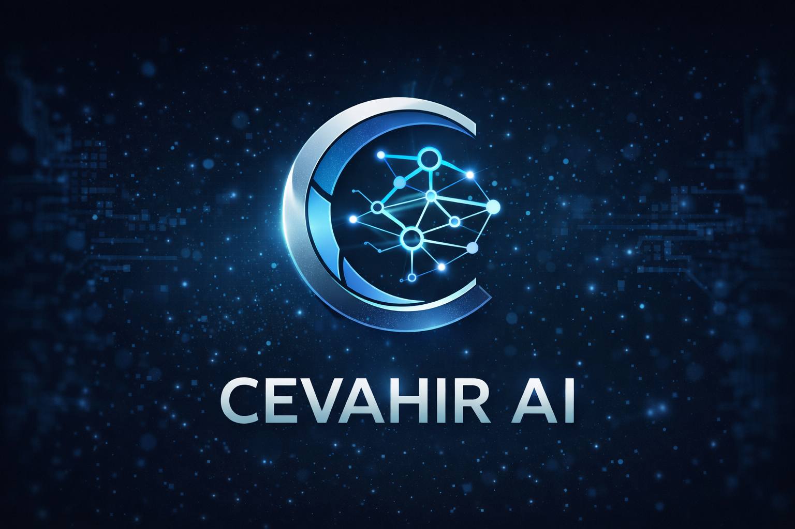
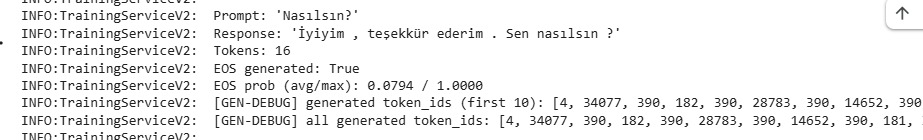
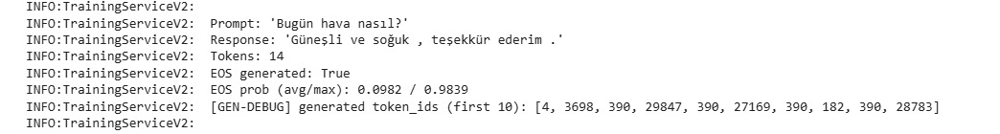
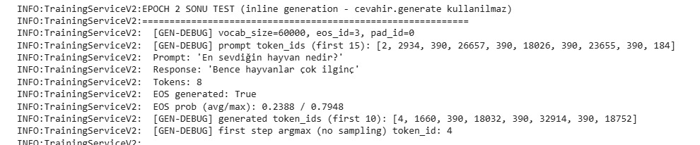
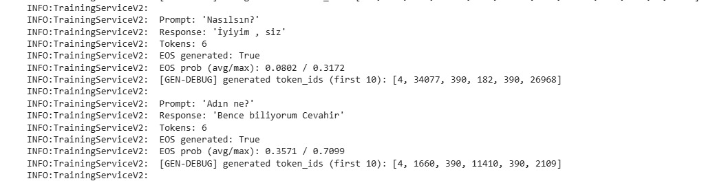
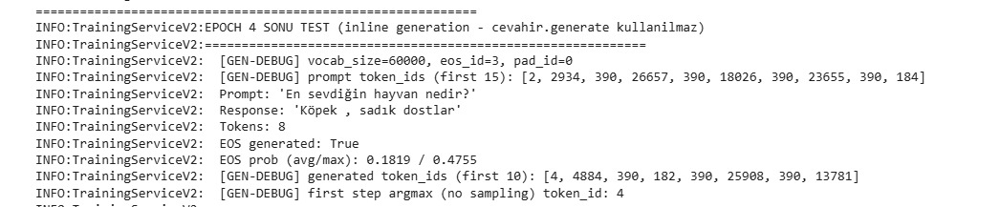
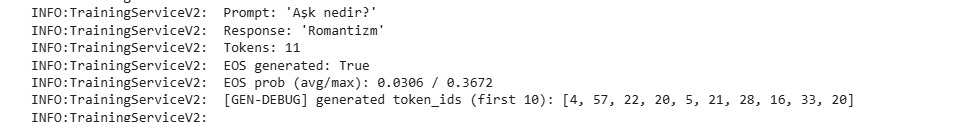

# 🇹🇷 Cevahir AI & Engine

**Full-stack open-source AI engine.**

An **end-to-end** language model infrastructure spanning from tokenizer training to the cognitive reasoning layer — all within a single repository. Born as a Turkish LLM project, its language-agnostic architecture allows you to train models in any language you choose.

*"A freedom manifesto shaped by the vision of Turkish youth, challenging global tech giants with limited resources. This is not just a model — it is a complete factory designed for you to build your own AI world."*

**A Gift to Turkish Youth.** · Open Source · Full-Stack AI Engine · End-to-End

*Cevahir AI & Engine is a full-stack open-source AI engine that provides an end-to-end infrastructure for building and deploying language models — from tokenizer training to cognitive reasoning layers.*

<p align="center">
  
</p>

---

## Vision & Manifesto

Cevahir advocates for the democratization of knowledge in an era dominated by massive GPU farms and closed-box algorithms.

- **Limited Resources, Unlimited Innovation:** Proof that world-class results can be achieved not with big budgets, but with optimized, intelligent architecture.
- **A Gift to Turkish Youth:** A reference architecture for a generation that shapes technology rather than merely consuming it.
- **Complete AI Infrastructure:** One of the **rare** open-source projects that provides a full AI infrastructure — from tokenizer training to the cognitive layer — in a single repository; every cell is open source.

Cevahir **is not limited to Turkish.** While the engine was first optimized for Turkish, it offers a **language-agnostic** infrastructure; you can train your own models in any language and with any dataset.

---

## Features

- **Turkish BPE Tokenizer** — End-to-end training, vocab/merges, encode-decode pipeline (Unicode, İ/ı rules, syllabification, morphology support)
- **Transformer Decoder** — RoPE, RMSNorm, SwiGLU, causal mask, weight tying, KV cache, Flash Attention infrastructure
- **Model Management** — Build, training components, save/load, forward/predict, TensorBoard
- **Cognitive Management** — Strategy (direct/think/debate/tot), memory (RAG, vector DB), critic, tool use, middleware, monitoring
- **Chat Pipeline** — ChattingManager, session/history, chat assistant flow via Cevahir unified API

---

## Cevahir Engine: Not Just a Model — An Ecosystem

**Cevahir AI & Engine** is a **full-stack open-source AI engine** that provides **end-to-end** infrastructure for building language models. Many open-source projects offer only a *training framework* (tokenizer → model → training → inference). Cevahir additionally includes a **chat system**, **cognitive management** (strategy layers: think / debate / ToT), a **unified engine API**, **tool use**, and **RAG memory** — all within a single repository; this structure places the project in the *AI engine / full-stack AI* category.

Using this infrastructure — the heart of Cevahir — you can train your own custom AI models **in any language** and with any dataset.

### 1. Turkish-Focused Hybrid Tokenizer (BPE)

Cevahir Engine approaches the Turkish language with a native perspective, while the same infrastructure offers a **language-agnostic** architecture:

- **Byte Pair Encoding (BPE):** A custom encoding process that recognizes Turkish agglutinative morphology, Unicode characters (İ/ı, Ş/ş, etc.), and morphological features. Vocab/merges can be retrained for other languages as well.
- **Language-Agnostic Architecture:** Although the infrastructure is optimized for Turkish, the engine has the capacity to produce high-performance models in **any language worldwide**; the project is not limited to Turkish.
- **GPU-Accelerated Batch Tokenization:** The ability to process millions of lines of data in seconds.

### 2. Flexible Model Architecture (Transformer V-4)

- **Modular Design:** Define your own neural network configuration (number of layers, heads, dimensions) in seconds using modern components such as RoPE, RMSNorm, SwiGLU, and Flash Attention.
- **Unlimited Model Production:** Train your own vertical specialty models (Law, Medicine, Software, etc.) from scratch, or continue from existing weights.

### 3. Cognitive Management

Enables the model not only to generate text but to **think**:

- **Strategy Layers:** Solve complex problems with Direct, Think, Debate, and Tree of Thoughts (ToT) strategies.
- **Dynamic Memory:** The infrastructure for RAG and Vector DB integration — allowing the model to converse with up-to-date data — is ready out of the box.

---

## Architecture

```
┌─────────────────────────────────────────────────────────┐
│                    Cevahir (Unified API)                 │
│                     model/cevahir.py                     │
└─────────────────────────────────────────────────────────┘
                        │
        ┌───────────────┼───────────────┐
        │               │               │
        ▼               ▼               ▼
┌──────────────┐ ┌──────────────┐ ┌──────────────┐
│ TokenizerCore│ │ ModelManager  │ │CognitiveMgr  │
│ (Turkish BPE)│ │ (V-4 NN)     │ │ (Cognitive)  │
└──────────────┘ └──────────────┘ └──────────────┘
        │               │               │
        ▼               ▼               ▼
  vocab/merges    Neural Network   Memory/Tools
                  (RoPE, RMSNorm,  (RAG, Critic,
                   SwiGLU, …)       Tools)
```

- **Cevahir** — encode/decode, generate, process (cognitive), generate_batch, process_batch
- **TokenizerCore** — BPE (Turkish-focused, language-agnostic), GPU batch, OOV syllable fallback
- **ModelManager** — Model lifecycle, checkpoint, TensorBoard
- **CognitiveManager** — handle(), strategy selection, memory, critic, register_tool(), get_metrics()

---

## Installation

The project must be cloned from GitHub and run in your own environment. Dependencies (`requirements.txt` etc.) may include approximately **200 libraries**; it is recommended that you have knowledge of Python, pip/venv, and if necessary CUDA/PyTorch for setup and environment configuration. Detailed steps may vary depending on the project structure and the versions you use; responsibility for setup rests with the developer.

---

## Quick Start (Train Your Own Model)

```python
from model.cevahir import Cevahir, CevahirConfig

# 1. Define your own architecture
config = CevahirConfig(
    device="cuda",  # or "cpu"
    model={
        "vocab_size": 60000,  # Optimized with Turkish BPE; can be retrained for other languages
        "embed_dim": 512,     # Define your own capacity
        "num_layers": 8,
        "num_heads": 8,
    }
)

# 2. Start the engine
cevahir = Cevahir(config)

# 3. Chat (with cognitive layer)
output = cevahir.process("Hello, how are you?")
print(output.response)

# 4. Text generation
text = cevahir.generate("The capital of Turkey is", max_new_tokens=50, temperature=0.8)
print(text)

# For training with your own data: see the training_system/ guide.
```

---

## Terminal Testing

Chat and generation tests with a trained model can be done via **terminal** using `chat_pipeline.py`:

```bash
python model_management/chat_pipeline.py
```

*(This script uses the Cevahir + ChattingManager pipeline; a checkpoint or saved model is required.)*

---

## Sample Outputs During Training — Example Generation During Training

These are inference samples obtained with **TrainingServiceV2** during training or epoch-end tests: the prompt given to the model, the generated response, token count, and EOS information are visible in the log. You can add screenshots of this kind below.

### Sample output images

<p align="center">
  
</p>
<p align="center">
  
</p>
<p align="center">
  
</p>
<p align="center">
  
</p>
<p align="center">
  
</p>
<p align="center">
  
</p>

---

## Training

### Training Data

The dataset used for model training contains **approximately 680,000 examples**. If you want to use the training data in your own environment, you can download it from the link below:

- **[Training data (Google Drive)](https://drive.google.com/drive/folders/19G5uGS5YM3rf42OefjM3KsXRyn0ZEshW?usp=sharing)** — ~680k examples (docx, txt, question–answer json, etc.); can be converted to a compatible format via `prepare_cache.py`.

### Pre-trained Model (Download)

If you want to try inference or chat without training from scratch, you can download the ready-made trained model weights:

### From-Scratch Training Flow

The steps for training from scratch must be followed **in order**:

1. **Tokenizer training** — Generates vocab and merges files:
   ```bash
   python tokenizer_management/train_bpe.py
   ```
   Output: `vocab.json`, `merges.txt` (or paths defined in config).

2. **Training data cache** — Converts raw data into autoregressive training format:
   ```bash
   python tokenizer_management/prepare_cache.py
   ```
   Supported data: **docx**, **txt** (raw text), **json** (question–answer). Output: A fully prepared cache file in autoregressive format with BOS, EOS, PAD, SEP and input/target sequences. Data is split into chunks of approximately **512 tokens**; longer segments are split again, shorter ones are filled with **padding**. To change chunk length or padding behavior, see `tokenizer_management/prepare_cache.py`.

3. **Model training** — Training with the prepared cache:
   ```bash
   python training_system/train.py
   ```
   The cached data is loaded automatically; training proceeds on this format.

A GPU is recommended for training.

### Changing Model Parameters

If you want to change the model size and training hyperparameters (embed_dim, num_layers, num_heads, lr, dropout, etc.), updates must be made in **two places**:

- **`model/cevahir.py`** — CevahirConfig / model default values (for compatibility with inference and pipeline).
- **`training_system/train.py`** — `TRAIN_CONFIG` and model parameters (values used during training).

Both must be consistent with each other; otherwise, a shape or behavior mismatch will occur when the trained checkpoint is loaded.

---

## Project Structure & Modularity

Cevahir Engine is built on **SOLID** principles with **12 main framework modules** and **653+** module files (.py):

- **tokenizer_management/** — Train your own BPE tokenizer from scratch (Turkish or any other language).
- **training_system/** — Start model training with your own dataset.
- **cognitive_management/** — Give the model decision-making capability.
- **src/** — Interact with the V-4 Neural Network core.
- **model/** — Unified API (cevahir.py).
- **model_management/** — Model lifecycle (build, save/load, forward).
- **chatting_management/** — Chat (ChattingManager, session, context).
- **docs/** — Documentation, error debugging processes.

```
cevahir_sinir_sistemi/
├── model/                 # Unified API (cevahir.py)
├── cognitive_management/  # Cognitive layer (strategy, memory, critic, tools)
├── model_management/      # Model lifecycle (build, save/load, forward)
├── training_system/       # Training pipeline (train.py, v2, v3)
├── tokenizer_management/  # BPE (Turkish-focused, language-agnostic)
├── src/                   # Neural network (CevahirNeuralNetwork, V-4)
├── chatting_management/   # Chat (ChattingManager, session, context)
└── docs/                  # Documentation
```

Framework modules: model, cognitive_management, model_management, training_system, tokenizer_management, src, chatting_management, data_loader_management, training_management, openai-data-mining, api, data_processing.

---

## Why Open Source?

AI is the technology of the future; yet resources are often in the hands of large corporations or reduced to only a training framework. As a **full-stack** and **end-to-end** AI engine, Cevahir AI & Engine allows you to:

- **Examine** a complete language model engine (tokenizer → model → cognitive) end-to-end and train your own models **in any language**; the project is not limited to Turkish.
- Tokenizer training, Transformer architecture, model training, chat, and cognitive strategies are all present **transparently in a single project**.
- The project was designed as an **educational resource** and **reference architecture** for Turkish youth (and all developers) to understand and advance artificial intelligence.

---

## Documentation

- **Architecture:** `docs/` — system architecture, layers, data flow
- **API Reference:** `docs/` — Usage of Cevahir, ModelManager, CognitiveManager, TokenizerCore
- **Module Documentation:** Docstrings and README files under `model/`, `cognitive_management/`, `model_management/`, `training_system/`, `tokenizer_management/`, `src/`
- **Training Guide:** `training_system/train.py`, `tokenizer_management/train_bpe.py`, `prepare_cache.py` — examine these files for parameters and flow
- **Inference / Chat:** `model_management/chat_pipeline.py`, `model/cevahir.py` — usage examples and config

Only this README and source code are in the project root; additional texts (introductions, process summaries, etc.) are not kept separately in the repository.

---

## License & Contributing

The project is licensed under **Apache License 2.0**; it is fully open-source and accessible to everyone. See the `LICENSE` file in the repo root for details. Contributions are welcome from developers **anywhere in the world**.

Contributions are warmly welcomed. You can follow the fork, feature branch, commit, and Pull Request steps.

---

## Contact

- **GitHub:** [@myylogic](https://github.com/myylogic)
- **X (Twitter):** [@myylogic](https://x.com/myylogic)
- **Instagram:** [@myylogic](https://instagram.com/myylogic)
- **Project:** Cevahir AI — A Gift to Turkish Youth.

---

**Developer:** Muhammed Yasin Yılmaz ([@myylogic](https://github.com/myylogic)) · **Status:** Open Source / Active Development · **Date:** 09.03.2026

<p align="center">
  
</p>

<p align="center">
Cevahir AI & Engine – Creator · Turkish AI Researcher
</p>
