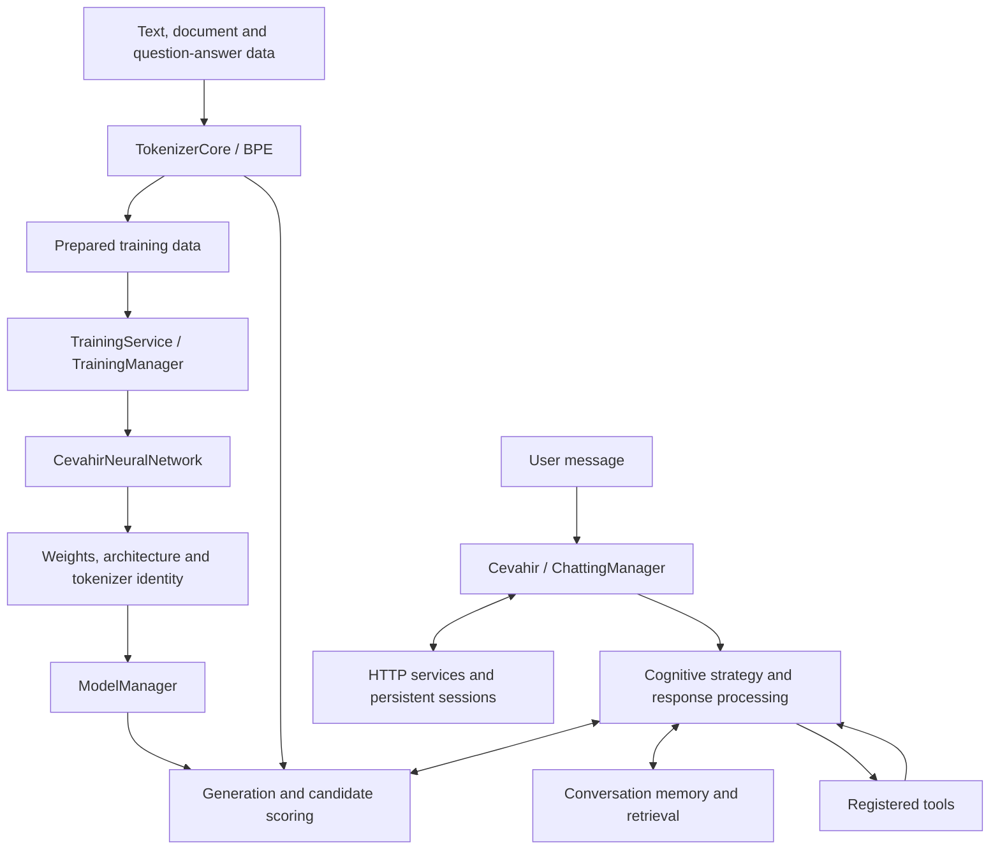

# 🇹🇷 Cevahir AI & Engine

[English](README.md) · [Türkçe](README-TR.md)

**An AI engine combining tokenizer infrastructure developed specifically for Turkish, a trainable language-model core and cognitive systems.**

I'm Muhammed Yasin Yılmaz. I built Cevahir to bring data preparation, model learning and the use of a trained model in conversation into one codebase. It includes its own BPE pipeline, a configurable PyTorch Transformer decoder, training and checkpoint management, generation, cognitive workflows, conversational memory, and application services.

I want developers, especially young people in Türkiye, to have a foundation they can inspect, train on their own data and extend with new capabilities. I share the implemented modules, my completed model training runs and their outputs as this work develops.

**My gift to Turkish youth. — Muhammed Yasin Yılmaz**

I am continuing Cevahir as an **open-source research and educational legacy**, with productization no longer its goal. The engineering work and research on learning throughout a system's operating life continue together.

## Read the engine as a book

**[Cevahir AI — Anatomy of an AI Engine: table of contents](docs/book/README.md)**

The modular Turkish book connects AI fundamentals to the real Cevahir implementation: tokenization, neural computation, Transformer blocks, training, checkpoints, generation, memory, cognition, tools and open research. Each chapter follows actual callers, inputs, outputs, configuration gates and evidence. [English reading guide](docs/book/README-en.md) · [Source map](docs/book/KAYNAK_HARITASI.md) · [Keeping code and documentation aligned](docs/book/BAKIM.md).

The [research laboratory](docs/book/tr/11-arastirma-laboratuvari.md) preserves successful and negative experiments. The [latest correction-state study](docs/research/living_learning_correction_2026_09_20/REPORT_TR.md) distinguishes current prediction from the ability to revise past experience. These bounded results do not solve the general living-learning problem.

<p align="center">
  
</p>

## What I'm building with Cevahir

With Cevahir, I want to bring **language representation, model learning and model use into one extensible system.** I want to understand and develop the whole path: how text becomes tokens, how a model learns from them, and how its responses use conversation history and tool results. I keep these stages open to inspection and modification in the source code.

**A place to develop language representations.** The BPE infrastructure developed specifically for Turkish connects normalization, vocabulary, merge rules, optional syllabification and morphology components to data preparation. Work on how language is represented can then reach model training through the same token identities.

**Infrastructure that turns architectural choices into trainable models.** Attention head layouts, positional encoding, normalization, residual structure and dense/expert FFN options feed into model construction. The training service connects that model to data; the training manager handles loss, gradients and optimization. Checkpoints and tokenizer identity provide the basis for using the resulting model with the same meaning later.

**A cognitive layer that uses the learned model.** Cevahir connects generation and candidate scoring to strategy selection, multiple candidate generation, tool use, memory retrieval and critic revision. This creates room to study and improve response construction without retraining the weights.

**A path from inspectable internals to conversational applications.** Model profiling, gradient/weight health checks and cognitive traces expose internal behavior. The unified `Cevahir` interface, conversation manager and application services connect the same engine to applications with users, sessions and history.

I use this foundation to develop Turkish language modeling and explore model and cognitive-system ideas. I've described how the parts work together in the [system overview](docs/architecture/SYSTEM_OVERVIEW.md) and their implementation behavior in the [architecture contract](docs/architecture/CEVAHIR_ARCHITECTURE_SPEC.md).

## System architecture


```mermaid
flowchart TD
    Sources[Text, document and question-answer data] --> Tokens[TokenizerCore / BPE]
    Tokens --> Cache[Prepared training data]
    Cache --> Training[TrainingService / TrainingManager]
    Training --> Core[CevahirNeuralNetwork]
    Core --> Checkpoint[Weights, architecture and tokenizer identity]
    Checkpoint --> Manager[ModelManager]
    Manager --> Generation[Generation and candidate scoring]
    Tokens --> Generation
    User[User message] --> Chat[Cevahir / ChattingManager]
    Chat --> Cognitive[Cognitive strategy and response processing]
    Cognitive <--> Generation
    Cognitive <--> Memory[Conversation memory and retrieval]
    Cognitive --> Tools[Registered tools]
    Tools --> Cognitive
    Chat <--> Services[HTTP services and persistent sessions]
```

The main model path is `Cevahir → ModelManager → CevahirNeuralNetwork`. The training launcher selects the V3 training service when available, using the active **V2 TrainingManager** with `training_backend="v2"`; it retains a V2 service fallback. Names such as V4, V7 and V8 in older comments describe development history. The current model is a configurable core whose capabilities are selected through configuration.

### Neural network core

[The decoder](src/neural_network.py) combines embeddings, stacked Transformer layers, output normalization and vocabulary projection. Its configurable components include:

- **MHA, MQA and GQA:** the number of query and key/value heads can be configured separately.
- **Position and attention:** RoPE, linear/YaRN scaling options, causal attention, sliding-window masks, QK normalization and attention/output logit soft-caps.
- **Feed-forward layers:** dense FFN or top-k Mixture of Experts, with SwiGLU/GELU and router auxiliary loss in the training objective.
- **Layer structure:** RMSNorm/LayerNorm, pre/post normalization, parallel residuals, weight tying and stochastic depth.
- **Memory and execution:** incremental KV caching, bounded cache eviction with sink tokens, PyTorch SDPA, optional external Flash Attention, and gradient checkpointing.

Normal forward calls can use SDPA without materializing attention weights. `return_attention_weights=True` requests the diagnostic weights; `collect_diagnostics=True` requests detailed tensor statistics. Standard calls return `(logits, attention_or_none)`; cached core calls include a third cache value. External Flash Attention and long-context configurations depend on the target hardware and need their own evaluation.

### Tokenizer, data and training

[TokenizerCore](tokenizer_management/core/tokenizer_core.py) is the shared entry point to **tokenizer infrastructure developed specifically for Turkish**. BPE training, vocabulary/merge management, encoding and decoding use the same components. Turkish `I/İ` handling, syllabification, rule-based stem/suffix helpers and special-token management are part of this infrastructure. Syllabification and morphology are configurable; they do not run unconditionally on every inference call.

A tokenizer developed for Turkish does not necessarily need to be replaced to work with another language. The same vocabulary and merge rules can serve different languages within their text coverage. The tokenizer represents text; the model learns language through training data and weights. Cevahir's current character filters and coverage checks are described in the [tokenizer guide](docs/modules/tokenizer_management/README-en.md).

[The data loader](data_loader_management/data_loader_manager.py) carries documents and question-answer records into training with source information. [Collection/conversion tools](data_processing) and [subtitle processing](dataset_subtitle/subtitle_processor.py) help prepare text; their outputs enter through the selected data directory.

[Training preparation](training_system/prepare_cache.py) reads supported TXT, DOCX and question-answer JSON data and builds tokenized input/target records. Prepared data can be reused across epochs. Cache identities include source content, the vocabulary, merge rules and encoding settings; V3 consumption also checks cache integrity.

The training system includes source-aware train/validation splitting, grouping of exact duplicate records, length-based batching, dynamic padding, gradient accumulation, precision selection, optimizer/scheduler integration, validation and checkpoint rotation. The active training manager records optimizer, scheduler, scaler, RNG and loop state for resuming at epoch boundaries. MoE auxiliary loss participates in optimization rather than being returned as unused metadata.

### Generation, cognition and conversations

[The unified interface](model/cevahir.py) exposes encoding, decoding, generation and cognitive processing. Generation includes temperature sampling, greedy decoding, top-k/top-p controls, repetition handling, EOS limits, beam search and incremental KV caching.

[The cognitive system](cognitive_management) provides direct, think, debate and Tree of Thoughts workflows; context assembly, tool execution, critic stages, vector-memory integration, response caching and tracing. These are orchestration components whose response quality depends on the trained model, tools and retrieval setup. The built-in calculator executes restricted arithmetic; external tools can be registered through the tool interface.

The [cognitive module guide](docs/modules/cognitive_management/README-en.md) explains strategy execution, synchronous/asynchronous differences and open development boundaries.

[ChattingManager](chatting_management) manages conversation history and context. Memory entries, notes and summaries are scoped to users/sessions in the scoped cognitive flow. [API services](api) and [database repositories](database) connect the engine to authenticated sessions, stored conversations and user data.

## Outputs from my training runs

**The following screenshots come from my actual model-training runs and generation checks during training.** They include prompts, generated responses and training-time output. I keep them here as a record of the training I have carried out with Cevahir.

<p align="center">
  
  
  
  
  
  
</p>

I've also shared a [training-data collection](https://drive.google.com/drive/folders/19G5uGS5YM3rf42OefjM3KsXRyn0ZEshW?usp=sharing). Configure the data path and preparation settings for your own run. For inference, use a trained checkpoint together with the vocabulary, merges and BPE settings used for that checkpoint.

## Development beyond V4

I continued developing the core beyond V4. Version notes in the source record these successive additions:

| Source label | Implementation present in the current code |
|---|---|
| V4 | RMSNorm, SwiGLU, KV caching, advanced checkpointing, quantization and MoE integration |
| V5 | GQA/MQA head layouts, sliding-window attention and YaRN RoPE scaling |
| V6 | PyTorch SDPA, QK-Norm, parallel residuals, attention/output logit soft-caps and scaled residual initialization |
| V7 | Stochastic depth, merged SwiGLU gate/up projection and KV management with sink tokens |
| V8 lower-layer notes | Fixes to boundaries such as KV capacity and MoE auxiliary-loss accounting |

These labels do not identify separately installed model packages. The **V3** training service, active **V2** training manager and **V2** cognitive infrastructure each have their own development history. `config_version=1` and `architecture_version="cevahir-capabilities-1"` identify configuration compatibility. See the [neural core guide](docs/modules/neural_network/README-en.md) and [architecture contract](docs/architecture/CEVAHIR_ARCHITECTURE_SPEC.md) for the distinction.

## Inspecting and developing the system

[Model profiling](model_management/profiler.py) exposes parameter distribution, memory usage and computational-cost estimates; [health checks](model_management/health_monitor.py) inspect gradients, weights and attention statistics. Cognitive trace and metrics interfaces expose the stages a response passes through. These tools help examine the effect of an architectural choice or cognitive processing step.

My recent infrastructure work has strengthened the connections between these parts: shared model configuration, MoE loss in the training objective, incremental attention caching, tokenizer/checkpoint identity and user/session-scoped memory. I've recorded the details in the [lower-core contracts](docs/architecture/LOWER_CORE_CONTRACTS.md) and [lifecycle document](docs/architecture/LIFECYCLE_CONSOLIDATION.md). I track open work in the [next development round](docs/architecture/NEXT_DEVELOPMENT_ROADMAP.md).

## Current research

The broader question is how operating experience can persistently, controllably and generally change a system's future computation and behavior. The [book's research laboratory](docs/book/tr/11-arastirma-laboratuvari.md) connects the subsequent work on acquired rules, representation growth, interference, state transport, learned update behavior and recurrent state discovery. The [new correction-state experiment](docs/research/living_learning_correction_2026_09_20/REPORT_TR.md) examines what must survive to revise earlier experience. The general problem remains open; retesting and computation routing are parts of that inquiry.

I'm testing whether externally verified experience can help Cevahir choose how to spend computation on a request. The [experience-conditioned computation record](docs/research/EXPERIENCE_CONDITIONED_COMPUTE.md) describes three optional mechanisms:

- **Scoped feedback and strategy support:** experience stays within the same user/session, model and tokenizer identity. Strategy preferences require support from distinct, externally evaluated examples; corrections and forgetting update that support. `research.mode="off"` is the default. Budget, shadow and adaptive modes can be enabled explicitly.
- **Shared request compute caps:** generation, scoring and entropy calls share limits on calls, reserved output tokens and input characters. These are execution limits, not measurements of actual token use or FLOPs.
- **An explicit contextual MoE prior:** a separately enabled, bounded routing bias can influence the existing router. It remains fixed while a KV cache is populated. The current connection selects researcher-defined profiles; it does not learn expert meanings from experience.

Small contract tests and a synthetic offline replay exercise these mechanisms without running a trained model. I have not established real task-quality, transfer or computation savings from them. The training screenshots above come from my earlier model runs, not these research checks.

The earlier [representation witness audit](docs/research/REPRESENTATION_WITNESS_AUDIT.md) produced a **negative result for the proposed learning advantage**: when both deterministic searches receive the same ordered candidate language and observations, filtering by training contradictions before the same full consistency check preserves the answer. All 15 completed synthetic comparisons returned the same compatible representations, fitted tables and predictions. Filtering sometimes changed the counted search work, but supplied no new learning advantage in this formulation. I have set aside that claim; the small audit remains separate from the main engine in [research/](research).

## Getting started

Run commands from the repository root. The recorded lightweight verification environment is **Windows, Python 3.14.3 and PyTorch 2.10.0+cpu**. The repository currently has no root-level `requirements.txt` or `pyproject.toml`; [database/requirements.txt](database/requirements.txt) covers only the database module.

For the small core example below, create an environment and install the core dependencies. PowerShell:

```powershell
python -m venv .venv
.\.venv\Scripts\Activate.ps1
python -m pip install torch numpy
```

On Linux/macOS, activate it with `source .venv/bin/activate`. Additional dependencies depend on the subsystem: tokenizer/document paths use packages such as `tqdm`, `regex` and `python-docx`; training monitoring uses packages such as `psutil`, `matplotlib` and `tensorboard`; HTTP services use Flask, Flask-Cors, Flask-Limiter, SQLAlchemy and PyJWT. These groups are an orientation, not a complete locked installation manifest.

### Run a small model on CPU

This example constructs a small model and performs one forward pass. It uses synthetic token IDs and needs no dataset or checkpoint; it is a convenient starting point for exploring the core.

```python
import torch
from model_management.config_schema import tiny_model_config
from model_management.model_manager import ModelManager

torch.set_num_threads(1)
torch.manual_seed(42)
manager = ModelManager(tiny_model_config())
manager.initialize(
    build_optimizer=False, build_criterion=False, build_scheduler=False
)
logits, attention = manager.forward(
    torch.tensor([[1, 5, 8, 2]]), inference=True
)
print(logits.shape)  # torch.Size([1, 4, 128])
print(torch.isfinite(logits).all().item())  # True
```

### Load your trained model

Use the exact tokenizer files and BPE settings from training. Modern checkpoints contain construction metadata, so an unbuilt `ModelManager` can build the model from the saved configuration:

```python
from tokenizer_management.core.tokenizer_core import TokenizerCore
from model_management.model_manager import ModelManager

tokenizer = TokenizerCore({
    "vocab_path": "data/vocab_lib/vocab.json",
    "merges_path": "data/merges_lib/merges.txt",
    "use_gpu": False,
    # Supply bpe_config here if training used custom BPE settings.
})
manager = ModelManager({"device": "cpu"}, tokenizer=tokenizer)
manager.load("saved_models/checkpoints/last.pth", weights_only=True)
manager.eval_mode()
```

Replace the checkpoint path with your own. Raw/older weight files without construction metadata require an explicit matching model configuration. Legacy checkpoints without tokenizer identity emit a warning when a tokenizer is supplied; their token semantics cannot be verified automatically.

For the full interface, pass settings through `CevahirConfig(model={...}, tokenizer={...}, load_model_path=...)`. A `Cevahir` instance builds its model before loading, so those architecture settings must match the checkpoint. `load_model_path=None` enables default-path auto-detection; `load_model_path=""` explicitly starts a new model. A selected missing or incompatible checkpoint raises an error. The terminal chat entry point is [chat_pipeline.py](model_management/chat_pipeline.py), whose configuration must likewise match the trained model.

## Train with your data

1. **Choose the tokenizer.** Reuse matching vocab/merges for an existing model. If creating a new tokenizer, set its paths and training options in [tokenizer configuration](tokenizer_management/config.py), then run:

   ```powershell
   python tokenizer_management/train_bpe.py education
   ```

   Retraining the tokenizer can change token IDs; existing model weights and prepared caches must remain paired with their original tokenizer.

2. **Prepare the cache.** Match the tokenizer options and `max_seq_length` to your training configuration:

   ```powershell
   python training_system/prepare_cache.py --data-dir education --no-clear-cache
   ```

   `--no-clear-cache` preserves existing cache files; the script otherwise clears old caches. Use `--help` for sequence-length and encoding options. V3 training requires a compatible prepared cache.

3. **Configure and run training.** Set paths, model dimensions, optimizer, batch size, epochs and device in `TRAIN_CONFIG` in [training_system/train.py](training_system/train.py):

   ```powershell
   python training_system/train.py
   ```

   The checked-in preset is a substantial training configuration, including 100 epochs, batch size 64 and an eight-layer, 512-dimensional model. Adjust it for your hardware before running. The CPU example above is the lightweight entry point.

Architecture configuration is normalized by [config_schema.py](model_management/config_schema.py). Change the configuration supplied to the system; editing the default class definitions in `model/cevahir.py` is not required. Cache preparation and training still have separate entry-point settings, which must agree.

## Application integration

The integrated Flask entry point is [api.app_factory.create_app](api/app_factory.py). It wires the model, ChattingManager, services, authentication, health checks and database access. Configure the database, an explicit `JWT_SECRET_KEY`, model path and matching tokenizer before starting the application. Model overrides can be supplied through `CEVAHIR_MODEL_CONFIG` in the factory configuration. The older `api/app.py` retains an obsolete configuration import and is not the recommended entry point.

## Repository map

| Directory | Responsibility |
|---|---|
| [src/](src) | Neural decoder, attention, FFN/MoE, normalization and KV cache |
| [tokenizer_management/](tokenizer_management) | BPE training, encoding/decoding, vocabulary and merge management |
| [data_loader_management/](data_loader_management) | Document and question-answer loading, chunking and source identity |
| [data_processing/](data_processing), [dataset_subtitle/](dataset_subtitle) | Data collection, document conversion and subtitle-to-text tools |
| [training_system/](training_system) | Data preparation, cache, batching and training service |
| [training_management/](training_management) | Training loop, optimization, monitoring and checkpoints |
| [model_management/](model_management) | Configuration, construction, loading, saving, profiling and inference |
| [model/](model) | Unified Cevahir interface and generation adapter |
| [cognitive_management/](cognitive_management) | Strategies, tools, critic, scoped memory and middleware |
| [chatting_management/](chatting_management) | Sessions, conversation history and context |
| [api/](api), [database/](database) | HTTP services, authentication and persistence |
| [benchmarks/](benchmarks), [tests/](tests), [scripts/](scripts) | Measurements, behavior verification and standalone diagnostic tools |
| [research/](research) | Isolated research experiments, including the deterministic representation witness audit |
| [docs/](docs) | Architecture, module guides and development history |

## Verification and development status

I've shared examples from my model training above. In current engineering checks, I also use small CPU models to compare cached/full-sequence results, gradients, save/load behavior, tokenizer identity and state isolation. These synthetic loss or timing measurements do not measure the language quality of my trained model.

For a small lifecycle verification group and a separate core measurement:

```powershell
python -m pip install pytest
python -m pytest tests/evolution/test_lower_layer_contracts.py tests/evolution/test_checkpoint_lifecycle.py -q
python benchmarks/core.py --label local --output benchmarks/results/core_local.json
```

See [benchmark instructions](benchmarks/README.md) for dependencies and broader verification. My reported results cover targeted checks; I have not established that the entire historical test suite passes. I still have open work on lossless Unicode tokenization, full-record training alignment checks, near-duplicate data separation, concurrent model replacement/generation, and retrieval/critic/ToT quality evaluation. GPU execution, distributed training, long-context quality and real compilation performance require separate validation; the presence of helper modules does not imply integration into the active training path.

## Documentation, contribution and contact

- [How the modules form a system](docs/architecture/SYSTEM_OVERVIEW.md)
- [Architecture and supported behavior](docs/architecture/CEVAHIR_ARCHITECTURE_SPEC.md)
- [Next major development round: findings and sequence](docs/architecture/NEXT_DEVELOPMENT_ROADMAP.md)
- [Lower-core contracts](docs/architecture/LOWER_CORE_CONTRACTS.md)
- [Checkpoint, data and runtime lifecycle](docs/architecture/LIFECYCLE_CONSOLIDATION.md)
- [Experience-conditioned computation: mechanisms, evaluation and limits](docs/research/EXPERIENCE_CONDITIONED_COMPUTE.md)
- [Independent capability discovery](docs/research/FRONTIER_DISCOVERY_2026_09_20.md)
- [Representation witness audit: equivalence and the rejected learning claim](docs/research/REPRESENTATION_WITNESS_AUDIT.md)
- [Development log](docs/development/EVOLUTION_LOG.md)
- [Module documentation](docs/modules)

I welcome contributions to the core, data and tokenizer pipeline, model lifecycle, application integration and evaluations. Describe the affected flow, the resulting behavior and the verification appropriate to the change.

I share Cevahir under the [Apache License 2.0](LICENSE).

**Find me online:** [GitHub](https://github.com/myylogic) · [X](https://x.com/myylogic) · [Instagram](https://instagram.com/myylogic)

<p align="center">
  
</p>

*I updated this document to match the current source code on 20 September 2026.*
