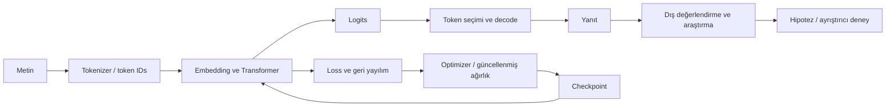

# Cevahir AI — Bir Yapay Zeka Motorunun Anatomisi

**Gerçek kaynak kodundan, açık araştırma sorularına uzanan teknik kitap.**

[Repository ana sayfası](../../README-TR.md) · [English reading guide](README-en.md) · [Kaynak haritası](KAYNAK_HARITASI.md) · [Akademik okuma ve yeniden üretim](AKADEMIK_OKUMA.md) · [Kitabı güncel tutmak](BAKIM.md)

Cevahir'in yönü açık kaynak araştırma ve eğitimdir. Bu kitap, ürün geliştirme hedefinin yerine yeni bir basitleştirilmiş uygulama koymaz. Aynı mühendislik kodunu, testleri ve araştırma kayıtlarını birbirine bağlar. Okuyucu bir kavramı öğrendikten sonra onun gerçek bir sistemde hangi girdiyi aldığını, hangi hesabı yaptığını ve çıktısını kimin kullandığını izleyebilmelidir.

Kitabın ana dili Türkçedir. Teknik terimlerin İngilizce karşılıkları gerektiğinde verilir; mevcut İngilizce modül belgeleri korunur. **Bu ilk sürümün kaynak inceleme tarihi 20 Eylül 2026'dır.** Davranışın son sözü güncel uygulamadır; bir kaynak dosyasındaki eski başlık veya yorum, etkin çağrı yolunun yerine geçmez. Bir kararın tarihsel gerekçesi kayıtlı değilse, kitap bunun mühendislik etkisini açıklar ve gerekçe uydurmaz.

## İçindekiler

| Bölüm | Öğrenilecek bağlantı |
|---|---|
| **I — Temeller ve dilin sayısal temsili** | |
| [1. Motor, dil modeli ve öğrenme](tr/01-motor-ve-ogrenme.md) | Metinden olasılığa; model, motor, eğitim ve kullanımın farklı rolleri. |
| [2. Metinden token kimliklerine](tr/02-metin-tokenizer.md) | Konuya göre dosya/metot haritası; mevcut sözlükle altı çalıştırılmış örnek; BPE, ayarlar, bilgi kaybı ve embedding bağlantısı. |
| **II — Sinirsel hesap** | |
| [3. Embedding, parametre ve sinir ağı](tr/03-sinir-aglari.md) | ID → vektör → katman → logits; şekiller, ağırlıklar ve öğrenilebilir hesap. |
| [4. Attention'ın matematiği ve gerçek yolları](tr/04-attention.md) | Q/K/V, causal mask, MHA/MQA/GQA; elle hesap, SDPA ve Flash koşulları. |
| [5. Transformer bloğunun anatomisi](tr/05-transformer.md) | Konum, RMSNorm, residual, SwiGLU/MoE ve yapılandırma seçimleri. |
| **III — Eğitim ve model yaşam döngüsü** | |
| [6. Veriden parametre güncellemesine](tr/06-egitim.md) | Hazırlanmış veri, batch, loss, gradient, backward, optimizer ve etkin eğitim yolu. |
| [7. Model kimliği, checkpoint ve devam](tr/07-model-yasam-dongusu.md) | Kurulum, kaydetme/yükleme, tokenizer uyumu, değerlendirme ve resume sınırları. |
| **IV — Üretim ve sistemin bütünü** | |
| [8. Bir sonraki tokendan yanıta](tr/08-uretim.md) | Autoregressive üretim, sampling, KV cache, decode ve gerçek üretim adaptörü. |
| [9. Bağlam, bellek, cognition ve araçlar](tr/09-bellek-bilis-araclar.md) | Retrieval, stratejiler, eleştiri ve dış araç sonuçlarının modele bağlanması. |
| [10. Kullanıcı mesajının uçtan uca yolu](tr/10-uctan-uca-sistem.md) | Facade, konuşma yöneticisi, HTTP servisleri ve farklı giriş noktaları. |
| **V — Bilinen sistemden açık araştırmaya** | |
| [11. Yaşarken öğrenme laboratuvarı](tr/11-arastirma-laboratuvari.md) | Hipotez → mekanizma → kod → karşılaştırma → sonuç → sınırlılık. |
| [12. Bilmediklerimiz ve araştırmanın devamı](tr/12-acik-sorular.md) | Kalıcılık, düzeltme, temsil, öğrenme biçimi ve birleşik yaşamın açık sorunları. |

21 Eylül genişletmesinde 3–6. bölümlere sinir ağı ve temsilin temelleri, ayrıntılı matematik, yöntemlerin özgün kaynakları, tarihli endüstri karşılaştırmaları, dosya/metot haritaları ve çözümlü alıştırmalar eklendi. Gerçek Cevahir bileşenleriyle yedi küçük CPU örnek grubu çalıştırıldı. Bu, kitabın bütün bölümlerinin aynı ayrıntı düzeyinde tamamlandığı anlamına gelmez; güncel kapsam [akademik okuma rehberinde](AKADEMIK_OKUMA.md) açıklanır.

## Nasıl okunmalı?

İlk kez dil modeli okuyorsanız sırayla ilerleyin. Python/PyTorch biliyorsanız 3–8 arasında bir bölüm seçip kaynak zincirini takip edebilirsiniz. Sisteme katkı yapacaksanız 10. bölüm ile kaynak haritasından başlayın. Araştırma için 11–12'yi okuyun; küçük deneylerin ana motorla hangi noktalarda **bağlı olmadığını** da izleyin.

Her bölüm aynı sorulara geri döner: Bu hesap neden gerekli? Alternatif nedir? Cevahir hangi yolu gerçekten seçiyor? Hangi ayar bu yolu değiştirir? Çağıran kim, girdi ve çıktı nedir? İlgili test neyi kanıtlar, neyi kanıtlamaz? Büyük dosyaları kopyalamak yerine küçük parçalar ve gerçek sembollere bağlantılar kullanılır.

Son ok bir otomatik eğitim hattı değildir. Konuşmadaki her sonuç ana modelin ağırlıklarını güncellemez. Uygulamadaki opsiyonel deneyim politikası ve bağımsız yaşarken öğrenme deneyleri, araştırma bölümünde ayrı incelenir.

## İddiaları okuma anahtarı

| İfade | Anlamı |
|---|---|
| **Kodda uygulanmış** | Gerçek sınıf/metot ve çağrı yolu mevcut; etkinleşme koşulu ayrıca gerekir. |
| **Varsayılan** | Belirtilen giriş noktasındaki ayar. Doğrudan constructor ile normalleştirilmiş ayar farklı olabilir. |
| **Hedefli testle sınanmış** | Adı verilen testin küçük koşullarında kontrol edilmiş; bütün test paketi veya GPU sonucu değildir. |
| **Deneysel sonuç** | Tanımlı veri, karşılaştırma ve ölçütle üretilmiş kayıt. Aile dışına kendiliğinden taşınmaz. |
| **Hipotez / açık** | Henüz gösterilmemiş; adı veya dosyası var diye uygulanmış sayılmaz. |
| **Tarihsel kayıt** | O turda düşünülmüş veya ölçülmüş durum; daha yeni kayıtla birlikte okunur, sessizce silinmez. |

## Mevcut belgeler bu kitabın neresinde?

[Sistem bütünlüğü rehberi](../architecture/SYSTEM_OVERVIEW.md), [mimari sözleşme](../architecture/CEVAHIR_ARCHITECTURE_SPEC.md), [alt çekirdek sözleşmeleri](../architecture/LOWER_CORE_CONTRACTS.md), [yaşam döngüsü kaydı](../architecture/LIFECYCLE_CONSOLIDATION.md) ve [iki dilli modül rehberleri](../modules/README.md) kitabın başvuru katmanıdır. Tekrar yazılmadılar. Bölümler gerekli olanı açıklar, ayrıntılı sözleşmeye buradan geçer. Eski rehberlerde güncel API ile uyuşmayan örnekler varsa kaynak haritasında ve ilgili bölümde belirtilir.

[Araştırma kayıtları](../research) deneylerin ayrıntılı günlüğüdür. Kitap bu kayıtların yerine geçmez; olumlu ve olumsuz sonuçları aynı zaman çizgisinde okunur kılar. Yeni sonuç, eski kaydı silmek yerine yeni bir bağlantı ve yorumla eklenir.

Kaynak bağlantıları ve kayıtlı sınıf/metot adları `python scripts/check_book.py` ile denetlenir. Kontrol davranışın doğru açıklandığını ispatlamaz; insan incelemesine ek bir eskime uyarısıdır. Tam bakım düzeni [burada](BAKIM.md).
