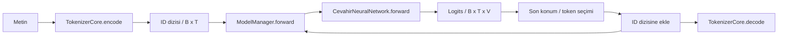

# 1. Motor, dil modeli ve öğrenme

[İçindekiler](../README.md) · [Sonraki: Metinden token kimliklerine](02-metin-tokenizer.md)

Bir mesajdan cevap üreten sistemi dışarıdan tek bir kutu gibi görürüz. İçeride ise farklı işler vardır: metni sayılara çevirmek, bu sayılar üzerinde öğrenilmiş hesap yapmak, sıradaki parçayı seçmek, konuşma geçmişini hazırlamak, gerekiyorsa bir araç çağırmak ve durumu saklamak. **Yapay zeka motoru**, bu kitapta bu işlerin uygulanabilir bir bütünde bağlandığı altyapıyı anlatır. Tek bir bilimsel model türünün adı değildir.

Cevahir'de bu ayrım somuttur. [Birleşik `Cevahir` sınıfı](../../../model/cevahir.py#L963) kullanıcıya metin, üretim ve bilişsel işlem girişleri açar. [`ModelManager`](../../../model_management/model_manager.py) modelin kurulumu, kullanımı ve saklanmasını yönetir. [`CevahirNeuralNetwork`](../../../src/neural_network.py#L85) sayısal hesabı yapar. [`TokenizerCore`](../../../tokenizer_management/core/tokenizer_core.py) metin ile token kimlikleri arasındaki dönüşümü üstlenir. Bu parçaların hiçbiri tek başına bütün motor değildir.

## Dil modeli hangi problemi çözer?

Bir dil modeli, bağlamdaki tokenlardan sonra hangi tokenların daha olası olduğunu hesaplayabilir. `x_1,…,x_T` bir token dizisiyse autoregressive modelin kullandığı çarpanlara ayırma:

$$
p_\theta(x_1,\ldots,x_T)=\prod_{t=1}^{T}p_\theta(x_t\mid x_1,\ldots,x_{t-1}).
$$

`θ`, modelin öğrenilebilir sayılarını, yani parametrelerini belirtir. Bu eşitlik bir sistemin doğru, tutarlı veya bilgili cevap vereceğinin garantisi değildir. Öğrenilen dağılım eğitim verisine, model kapasitesine ve eğitim yöntemine bağlıdır. Üretimde seçilen token en olası token olabilir veya olasılıklara göre örneklenebilir; bu seçim modelin kendisinden ayrı bir işlemdir.

Sadece son birkaç kelimenin sayımını kullanan n-gram modeli daha küçük ve daha kolay incelenebilir bir alternatiftir; fakat uzun bağlamı temsil etme biçimi sınırlıdır. Yinelenen ağlar geçmişi bir çalışma durumunda taşır. Transformer ise bir katmanda token temsillerini attention yoluyla ilişkilendirir. Cevahir'in etkin sinirsel yolu Transformer tabanlı, nedensel maske kullanabilen bir decoder'dır. Sınıf adında `TransformerEncoderLayer` geçmesi, mevcut çalışma yolunu otomatik olarak BERT tarzı çift yönlü bir encoder yapmaz. [Dördüncü](04-attention.md) ve [beşinci bölüm](05-transformer.md) maskeyi ve çağrıları açar.

## Sayılara dönüşün ilk resmi

Token, modelin işlediği metin parçasıdır; kelime olmak zorunda değildir. Token ID, bu parçanın sözlükteki tam sayı adresidir. Örneğin kavramsal `[12,7,31]` dizisi üç tokenı gösterir; bunlar Cevahir'in gerçek sözlüğüne aitmiş gibi varsayılmamalıdır. ID'nin büyüklüğü anlam büyüklüğü değildir. Model önce bu adreslerden öğrenilebilir vektörleri, yani embedding satırlarını seçer.

Bir batch `B` dizi, her dizi `T` token içeriyorsa kimlik tensörünün şekli `[B,T]`dir. Embedding ve katmanlar bunu `[B,T,D]` temsillere, çıkış projeksiyonu `[B,T,V]` logits tensörüne dönüştürür. `D` temsil genişliği, `V` sözlük büyüklüğüdür. Logit bir olasılık değildir: aynı konumdaki `V` sayı softmax ile normalize edilince toplamı 1 olan bir dağılım elde edilir.

$$
p_i=\frac{e^{z_i}}{\sum_{j=1}^{V}e^{z_j}}.
$$

Token seçimi bu dağılım üzerinde yapılır; seçilen ID mevcut diziye eklenir ve bir sonraki adımın bağlamına katılır. Sonunda tokenizer'ın decode yolu ID'leri metne çevirir. Decode, logits tensörünü doğrudan cümleye çeviren bir sinir ağı değildir.



Bu çizim veri akışıdır; her ok bağımsız bir HTTP çağrısı veya nesne oluşturma değildir. Gerçek üretim döngüsü [8. bölümde](08-uretim.md) incelenen `CevahirModelAPI` içindedir. `ModelManager.generate` adı tek başına tam autoregressive döngü anlamına gelmez; eski kısa yolu vardır. Metot adı yerine uygulamayı okumamızın nedeni budur.

## Cevahir'de tek ileri geçişi izlemek

[`Cevahir.forward`](../../../model/cevahir.py#L1291), metin/ID listesi/tensörü `_InputValidator.validate_and_convert_input` ile uygun tensöre çevirir, sonra yöneticiyi çağırır. Kaynaktaki küçük bağlantı:

```python
logits, _ = self._model_manager.forward(inputs, **kwargs)
```

[`ModelManager.forward`](../../../model_management/model_manager.py#L486) girdiyi aygıta taşır, maskeleri ve desteklenen seçenekleri düzenler, çekirdeği çağırır ve logits ile yardımcı çıktıyı döndürür. `inference=True` yolunda gradyan kaydı kapatılır ve değerlendirme modu geçici uygulanır. Facade yalnız logits döndürür. Aynı adla anılan katmanların dönüş tiplerini karıştırmamak gerekir.

| Sınır | Kim çağırır? | Ne alır, ne üretir? | Sonraki kullanım |
|---|---|---|---|
| `Cevahir.forward` | Facade kullanan uygulama | Metin/liste/tensör → logits | Doğrudan inceleme veya uygulamanın kendi hesabı. |
| `ModelManager.forward` | Facade, üretim adaptörü veya eğitim yolu | ID tensörü ve seçenekler → `(logits, aux)` | Kayıp hesabı, token seçimi veya tanılama. |
| `CevahirNeuralNetwork.forward` | Model yöneticisi veya doğrudan çekirdek kullanıcısı | ID'ler → katman hesabı ve vocabulary projeksiyonu | Yönetici/adaptör; cache dönüş sözleşmesi 5 ve 8. bölümlerde. |

Bu sınırların biri değişirse etkisi son metne kadar gider. Örneğin vocabulary boyutu değiştirilirken tokenizer ID anlamları korunmazsa, doğru boyutlu bir tensör yanlış tokenları ifade edebilir. Bir maskenin anlamını ters çevirmek geleceği gizlemek yerine erişimi yanlış yere açabilir. Mimari öğrenmek bu bağımlılıkları takip etmektir.

## Eğitilmemiş bir motoru çalıştırmak

Repository kökünden, PyTorch kurulu ortamda şu küçük örnek gerçek `ModelManager` ile ileri geçiş yapar:

```python
import torch
from model_management.config_schema import tiny_model_config
from model_management.model_manager import ModelManager

torch.manual_seed(42)
torch.set_num_threads(1)
manager = ModelManager(tiny_model_config())
manager.initialize(
    build_optimizer=False, build_criterion=False, build_scheduler=False
)
logits, attention = manager.forward(
    torch.tensor([[1, 5, 8, 2]]), inference=True
)
assert tuple(logits.shape) == (1, 4, 128)
assert torch.isfinite(logits).all()
```

[`tiny_model_config`](../../../model_management/config_schema.py#L660) iki katman, 32 genişlik ve 128 tokenlık sözlükle CPU boyutlu bir deneme kurar. Rastgele başlangıçlı model kullanılır. Bu örnek dil kalitesini, Türkçe yeteneği veya öğrenmeyi göstermez; veri/hesap sözleşmesini görünür kılar. Gerçek dil üretimi için eğitilmiş checkpoint ve onunla aynı tokenizer gerekir. Mevcut [başlangıç yönergeleri](../../../README-TR.md) ve [modül rehberleri](../../modules/README.md) kurulum ayrıntılarını taşır.

## Hesap yapmak ile öğrenmek

İleri geçişte aynı parametreler yeni girdiye uygulanır. Eğitimde ise bir hedefle karşılaştırılan çıktıdan kayıp üretilir; türevler ve optimizer aracılığıyla parametreler değiştirilir. Bu yüzden daha uzun cevap üretmek, tek başına daha fazla öğrenmek değildir. KV cache'i doldurmak da ağırlık güncellemesi değildir.

Kayıp `L(θ)` için basit gradyan adımı `θ' = θ − η∇_θL` biçimindedir. Cevahir'in etkin eğitim yolu daha fazla ayrıntı taşır: padding hedefleri, geçerli token sayıları, birikmiş gradyanlar, hassasiyet ölçekleme ve MoE yardımcı kaybı. Bunları tek denklemin arkasına gizlemek yerine [6. bölümde](06-egitim.md) gerçek döngüyle bağlarız.

Öğrenme araştırmamız parametre optimizasyonundan daha geniş bir soru soruyor: deneyim gelecekte yapılabilen hesapları kalıcı ve kontrollü biçimde değiştirebilir mi? Bu soru, metin geçmişini context'e eklemekten de farklı. Yeni bir yürütme kuralı edinme, mevcut kuralları daha ucuz yürütülebilir hale getirme ve sonraki deneyimden öğrenme biçimini değiştirme farklı deneylerde incelendi. Bunlar [11. bölümün](11-arastirma-laboratuvari.md) konusu; motorun zaten genel olarak yaşarken öğrendiği varsayımı değildir.

## Kendi kontrol sorunuz

Yukarıdaki örnekte logits şekli doğru fakat üretilen metin anlamsızsa, hangi iddia doğrulanmış olur? Yalnız ileri geçiş ve boyut sözleşmesi. Aynı örneğe tokenizer eklemek bu ağırlıkları eğitmez. Tokenizer, veri temsili ile öğrenilmiş parametrelerin arasındaki anlam sözleşmesini kurar; şimdi bu sözleşmeyi açacağız.

[İçindekiler](../README.md) · [Sonraki bölüm](02-metin-tokenizer.md)
