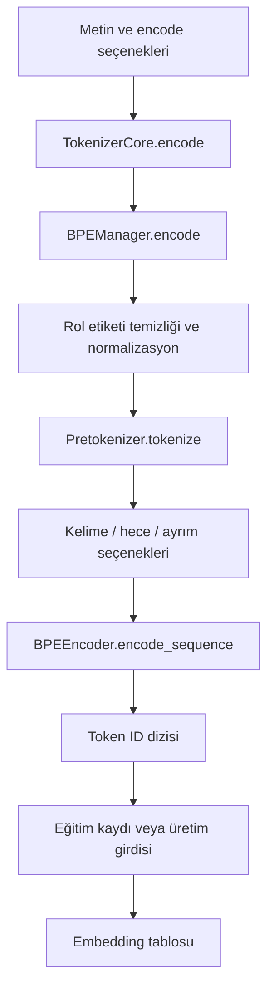

# 2. Metinden sayılara: token, sözlük ve tokenizer

[İçindekiler](../README.md) · [Önceki: Motor ve öğrenme](01-motor-ve-ogrenme.md) · [Sonraki: Sinir ağları](03-sinir-aglari.md)

Bir dil modeline `Merhaba dünya!` verdiğimizde sinir ağı harfleri doğrudan işlemez. Önce metin, sayısal kimliklerden oluşan bir diziye çevrilir. Bu bölümün sonunda bir metnin hangi işlemlerden geçtiğini, bu işlemlerin nerede bilgi kaybedebildiğini ve üretilen kimliklerin neden model ağırlıklarından bağımsız değiştirilemeyeceğini takip edebileceğiz. Kod karşılığı 20 Eylül 2026 tarihinde incelenmiştir.

## Kelime, token ve kimlik aynı şey değildir

**Token**, modelin işlediği ayrık birimdir. Bir kelime, kelimenin parçası, noktalama işareti veya özel bir sınır işareti olabilir. **Vocabulary**, bu birimlerle tamsayı kimlikleri arasındaki sözlüktür. **Tokenizer** ise metinden bu diziyi üretmek ve kimlikleri tekrar okunabilir metne çevirmek için kullanılan işlemler bütünüdür.

Kimliklerin büyüklükleri dilsel yakınlık ifade etmez. Sözlükte iki öğenin 17 ve 18 olması, anlamlarının yakın olduğu sonucunu vermez. Sayılar, sonraki bölümde göreceğimiz embedding tablosunun satır adresleridir. Matematiksel olarak tokenizer, metni $x=(x_1,\ldots,x_T)$ dizisine dönüştürür; $x_t\in\{0,\ldots,V-1\}$ ve $V$ sözlük büyüklüğüdür. Embedding işlemi daha sonra $h_t=E[x_t]$ ile her kimliği $d$ boyutlu bir vektöre dönüştürür. Ayrık kimliği tokenizer belirler; embedding vektörünün değerleri sinir ağı eğitimi sırasında öğrenilir.

Tüm kelimeleri ayrı birim yapmak uzun kuyruktaki nadir kelimeler ve yeni ekli biçimler için büyük bir sözlük gerektirebilir. Her karakteri ayrı işlemek daha küçük bir alfabe sağlayabilir, fakat diziyi uzatır. Alt kelime yaklaşımı bu iki seçeneğin arasında paylaşılabilen parçalar kullanır. BPE'nin sinirsel dil işlemedeki bu kullanımı için [Sennrich, Haddow ve Birch'in özgün çalışması](https://aclanthology.org/P16-1162/) okunabilir. Cevahir bu aileden bir BPE uygulamasını Türkçe işleme yardımcılarıyla birleştirir. Bunun diğer tokenizer'lara karşı ölçülmüş genel üstünlüğü bu bölümün iddiası değildir.

## Bir BPE sözlüğü neyi öğrenir?

BPE eğitiminde başlangıçtaki simge dizilerinde komşu çiftler sayılır. Bir çift birleştirildiğinde sonraki turlarda tek bir simge gibi işlenebilir. Şematik olarak `a b a b` dizisinde `(a,b)` birleşimi `ab ab` üretir. Bu örnek gerçek Cevahir sözlüğüne ait bir token çıktısı değildir; birleşim işlemini gösterir. Birleşimlerin **sırası** da önemlidir: yalnız son sözlüğü saklamak, kodlamada hangi birleşimin önce uygulanacağını tamamen açıklamaz.

Cevahir'de [BPETrainer.train](../../../tokenizer_management/bpe/bpe_trainer.py#L142), önceden tokenleştirilmiş `List[List[str]]` alır. Mevcut birleşimleri uygular, yapılandırmaya göre CPU veya GPU eğitim yoluna gider ve sözlükle birleşim listesini geliştirir. CPU yolu [_train_cpu_sequential](../../../tokenizer_management/bpe/bpe_trainer.py#L776), çift istatistikleri ve birleşim işlemleri üzerinden izlenebilir. `min_frequency`, `max_iter`, `target_merges` durmayı etkiler. Bu işlem dil modelinin ağırlıklarını geri yayılımla eğitmek değildir; metnin hangi ayrık birimlerle temsil edileceğini kurar.

Üst API [TokenizerCore.train_model](../../../tokenizer_management/core/tokenizer_core.py#L247), metin korpusunu `BPEManager.train` çağrısına verir; ardından sözlük ve birleşimleri saklar. Bu imzadaki `vocab_size` parametresinin bulunması tek başına onun hedef büyüklüğü uyguladığı anlamına gelmez: mevcut gövdede bu parametre dalı `pass` içerir. Etkin BPE yapılandırması ve alt eğitim sınırları kontrol edilmelidir. Yeni tokenizer eğitimi için gerçek giriş [train_bpe.py](../../../tokenizer_management/train_bpe.py), mevcut araçların kullanım rehberi ise [tokenizer modül belgesidir](../../modules/tokenizer_management/README.md).

## Cevahir'de encode çağrısının içi



[TokenizerCore.encode](../../../tokenizer_management/core/tokenizer_core.py#L429) dışarıdan `str` metin ve `mode`/kodlama seçenekleri alır, `(tokens, token_ids)` çifti döndürür. Boş metin için iki boş liste üretir. Normalizasyonu kendisi yeniden uygulamaz; seçilen bayrakları alt yöneticiye geçirir. Kaynaktan kısa bir parça:

```python
tokens, token_ids = self.tokenizer.encode(
    text,
    mode=mode,
    include_whole_words=iw,
    include_syllables=isy,
    include_sep=isp,
    add_special_tokens=add_special_tokens,
)
```

Buradaki `tokens` açıklayıcı metin parçalarıdır. Encoder bir metin parçasını birden fazla alt kimliğe açabildiği için iki listenin her durumda birebir aynı uzunlukta olduğunu varsaymayın. Sinir ağına verilecek dizi `token_ids` çıktısıdır.

[BPEManager._tokenize_with_punct](../../../tokenizer_management/bpe/bpe_manager.py#L388) önce rol etiketlerini temizler ve hafif normalizasyon uygular; ardından [Pretokenizer.tokenize](../../../tokenizer_management/bpe/tokenization/pretokenizer.py#L273) çalışır. Pretokenizer'ın Unicode normalizasyonu, harf dönüşümü, temizlik ve parçalama seçenekleri vardır. Bütün kelime seçeneği kelime sonu işaretli öğeleri ekler. Hece seçeneği açılırsa Türkçe heceleyici çalışır; morfoloji öğeleri ise ayrıca `include_morphology` açık olduğunda heceler üzerinden eklenir. Buradan eksiksiz bir dilbilimsel çözümleyici sonucu çıkmaz.

[BPEEncoder._encode_token_to_ids](../../../tokenizer_management/bpe/bpe_encoder.py#L294), önce doğrudan sözlük isabetini dener; sonra sıralı BPE birleşimlerini, gerektiğinde parçalama ve karakter fallback yollarını kullanır. Karakter fallback'i **byte fallback değildir**. Encoder'ın `use_gpu` seçeneği de tüm metin yolunun GPU üzerinde çalıştığını kanıtlamaz: mevcut kod çok karakterli öğeler için CPU yolunu kullanır. Performans ancak bu gerçek yol ve iş yükü ölçülerek değerlendirilir.

## Hangi seçenek hangi davranışı değiştirir?

| Seçenek / durum | Kaynaktaki davranış ve sonucu |
|---|---|
| `mode="inference"` | `TokenizerCore` varsayılanında bütün kelime açık, hece ve kelimeler arası SEP kapalıdır. |
| `mode="train"` | Core'un yerel varsayımlarında bu üç seçenek açıktır; hazırlama/servis çağrıları bunları ayrıca belirleyebilir. Etkin çağrıya bakılır. |
| `add_special_tokens=None` | `BPEManager` açık yapılandırma yoksa inference için BOS ekler, train için eklemez. EOS ayrıca `add_eos_on_encode` ile kontrol edilir. |
| `text_loss_policy` | `warn` varsayılandır; `error`, denetlenen karakter kaybını reddeder; `ignore` denetimi kapatır. |
| `read_only=True` | Mevcut tokenizer varlıklarıyla çalışma niyetini belirtir; varlıkların bulunmaması hata verir. |

Özel tokenların rolleri de ayrıdır: BOS başlangıcı, EOS bitiş hedefini, PAD toplu işleme dolgusunu, UNK temsil edilemeyen öğeyi, SEP ise uygun biçimlerde ayrımı belirtir. Kimlikleri metin örneğine bakarak tahmin edilmez; güncel sözlükten okunur. Eğitimde BOS/EOS ekleme yeri ile çıkarımda ekleme yeri farklı olduğundan aynı sınırları iki kere eklemek eğitim hedefini değiştirebilir.

Standart temizlik tüm Unicode girdiyi kayıpsız korumaz. `text_loss_policy` kontrolü, rol etiketi temizliği ve normalizasyon **sonrasındaki** metni pretokenizer çıktısıyla karşılaştırır. Karakter çokluklarını denetler; önceki dönüşümlerdeki bütün kayıpları veya karakter sırasının korunmasını kanıtlamaz. Bu sınırlamanın ayrıntıları [mevcut tokenizer rehberinde](../../modules/tokenizer_management/README.md) korunmuştur.

## Bu çıktıyı kim kullanıyor?

Eğitim tarafında [TokenizerCore.load_training_data](../../../tokenizer_management/core/tokenizer_core.py#L720), veri yükleyiciden soru-cevap ve ham metin alır. Soru ve cevabı ayrı kodlar, aralarına SEP koyar; kimlik dizilerini kaynak kimliğiyle birlikte hazırlama katmanına verir. [prepare_cache](../../../training_system/prepare_cache.py#L62) bu kayıtları modelin next-token hedeflerine çevirir. Ayrıntıyı [eğitim bölümünde](06-egitim.md) izleyeceğiz.

Çıkarım tarafında [ModelManager.generate](../../../model_management/model_manager.py#L882) adlı basit üretim yolu `self.tokenizer.encode(prompt)` çağırır ve token kimliklerini modele geçirir. Bu metodun kendi gövdesi tek ileri geçiş ve argmax yapar. Tam autoregressive üretim adaptörünün çağrı zinciri [üretim bölümündedir](08-uretim.md). [TokenizerCore.decode](../../../tokenizer_management/core/tokenizer_core.py#L615), üretilmiş kimlikleri BPE çözme katmanına aktararak metin sonucunu verir; encode/decode dönüşlerinin her girdi için özgün metne eşit olduğu varsayılmaz.

Sözlükte iki kimliğin yer değiştirmesi embedding tablosundaki iki satırın anlamını değiştirir. Bu nedenle sözlük büyüklüğünün eşitliği model uyumluluğu için yeterli değildir. [tokenizer_digest](../../../training_system/cache_identity.py#L27), sözlük, birleşim dosyası ve BPE yapılandırmasını kimliğe katar. Cache ve checkpoint sınırlarında bu kimlik kullanılır; [yaşam döngüsü bölümü](07-model-yasam-dongusu.md) bu denetimi tamamlar.

## Okumayı gerçek bir kontrole bağlamak

[test_tokenizer_contracts.py](../../../tests/evolution/test_tokenizer_contracts.py), dağıtılan sözlükteki temel kimliklerin değişmediğini, Türkçe karakter örneklerini, yapılandırma ayrımını ve metin kaybı politikasını sınar. [Tokenizer benchmark'ı](../../../benchmarks/tokenizer_benchmark.py) ile [ölçüm kapsamı](../../../benchmarks/README.md) hız ve çıktı kayıtlarını ayrı tutar. Bunlar bütün dillerde kayıpsızlık veya dil modelinin dil yeteneği testi değildir.

Kodu okurken küçük bir iz sürün: `mode` değerini encode çağrısından başlayarak bayrak çözümüne, BPEManager'a ve encoder'a kadar taşıyın. Ardından çıkan bir kimliğin embedding satırına nasıl dönüştüğünü takip edin. Böylece normalizasyon kararının yalnız ekrandaki yazıyı değil, modelin görebildiği deneyimi değiştirdiği görünür olur.

[Sonraki: Sinir ağları ve parametreler](03-sinir-aglari.md) · [İçindekiler](../README.md)
