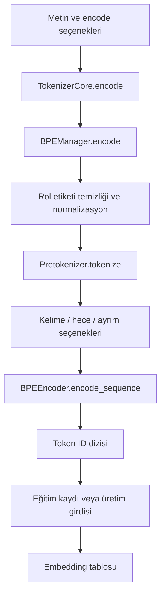

# 2. Metinden sayılara: token, sözlük ve tokenizer

[İçindekiler](../README.md) · [Önceki: Motor ve öğrenme](01-motor-ve-ogrenme.md) · [Sonraki: Sinir ağları](03-sinir-aglari.md)

Bir dil modeline `Merhaba dünya!` verdiğimizde sinir ağı harfleri doğrudan işlemez. Önce metin, sayısal kimliklerden oluşan bir diziye çevrilir. Bu bölümün sonunda bir metnin hangi işlemlerden geçtiğini, bu işlemlerin nerede bilgi kaybedebildiğini ve üretilen kimliklerin neden model ağırlıklarından bağımsız değiştirilemeyeceğini takip edebileceğiz. İlk kaynak incelemesi 20 Eylül 2026'da yapıldı; dosya/metot haritası ve mevcut sözlükle çalıştırılmış örnekler 21 Eylül'de genişletildi.

## Kelime, token ve kimlik aynı şey değildir

**Token**, modelin işlediği ayrık birimdir. Bir kelime, kelimenin parçası, noktalama işareti veya özel bir sınır işareti olabilir. **Vocabulary**, bu birimlerle tamsayı kimlikleri arasındaki sözlüktür. **Tokenizer** ise metinden bu diziyi üretmek ve kimlikleri tekrar okunabilir metne çevirmek için kullanılan işlemler bütünüdür.

Kimliklerin büyüklükleri dilsel yakınlık ifade etmez. Sözlükte iki öğenin 17 ve 18 olması, anlamlarının yakın olduğu sonucunu vermez. Sayılar, sonraki bölümde göreceğimiz embedding tablosunun satır adresleridir. Matematiksel olarak tokenizer, metni $x=(x_1,\ldots,x_T)$ dizisine dönüştürür; $x_t\in\{0,\ldots,V-1\}$ ve $V$ sözlük büyüklüğüdür. Embedding işlemi daha sonra $h_t=E[x_t]$ ile her kimliği $d$ boyutlu bir vektöre dönüştürür. Ayrık kimliği tokenizer belirler; embedding vektörünün değerleri sinir ağı eğitimi sırasında öğrenilir.

Tüm kelimeleri ayrı birim yapmak uzun kuyruktaki nadir kelimeler ve yeni ekli biçimler için büyük bir sözlük gerektirebilir. Her karakteri ayrı işlemek daha küçük bir alfabe sağlayabilir, fakat diziyi uzatır. Alt kelime yaklaşımı bu iki seçeneğin arasında paylaşılabilen parçalar kullanır. BPE'nin sinirsel dil işlemedeki bu kullanımı için [Sennrich, Haddow ve Birch'in özgün çalışması](https://aclanthology.org/P16-1162/) okunabilir. Cevahir bu aileden bir BPE uygulamasını Türkçe işleme yardımcılarıyla birleştirir. Bunun diğer tokenizer'lara karşı ölçülmüş genel üstünlüğü bu bölümün iddiası değildir.

## Bir BPE sözlüğü neyi öğrenir?

BPE eğitiminde başlangıçtaki simge dizilerinde komşu çiftler sayılır. Bir çift birleştirildiğinde sonraki turlarda tek bir simge gibi işlenebilir. Şematik olarak `a b a b` dizisinde `(a,b)` birleşimi `ab ab` üretir. Bu örnek gerçek Cevahir sözlüğüne ait bir token çıktısı değildir; birleşim işlemini gösterir. Birleşimlerin **sırası** da önemlidir: yalnız son sözlüğü saklamak, kodlamada hangi birleşimin önce uygulanacağını tamamen açıklamaz.

Cevahir'de [BPETrainer.train](../../../tokenizer_management/bpe/bpe_trainer.py#L142), önceden tokenleştirilmiş `List[List[str]]` alır. Mevcut birleşimleri uygular, yapılandırmaya göre CPU veya GPU eğitim yoluna gider ve sözlükle birleşim listesini geliştirir. CPU yolu [_train_cpu_sequential](../../../tokenizer_management/bpe/bpe_trainer.py#L776), çift istatistikleri ve birleşim işlemleri üzerinden izlenebilir. `min_frequency`, `max_iter`, `target_merges` durmayı etkiler. Bu işlem dil modelinin ağırlıklarını geri yayılımla eğitmek değildir; metnin hangi ayrık birimlerle temsil edileceğini kurar.

Üst API [TokenizerCore.train_model](../../../tokenizer_management/core/tokenizer_core.py#L247), metin korpusunu `BPEManager.train` çağrısına verir; ardından sözlük ve birleşimleri saklar. Bu imzadaki `vocab_size` parametresinin bulunması tek başına onun hedef büyüklüğü uyguladığı anlamına gelmez: mevcut gövdede bu parametre dalı `pass` içerir. Etkin BPE yapılandırması ve alt eğitim sınırları kontrol edilmelidir. Yeni tokenizer eğitimi için gerçek giriş [train_bpe.py](../../../tokenizer_management/train_bpe.py), mevcut araçların kullanım rehberi ise [tokenizer modül belgesidir](../../modules/tokenizer_management/README.md).

## Cevahir'de encode çağrısının içi



[TokenizerCore.encode](../../../tokenizer_management/core/tokenizer_core.py#L429) dışarıdan `str` metin ve `mode`/kodlama seçenekleri alır, `(tokens, token_ids)` çifti döndürür. Boş metin için iki boş liste üretir. Normalizasyonu kendisi yeniden uygulamaz; seçilen bayrakları alt yöneticiye geçirir. Kaynaktan kısa bir parça:

```python
tokens, token_ids = self.tokenizer.encode(
    text,
    mode=mode,
    include_whole_words=iw,
    include_syllables=isy,
    include_sep=isp,
    add_special_tokens=add_special_tokens,
)
```

Buradaki `tokens` açıklayıcı metin parçalarıdır. Encoder bir metin parçasını birden fazla alt kimliğe açabildiği için iki listenin her durumda birebir aynı uzunlukta olduğunu varsaymayın. Sinir ağına verilecek dizi `token_ids` çıktısıdır.

[BPEManager._tokenize_with_punct](../../../tokenizer_management/bpe/bpe_manager.py#L388) önce rol etiketlerini temizler ve hafif normalizasyon uygular; ardından [Pretokenizer.tokenize](../../../tokenizer_management/bpe/tokenization/pretokenizer.py#L273) çalışır. Pretokenizer'ın Unicode normalizasyonu, harf dönüşümü, temizlik ve parçalama seçenekleri vardır. Bütün kelime seçeneği kelime sonu işaretli öğeleri ekler. Hece seçeneği açılırsa Türkçe heceleyici çalışır; morfoloji öğeleri ise ayrıca `include_morphology` açık olduğunda heceler üzerinden eklenir. Buradan eksiksiz bir dilbilimsel çözümleyici sonucu çıkmaz.

[BPEEncoder._encode_token_to_ids](../../../tokenizer_management/bpe/bpe_encoder.py#L294), önce doğrudan sözlük isabetini dener; sonra sıralı BPE birleşimlerini, gerektiğinde parçalama ve karakter fallback yollarını kullanır. Karakter fallback'i **byte fallback değildir**. Encoder'ın `use_gpu` seçeneği de tüm metin yolunun GPU üzerinde çalıştığını kanıtlamaz: mevcut kod çok karakterli öğeler için CPU yolunu kullanır. Performans ancak bu gerçek yol ve iş yükü ölçülerek değerlendirilir.

## Konuya göre hangi dosyayı, hangi metodu okumalı?

Bir dosyayı baştan sona okumak yerine, açıklamak istediğimiz davranıştan başlayabiliriz. Aşağıdaki sıra tek bir metnin başına ne geldiğini izler. Bağlantılar Cevahir'in gerçek uygulamasına gider; tabloda bir metodun bulunması bütün seçeneklerinin her istekte çalıştığı anlamına gelmez.

| Konu | Dosya ve metot | Girdi → işlem → çıktı; sıradaki tüketici |
|---|---|---|
| Mevcut tokenizer'ı kurmak | [tokenizer_core.py — `TokenizerCore.__init__`](../../../tokenizer_management/core/tokenizer_core.py#L90) | Yapılandırma → vocab/merges yolları, alt BPE ayarları ve moda bağlı varsayımlar → `BPEManager` örneği. |
| Seçeneğin etkin değerini bulmak | [tokenizer_core.py — `_resolve_include_flags`](../../../tokenizer_management/core/tokenizer_core.py#L397) | Mod ve açık/boş bayraklar → train/inference varsayımları → kelime, hece ve SEP kararları. |
| Dış kodlama API'si | [tokenizer_core.py — `encode`](../../../tokenizer_management/core/tokenizer_core.py#L429) | Metin ve seçenekler → alt yöneticiyi çağırır, UNK oranını hesaplar → parçalar ve model ID'leri. |
| Akışı düzenlemek | [bpe_manager.py — `BPEManager.encode`](../../../tokenizer_management/bpe/bpe_manager.py#L463) | Metin → özel tokenlar, ön işleme, encoder, koşullu OOV yolu → `(tokens, token_ids)`. |
| Normalize etmek ve parçalamak | [bpe_manager.py — `_tokenize_with_punct`](../../../tokenizer_management/bpe/bpe_manager.py#L388), [pretokenizer.py — `Pretokenizer.tokenize`](../../../tokenizer_management/bpe/tokenization/pretokenizer.py#L273) | Metin → rol temizliği, Unicode/boşluk işlemleri, karakter kaybı denetimi, kelime/hece/noktalama → encoder'a giden parçalar. |
| BPE sırasını kurmak | [bpe_encoder.py — `_build_merge_ranks`](../../../tokenizer_management/bpe/bpe_encoder.py#L280) | Sıralı çift listesi → çiftin öncelik değeri → BPE aramasının kullandığı tablo. |
| Bir parçayı kimliklere açmak | [bpe_encoder.py — `_encode_token_to_ids`](../../../tokenizer_management/bpe/bpe_encoder.py#L294), [`_bpe_ids_for_token`](../../../tokenizer_management/bpe/bpe_encoder.py#L371) | Parça → doğrudan sözlük veya sıralı birleşimler ve fallback → bir ya da birden çok ID. |
| Parça dizisini birleştirmek | [bpe_encoder.py — `encode_sequence`](../../../tokenizer_management/bpe/bpe_encoder.py#L188) | Parçalar → her parçanın ID'lerini arka arkaya ekler → düz tamsayı dizisi. |
| Kimlikleri okunabilir metne çevirmek | [tokenizer_core.py — `decode`](../../../tokenizer_management/core/tokenizer_core.py#L615), [bpe_manager.py — `decode`](../../../tokenizer_management/bpe/bpe_manager.py#L793), [bpe_decoder.py — `BPEDecoder.decode`](../../../tokenizer_management/bpe/bpe_decoder.py#L161) | ID'ler → ters sözlük, özel işaret ve kelime sonu işlemleri, noktalama temizliği → metin. |
| Birden çok kaydı işlemek | [tokenizer_core.py — `batch_encode`](../../../tokenizer_management/core/tokenizer_core.py#L514) | Metin iterable'ı → CPU'da tekil encode çağrıları, hata politikası → başarılı sonuçların listesi. |
| Temsil dilini eğitmek | [bpe_manager.py — `train`](../../../tokenizer_management/bpe/bpe_manager.py#L961), [bpe_trainer.py — `BPETrainer.train`](../../../tokenizer_management/bpe/bpe_trainer.py#L142) | Korpus/parça dizileri → birleşim ve sözlük güncellemeleri → sonraki encode'ların kullandığı varlıklar. |

Bu zincirde `TokenizerCore`, `BPETokenizer` adlı sınıfı araya koymaz. Core'un constructor'ı doğrudan `BPEManager` kurar; yönetici `_initialize_components` içinde encoder, decoder ve trainer'ı oluşturur. [`bpe_tokenizer.py`](../../../tokenizer_management/bpe/bpe_tokenizer.py) dosyasındaki alternatif sarmalayıcının projede bulunması onu bu çağrı zincirinin bir adımı yapmaz. Aynı şekilde yönetici bir `Postprocessor` nesnesi kurar, fakat burada `BPEDecoder`'a onu constructor argümanı olarak vermez; decoder'ın kendi varsayılan `DummyPostprocessor`'ı kullanılır. Noktalama temizliğini açıklarken asıl işlem olan `BPEDecoder.decode` gövdesine bakmamızın nedeni budur.

Kurulumda üst düzey BPE anahtarlarından seçilen değerlerin üzerine iç içe `bpe_config` değerleri yazılır. Core'un train/inference kelime-hece-SEP varsayımları ise ayrıca kurulup `encode` sırasında açık argüman olarak alt yöneticiye verilir. Dolayısıyla iç `bpe_config` içindeki bir seçenek adıyla Core'un moda bağlı seçeneğini aynı şey sayamayız. Çağrının açık bayrağı, Core'un `_resolve_include_flags` hesabını; onun sonucu da yöneticinin alacağı değeri belirler.

## Mevcut sözlüğümüzle gerçekten çalışan bir cümle

Aşağıdaki örnek repository kökünde, mevcut Python bağımlılıklarıyla çalışır. Yeni sözlük eğitmez veya model ağırlığı yüklemez. Açık `read_only` ve `auto_vocab_update=False` ile dağıtılan varlıkları kullanır. Bu çalıştırmada **60.000 sözlük öğesi ve 24.896 yüklenmiş birleşim kuralı** vardı; bunlar hedef ayardan tahmin edilen sayılar değil, yüklenmiş nesnelerden alınan değerlerdir.

```python
from pathlib import Path
from tokenizer_management.core.tokenizer_core import TokenizerCore

root = Path.cwd()  # Repository kökünde çalıştırın.
tokenizer = TokenizerCore({
    "vocab_path": str(root / "data/vocab_lib/vocab.json"),
    "merges_path": str(root / "data/merges_lib/merges.txt"),
    "read_only": True,
    "use_gpu": False,
    "bpe_config": {"auto_vocab_update": False},
})
pieces, ids, stats = tokenizer.encode_with_stats(
    "Merhaba dünya!", mode="inference", add_special_tokens=False
)
print(pieces)
print(ids)
print(tokenizer.decode(ids))
```

Ölçülen çıktı:

```text
['Merhaba</w>', ' ', 'dünya</w>', ' ', '!']
[5281, 390, 14274, 390, 183]
Merhaba dünya!
```

Bu sayıların kaynağı [dağıtılan vocab.json](../../../data/vocab_lib/vocab.json); birleşimlerin kaynağı [merges.txt](../../../data/merges_lib/merges.txt) dosyasıdır. Sözlük değişirse aynı sayıları beklemek doğru olmaz. Tam çalıştırma ve varlık özetleri [tokenizer_walkthrough.json](../evidence/tokenizer_walkthrough.json) içinde saklanır. [Çalıştırılabilir örnek](../../../scripts/book_tokenizer_walkthrough.py) aşamaları mevcut sınıf/metotlardan yeniden değerlendirir; ikinci bir tokenizer uygulaması kurmaz. Her parçanın ürettiği kimlikleri birleştirip gerçek encode sonucuyla eşitliğini denetler.

| Aşama | `Merhaba dünya!` için gözlenen değer | Neyi açıklıyor? |
|---|---|---|
| Manager normalizasyonu | `Merhaba dünya!` | Bu girdide hafif normalizasyon görünür değişiklik yapmadı. |
| Pretokenizer çıktısı | `['Merhaba', ' ', 'dünya', ' ', '!']` | Noktalama ayrı öğedir; ünlem öncesinde işleme sırasında boşluk oluşur. |
| Encoder'a giden parçalar | `['Merhaba</w>', ' ', 'dünya</w>', ' ', '!']` | `</w>` kelime sonu işaretidir; kullanıcı metnindeki gerçek bir yazı değildir. |
| Model kimlikleri | `[5281, 390, 14274, 390, 183]` | Bu örneğin iki kelimesi doğrudan sözlükte bulundu. |
| Decode | `Merhaba dünya!` | Çözücü kelime sonlarını ve noktalama boşluğunu işler. |

`cleanup_punctuation_spaces=False` ile aynı ID'ler **`Merhaba dünya !`** olarak çözüldü. Bu fark encoder veya embedding değişmeden, çıktı metninin biçimlendirilmesiyle oluşur. Modelin gördüğü kimlik dizisiyle ekranda okunan cümleyi ayrı incelemek gerekir.

## Tek parça neden 28 kimlik olabilir?

`cevahirleştirilemeyenlerden` girdisinde dış API'nin parça listesi tek öğedir:
`['cevahirleştirilemeyenlerden</w>']`. Aynı çalıştırmada ID listesi **28 öğe**
taşır; ters sözlük bunları kelimenin karakterleri ve sondaki `</w>` olarak gösterir.
Decode kelimeyi geri verir ve UNK sayısı sıfırdır.

Bu örnek iki farklı bilgiyi ayırır. Kelime temsil edilebilmiştir, fakat tek ID'ye
sığmamıştır. Birçok ekli biçimde bunun maliyeti token dizisinin uzamasıdır; örnek
tek başına bütün Türkçe için ortalama verim ölçüsü değildir. Ayrıca `len(pieces)`
modelin işleyeceği dizi uzunluğu değildir. `zip(pieces, ids)` kullanmak bir
parçanın bütün kimliklerini açıklamaz; ancak bir öğesini eşler.

Encoder'ın CPU yolu önce doğrudan sözlük isabetini arar. İsabet yoksa
`_token_to_symbols` kelimeyi karakterlere ve son işaretine ayırır;
`_bpe_ids_for_token`, komşu çiftler arasından kayıtlı rank'ı en küçük olanı
birleştirip işlemi tekrarlar. Güncel cümlenin en sık çiftini yeniden öğrenmez;
önceden öğrenilmiş birleşim sırasını uygular. Son simgeler `_map_symbols_to_ids`
ile kimliklere çevrilir; gerekirse `_char_fallback_ids` daha küçük öğelere döner.
Bu örnekte gözlenen sonucun karakter kimliklerinden oluşması, bütün kelimelerin
aynı yoldan veya aynı uzunlukta kodlandığı anlamına gelmez.

[`encode_sequence`](../../../tokenizer_management/bpe/bpe_encoder.py#L188)
bu listeleri tek düz ID dizisinde toplar. Model girdisinin `T` uzunluğu budur.
Sonraki bölümdeki embedding tablosu, ilk örnekte sırayla `E[5281]`, `E[390]`,
`E[14274]`, `E[390]`, `E[183]` satırlarını okur. Aynı boşluk ID'si aynı embedding
satırına gider; farklı konumlarda bulunmasının hesabını daha sonraki konumsal
mekanizma yapar.

## Hangi seçenek hangi davranışı değiştirir?

| Seçenek / durum | Kaynaktaki davranış ve sonucu |
|---|---|
| `mode="inference"` | `TokenizerCore` varsayılanında bütün kelime açık, hece ve kelimeler arası SEP kapalıdır. |
| `mode="train"` | Core'un yerel varsayımlarında bu üç seçenek açıktır; hazırlama/servis çağrıları bunları ayrıca belirleyebilir. Etkin çağrıya bakılır. |
| `add_special_tokens=None` | `BPEManager` açık yapılandırma yoksa inference için BOS ekler, train için eklemez. EOS ayrıca `add_eos_on_encode` ile kontrol edilir. |
| `text_loss_policy` | `warn` varsayılandır; `error`, denetlenen karakter kaybını reddeder; `ignore` denetimi kapatır. |
| `read_only=True` | Mevcut tokenizer varlıklarıyla çalışma niyetini belirtir; varlıkların bulunmaması hata verir. |

Özel tokenların rolleri de ayrıdır: BOS başlangıcı, EOS bitiş hedefini, PAD toplu işleme dolgusunu, UNK temsil edilemeyen öğeyi, SEP ise uygun biçimlerde ayrımı belirtir. Kimlikleri metin örneğine bakarak tahmin edilmez; güncel sözlükten okunur. Eğitimde BOS/EOS ekleme yeri ile çıkarımda ekleme yeri farklı olduğundan aynı sınırları iki kere eklemek eğitim hedefini değiştirebilir.

Standart temizlik tüm Unicode girdiyi kayıpsız korumaz. `text_loss_policy` kontrolü, rol etiketi temizliği ve normalizasyon **sonrasındaki** metni pretokenizer çıktısıyla karşılaştırır. Karakter çokluklarını denetler; önceki dönüşümlerdeki bütün kayıpları veya karakter sırasının korunmasını kanıtlamaz. Bu sınırlamanın ayrıntıları [mevcut tokenizer rehberinde](../../modules/tokenizer_management/README.md) korunmuştur.

### Aynı cümle, iki farklı mod

`add_special_tokens` verilmeden standart inference çağrısı ilk örneğin başına
`<BOS>` kimliği olan `2`yi ekledi; sonuç altı ID oldu. `mode="train"` çağrısında
ise Core'un yerel varsayımları bütün kelimeyi, heceleri ve SEP öğelerini birlikte
açtı. Aynı cümle **12 açıklayıcı parça ve 24 ID** üretti:

```text
Merhaba</w>, Mer, ha, ba, <SEP>, boşluk,
dünya</w>, dün, ya, <SEP>, boşluk, !
```

Çözülen metin `Merhaba Mer ha ba dünya dün ya!` oldu. Bu açıkça belirtilmiş
temsil seçiminin gözlenen çıktısıdır; kitap bunu düzgün bir metin round-trip'i
gibi göstermiyor. `mode="train"` demek bu çağrıda BPE birleşimlerinin yeniden
eğitildiği anlamına gelmez; kodlamanın seçeneklerini değiştirir. BPE eğitimi ayrı
`train_model → BPEManager.train → BPETrainer.train` yoludur. Gerçek cache hazırlama
çağrıları bayrakları ayrıca verdiği için, bu yerel varsayılanı bütün eğitim
verisinin fiilî biçimi olarak da genelleyemeyiz.

### UNK sıfır olduğu halde bilgi kaybolabilir

`Merhaba 🧬 dünya!` girdisi varsayılan uyarı politikasında ilk örnekle aynı beş
ID'ye ve `Merhaba dünya!` çıktısına dönüştü. `encode_with_stats` içindeki UNK
sayısı **0** kaldı: emoji encoder'a gelmeden önce çıkarılmıştı. Bu nedenle
“hiç UNK çıkmadı” ifadesi “girdide hiçbir şey kaybolmadı” anlamına gelmez.

`bpe_config={"text_loss_policy": "error", "auto_vocab_update": False}` ile aynı
girdi reddedildi. Alt yöneticideki `TokenizerTextLossError`, Core sınırında
`TokenizerCoreError` içine alınır; `__cause__` altında özgün hata ve
`{"U+1F9EC": 1}` bilgisi bulunur. Böylece okuyucu hem denetimin yapıldığı metodu
hem çağıranın hangi hata türünü göreceğini izleyebilir.

Buna karşılık `"  [USER] Merhaba\t  dünya!  "` girdisindeki rol etiketi ve fazla
boşluklar manager'ın önceki dönüşümlerinde gider. Sonuç yine aynı beş ID'dir.
Pretokenizer kayıp denetimi daha sonraki sınırda çalıştığı için, bu denetim
orijinal metnin bütün dönüşümler boyunca birebir saklandığının kanıtı değildir.

### Batch işlemi kayıt sırasını nasıl etkiler?

CPU'da [`batch_encode`](../../../tokenizer_management/core/tokenizer_core.py#L514)
tekil `encode` çağrılarını sırayla yapar. `skip_invalid=True` varsayılanı, hata
veren öğeyi sonuçtan çıkarabilir. Sıkı kayıp politikasıyla
`['Merhaba', '🧬', 'dünya']` girdisi çalıştırıldığında iki sonuç döndü:
`['Merhaba', 'dünya']`. Girdi ve çıktıyı körlemesine sıra üzerinden eşlemek,
ikinci çıktıyı yanlış kaynak kaydına bağlayabilir. `skip_invalid=False` aynı
örnekte hata yükseltir. Kaynak kimliğinin korunması bu nedenle yalnız veri
tabanının konusu değildir; tokenizer çağrısının hata sözleşmesiyle başlar.

## Bu çıktıyı kim kullanıyor?

Eğitim tarafında [TokenizerCore.load_training_data](../../../tokenizer_management/core/tokenizer_core.py#L720), veri yükleyiciden soru-cevap ve ham metin alır. Soru ve cevabı ayrı kodlar, aralarına SEP koyar; kimlik dizilerini kaynak kimliğiyle birlikte hazırlama katmanına verir. [prepare_cache](../../../training_system/prepare_cache.py#L62) bu kayıtları modelin next-token hedeflerine çevirir. Ayrıntıyı [eğitim bölümünde](06-egitim.md) izleyeceğiz.

Çıkarım tarafında [ModelManager.generate](../../../model_management/model_manager.py#L882) adlı basit üretim yolu `self.tokenizer.encode(prompt)` çağırır ve token kimliklerini modele geçirir. Bu metodun kendi gövdesi tek ileri geçiş ve argmax yapar. Tam autoregressive üretim adaptörünün çağrı zinciri [üretim bölümündedir](08-uretim.md). [TokenizerCore.decode](../../../tokenizer_management/core/tokenizer_core.py#L615), üretilmiş kimlikleri BPE çözme katmanına aktararak metin sonucunu verir; encode/decode dönüşlerinin her girdi için özgün metne eşit olduğu varsayılmaz.

Sözlükte iki kimliğin yer değiştirmesi embedding tablosundaki iki satırın anlamını değiştirir. Bu nedenle sözlük büyüklüğünün eşitliği model uyumluluğu için yeterli değildir. [tokenizer_digest](../../../training_system/cache_identity.py#L27), sözlük, birleşim dosyası ve BPE yapılandırmasını kimliğe katar. Cache ve checkpoint sınırlarında bu kimlik kullanılır; [yaşam döngüsü bölümü](07-model-yasam-dongusu.md) bu denetimi tamamlar.

## Okumayı gerçek bir kontrole bağlamak

[test_tokenizer_contracts.py](../../../tests/evolution/test_tokenizer_contracts.py), dağıtılan sözlükteki temel kimliklerin değişmediğini, Türkçe karakter örneklerini, yapılandırma ayrımını ve metin kaybı politikasını sınar. [Tokenizer benchmark'ı](../../../benchmarks/tokenizer_benchmark.py) ile [ölçüm kapsamı](../../../benchmarks/README.md) hız ve çıktı kayıtlarını ayrı tutar. Bunlar bütün dillerde kayıpsızlık veya dil modelinin dil yeteneği testi değildir.

Kodu okurken küçük bir iz sürün: `mode` değerini encode çağrısından başlayarak bayrak çözümüne, BPEManager'a ve encoder'a kadar taşıyın. Ardından çıkan bir kimliğin embedding satırına nasıl dönüştüğünü takip edin. Böylece normalizasyon kararının yalnız ekrandaki yazıyı değil, modelin görebildiği deneyimi değiştirdiği görünür olur.

Bu bölümdeki altı örneği ve ek decode/batch kontrollerini yeniden çalıştırmak için:

```powershell
python scripts/book_tokenizer_walkthrough.py
```

Komut mevcut kodu ve dağıtılan varlıkları kullanır, kayıtlı öğretici çıktılarla
karşılaştırır ve sözlük/merges dosyalarının çalıştırma sırasında baytlarının
değişmediğini denetler. `--write` yalnız açıkça incelenmiş yeni örnek kaydını
yazmak içindir; sıradan denetimde kullanılmaz. Bu bir hız yarışı, bütün dillerde
doğruluk sınaması veya GPU deneyi değildir. Eğitim ve çıkarımın hangi bilgiye
gerçekten eriştiğini dosya ve metot düzeyinde görmek için küçük bir çalışma
örneğidir.

[Sonraki: Sinir ağları ve parametreler](03-sinir-aglari.md) · [İçindekiler](../README.md)
