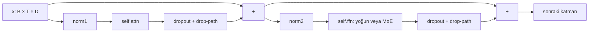

# 5. Transformer: dikkat hesabını öğrenilebilir bir bloğa dönüştürmek

[Kitabın içindekileri](../README.md) · [Önceki: Attention](04-attention.md) · [Sonraki: Eğitim](06-egitim.md)

Attention konumlar arasında bilgi taşır. Tek başına modelin tamamı değildir: her konumda özellikleri dönüştüren bir ileri besleme ağı, ölçek düzenleyen normalizasyonlar ve önceki temsili taşıyan residual bağlantılarla birleşir. Cevahir'in [TransformerEncoderLayer](../../../src/neural_network_module/ortak_katman_module/transformer_encoder_layer.py#L125) sınıfı bu birleşimi kurar. Adında “Encoder” bulunmasına rağmen, `causal_mask=True` ile kullanıldığı ana dil modeli akışı nedenseldir. Bu kitap sınıf adından çift yönlü erişim veya encoder–decoder mimarisi çıkarmayacaktır.

## Blok neden hem attention hem FFN içerir?

Attention bir konuma diğer konumların dönüştürülmüş değerlerini getirir. **FFN**, bu karışımın özelliklerini aynı konum içinde dönüştürür. Yoğun FFN'in aynı ağırlıkları bütün token konumlarında kullanılır; bu aşama kendi başına farklı konumlar arasında yeni bir toplama yapmaz.

Dropout ve stochastic depth'i şimdilik dışarıda bırakırsak, varsayılan seri pre-norm akışının denklemleri şöyledir:

`u = x + Attention(Norm₁(x))`

`y = u + FFN(Norm₂(u))`.

Residual bağlantıda alt ağ bütün temsili yeniden üretmek yerine mevcut temsile eklenecek katkıyı üretir. Bu aynı zamanda türev için kimlik yolunu korur: `y=x+f(x)` hesabının Jacobian'ı `I+J_f` olur. Bu cebirsel özellik her eğitim koşulunda kararlılık veya başarı garantisi değildir.



Bu şema [TransformerEncoderLayer._forward_impl](../../../src/neural_network_module/ortak_katman_module/transformer_encoder_layer.py#L532) içindeki **seri pre-norm** dalını gösterir. `pre_norm=False` olduğunda normalizasyon toplamadan sonra gelir: `u=Norm₁(x+Attention(x))`, `y=Norm₂(u+FFN(u))`. `parallel_residual=True` ancak pre-norm ile birlikte seçildiğinde [_parallel_forward_impl](../../../src/neural_network_module/ortak_katman_module/transformer_encoder_layer.py#L687) çağrılır; iki dal aynı `norm1(x)` girdisini alır. Kaynaktaki “parallel” aynı girdiyi paylaşan matematiksel dallanmayı ifade eder; Python çağrılarından otomatik eşzamanlı GPU yürütmesi sonucu çıkmaz.

## Normalizasyon: ortalamayı çıkarmak zorunlu mu?

LayerNorm son özellik ekseninin ortalamasını çıkarır ve varyansıyla ölçekler. RMSNorm ise ortalamayı çıkarmadan karelerin ortalamasına göre ölçekler:

`RMSNorm(x)_i = γ_i x_i / sqrt((Σ_j x_j²)/D + ε)`.

Burada `γ` öğrenilebilir ölçek, `ε` sıfıra bölünmeye karşı küçük sabittir. [RMSNorm çalışmasının](https://arxiv.org/abs/1910.07467) ayırt edici fikri yeniden merkezleme adımını kaldırmaktır. Cevahir'in [RMSNorm.forward](../../../src/neural_network_module/ortak_katman_module/rms_norm.py#L105) metodu, mevcutsa `F.rms_norm` çağırır; manuel fallback kareler ortalamasını float32 ile hesaplayıp sonucu giriş türüne döndürür. Bir kütüphane fonksiyonunun var olması, o çağrının her donanımda aynı kernel veya hızla yürüdüğü anlamına gelmez.

Katman kurucusunda `use_rmsnorm=True`, `norm1` ve `norm2` için RMSNorm seçer; kapatıldığında LayerNorm kurulur. Ana modelin son normalizasyonu da bu seçimden etkilenir. Önceki bölümde görülen embedding LayerNorm'u ayrı kalır. Attention nesnesinin kullanılmayan eski `norm` parametreleri ise checkpoint anahtarları için tutulur ve katman kurucusunda gradyanları kapatılır. Paralel pre-norm dalında kullanılmayan `norm2` için de aynı işlem uygulanır.

## Konum: RoPE embedding tablosuna eklenen bir sayı değildir

Kelime vektörleri tek başına sıra bilgisini vermez. Cevahir [PositionalEncoding](../../../src/neural_network_module/dil_katmani_module/positional_encoding.py#L51) aracılığıyla `sinusoidal`, `learned` ve `rope` yollarını sunar. İlk ikisi embedding üzerine konum vektörü ekler. RoPE yolunda asıl dönüşüm, attention içindeki Q ve K'ye uygulanır; V'ye uygulanmaz.

İki bileşenlik bir çift için konum `p` ve frekans `ω` dönüşümü:

`(a,b) ↦ (a cos(pω) − b sin(pω), a sin(pω) + b cos(pω))`.

[apply_rotary_pos_emb](../../../src/neural_network_module/dil_katmani_module/positional_encoding.py#L419), son ekseni ikişerli çiftler olarak işler; RoPE kurucusu bu nedenle head genişliğinin çift olmasını ister. Q ve K farklı konumlarda döndürüldüğünde nokta çarpımında göreli konum farkı etkisi oluşur; bu, [RoFormer/RoPE çalışmasının](https://arxiv.org/abs/2104.09864) temel ilişkisiyle eşleşir. `use_qk_norm=True` seçilirse Q/K head'lerine RMSNorm, bu döndürmeden **önce** uygulanır.

`rope_scaling_type="yarn"` ve `rope_scaling_factor>1` koşulunda [_build_yarn_rope_freqs](../../../src/neural_network_module/dil_katmani_module/positional_encoding.py#L235), düşük frekansları ölçekler, yüksekleri korur ve arada karışım uygular. Kitap bu dalı kodun verdiği adıyla anlatır; fonksiyonun adı, [YaRN makalesindeki](https://arxiv.org/abs/2309.00071) bütün eğitim ve ölçekleme reçetesinin aynen uygulandığını kanıtlamaz. Frekans tablosunu daha uzun yapmakla modelin bu uzunlukta dil kalitesini koruduğunu göstermek farklı işlerdir. Varsayılan `rope_scaling_type="none"`, faktör `1.0` olduğundan bu uzatma kapalıdır.

## SwiGLU: özellik üretmek ve kapılamak

Standart FFN, `D → F → D` doğrusal katmanları arasında aktivasyon kullanır. SwiGLU'da iki ayrı `F` boyutlu dönüşümün biri SiLU'dan geçer, diğeriyle bileşen bazında çarpılır:

`h = SiLU(xW_gateᵀ+b_gate) ⊙ (xW_upᵀ+b_up)`.

Sonraki projeksiyon `h`'yi tekrar `D` boyutuna indirir. Cevahir'in [FeedForwardNetwork._gated_forward](../../../src/neural_network_module/ortak_katman_module/feed_forward_network.py#L314) metodu iki ilk projeksiyonu tek katmanda toplar:

```python
x_proj = self.gate_up_proj(x)
gate, up = x_proj.chunk(2, dim=-1)
```

`gate_up_proj` çıktısı `[B,T,2F]`, iki parça `[B,T,F]` olur. Aktivasyon ve çarpımdan sonra dropout, ardından `fc2` çalışır. Bu, [GLU varyantları çalışmasındaki](https://arxiv.org/abs/2002.05202) kapılı FFN ailesiyle bağlantılıdır. Birleştirme iki matris çarpımı çağrısını tek çağrıya indirir; bu projede ölçüm yapılmadan hız yüzdesi verilemez.

Ana model `use_swiglu=True` için `swiglu`, kapalıyken `gelu` seçer. `ffn_dim=None` ise gerçek genişliği [resolve_ffn_dim](../../../src/neural_network_module/architecture_contracts.py#L7) belirler: kapısız yolda `4D`; kapılı yolda `int((2/3)·4D)` değeri 256'nın üst katına yuvarlanır. Örneğin `D=512` için kapılı genişlik `1536` olur. Bu nedenle “FFN her zaman 4D” ifadesi mevcut kod için yanlıştır. Açık `ffn_dim` verilirse o değer korunur.

## MoE: bütün tokenlara aynı FFN zorunlu değildir

`use_moe=True`, yoğun `FeedForwardNetwork` yerine [MixtureOfExperts](../../../src/neural_network_module/ortak_katman_module/mixture_of_experts.py#L215) kurar. [Router.forward](../../../src/neural_network_module/ortak_katman_module/mixture_of_experts.py#L173), her token için uzman logitlerini üretir, `top_k` uzmanı seçer ve yalnız seçilen logitler üzerinde softmax uygular. [MixtureOfExperts.forward](../../../src/neural_network_module/ortak_katman_module/mixture_of_experts.py#L349), her uzmana atanmış tokenları toplar; uzman çıktılarını yönlendirme ağırlıklarıyla birleştirip `[B,T,D]` üretir. Uzmanların belirli konularda uzmanlaştığı, yalnız bu sınıf adından anlaşılamaz; böyle bir iddia ayrıca ölçüm ister.

Router'a isteğe bağlı `[B,num_experts]` `routing_bias` verilebilir. Aynı batch satırındaki tokenlara aynı öncelik eklenir. Bu öncelik, öğrenilmiş router parametrelerinin yerine geçen yeni ağırlık dosyası değildir. Dolu KV cache sırasında değiştirilmesine ana model izin vermez; önce cache temizlenmelidir. Eğitimde ayarlı jitter, router logitlerine gürültü ekler; değerlendirmede eklenmez.

MoE çıktı yanında bir yardımcı yük dengeleme kaybı döndürür. `valid_token_mask` bu kaybın padding'i saymamasını sağlar; attention maskesinden ayrı bir sözleşmedir. [CevahirNeuralNetwork.get_and_reset_moe_loss](../../../src/neural_network.py#L970), katmanlardan o forward'a ait kayıpları alıp toplar. Katsayı zaten MoE içinde uygulanmıştır. Eğitim hedefi bu değeri bir kez tüketmelidir; cache, attention ağırlığı veya ana çapraz entropiyle karıştırmamalıdır.

## Seçeneğin bulunması, açık veya ölçülmüş olması değildir

| Özellik | Ortak şema varsayılanı | Gerçek etkinleşme koşulu |
| --- | --- | --- |
| RMSNorm / SwiGLU / RoPE | Açık / açık / `rope` | Kurucu seçimi ilgili modüllere aktarır. |
| MoE / QK-Norm | Kapalı / kapalı | İlgili boolean açık olmalı. |
| Paralel residual | Kapalı | `parallel_residual and pre_norm`. |
| Stochastic depth | `drop_path_rate=0` | Oran pozitif ve model eğitim modunda olmalı. |
| Aktivasyon checkpointing | Açık | Eğitim modunda yeniden hesaplama uygulanır. |
| RoPE uzatma | Kapalı | Uygun ölçekleme türü ve faktör gerekir. |

Varsayılanların kaynağı [ModelArchConfig](../../../model_management/config_schema.py#L76) ve [çekirdek kurucusudur](../../../src/neural_network.py#L111). İkisi her alanda özdeş değildir: şema sekiz, doğrudan çekirdek kurucusu on iki katman varsayar; `ModelManager` eski profili de ayrıca normalize eder. Bir çalışmayı tanımlarken yalnız “varsayılan model” demek yerine etkin ayar kaydı okunmalıdır.

[_stochastic_depth](../../../src/neural_network_module/ortak_katman_module/transformer_encoder_layer.py#L458), `[B,1,1]` Bernoulli maskesiyle residual katkıyı örnek bazında sıfırlar; kalan katkıyı `1/(1-p)` ile ölçekler. Attention ve FFN dalları ayrı çağrılarla maskelenir. Ana model oranı derinliğe göre sıfırdan hedefe dağıtır; tek katmanda oran sıfır kalır. Katkı hesaplandıktan sonra maskelendiği için bu uygulama, atlanan katmanın hesabını mutlaka tasarruf etmez. Değerlendirmede maskeleme yoktur.

Aktivasyon checkpointing ise kayıp için gereken ara aktivasyonları saklamak yerine backward sırasında yeniden hesaplar. [Katmanın forward metodu](../../../src/neural_network_module/ortak_katman_module/transformer_encoder_layer.py#L352) eğitimde checkpoint yoluna cache kapalı girer; yardımcı MoE kaybının yeniden hesaplamada ikinci kez kaydedilmesini engelleyen bağlam kullanır. Bu, diske model kaydetmekle aynı işlem değildir.

## Kaynaktan doğrulamaya geçiş

[FFN genişliği testi](../../../tests/evolution/test_lower_layer_contracts.py#L11) şemanın beklediği genişliği hem yoğun hem uzman ağırlıklarıyla karşılaştırır. [Paralel dal testi](../../../tests/evolution/test_lower_layer_contracts.py#L50) yalnız gerçekten kullanılmayan normalizasyonun dondurulduğunu; [MoE checkpoint testi](../../../tests/evolution/test_contextual_moe_routing.py#L121) yeniden hesaplama sırasında gradyanların ve yardımcı kaybın tek tüketiminin korunduğunu sınar. [Batched RoPE testi](../../../tests/evolution/test_attention_cache.py#L222) örneklerin farklı konum dizilerini denetler. Bunlar mimari sözleşme testleridir; daha uzun bağlamda dil kalitesinin veya uzmanlaşmanın kanıtı değildir.

Okuma alıştırması: seri ve paralel pre-norm için FFN'in aldığı girdiyi kaynakta bulun. İkisinin neden aynı hesap olmadığını açıklayın. Sonra `use_moe=True` değişikliğinin yalnız bir sınıf adını değil, eğitim hedefine eklenmesi gereken bir kaybı da değiştirdiğini çağrı zinciri üzerinde izleyin. [Mevcut çekirdek belgesi](../../modules/neural_network/README.md) kısa başvuru haritası olarak korunur; burada kavramların o haritadaki gerçek hesaba nasıl bağlandığı açılmıştır.
