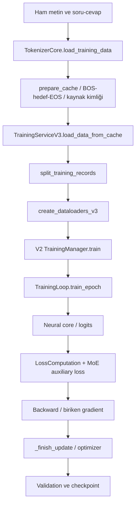

# 6. Veriden parametre güncellemesine

[İçindekiler](../README.md) · [Önceki: Transformer](05-transformer.md) · [Sonraki: Model yaşam döngüsü](07-model-yasam-dongusu.md)

Bir Transformer'ın doğru boyutta logits üretmesi, yararlı bir dil modeli olduğu anlamına gelmez. Eğitim, örneklerdeki hedef tokenları daha iyi öngörecek biçimde parametreleri değiştirir. Bu değişimin anlamını veri hazırlama belirler: hedef yanlış hizalanmışsa kusursuz çalışan optimizer yanlış görevi öğrenir. Bu yüzden eğitim anlatımını `backward()` satırından değil, metnin hedefe dönüşmesinden başlatıyoruz.

## Aynı veri, iki ayrı öğrenme işi

Tokenizer eğitimi sözlüğü ve birleşim kurallarını; dil modeli eğitimi bu kimliklerden sonraki kimlikleri öngören ağırlıkları belirler. İkisi aynı işlem değildir. Cevahir'in dil modeli eğitimi sırasında sözlüğü serbestçe büyüttüğünü varsayamayız. [`TokenizerCore.load_training_data`](../../../tokenizer_management/core/tokenizer_core.py#L720) mevcut tokenizer ile metinleri kodlar. Soru-cevap verisinde soru ve cevap arasına SEP yerleştirir, ham metni parçalara ayırır ve kaynak kimliğini taşır. Bu aşamadaki girdi/hedef listeleri hazırlanmış next-token batch'i ile karıştırılmamalıdır.

[`prepare_cache`](../../../training_system/prepare_cache.py#L62) içindeki `format_data_func`, normal kayıtta aynı token dizisinden şu çifti oluşturur:

```text
Metnin ID'leri:  [t1,  t2, t3]
Model girdisi:  [BOS, t1, t2, t3]
Hedef:         [t1,  t2, t3, EOS]
```

Her giriş konumunun çıktısı aynı konumdaki hedefe karşılaştırılır. Model `t2`yi girdide gördüğü konumda `t3`ü öngörür; nedensel attention gelecekteki konumlara erişimi engeller. Hazırlama kodundaki bağlantı:

```python
seq_in = [BOS_ID] + list(inp_ids)
seq_tgt = list(tgt_ids) + [EOS_ID]
```

Ardından uzunluk sınırı, EOS'un korunması ve PAD uygulanır. Uzun diziyi kesip son hedefi EOS yapmak, orijinal belgenin bitişiyle aynı olay değildir; hazırlama politikası öğrenilen durma davranışını etkiler. Eğitim döngüsü hedefleri **yeniden kaydırmaz**. Soru-cevap biçimi de kendiliğinden yalnız cevap tokenlarının kaybını hesaplayan bir maske demek değildir: hangi hedeflerin dışlandığı batch ve loss maskesinden okunur.

Cache, tokenlaştırmayı her epoch'ta yinelememek içindir. [`cache_identity.py`](../../../training_system/cache_identity.py) kaynak içeriğini, vocabulary/merges ve ilgili kodlama ayarlarını parmak izine katar. V3 tüketim yolu cache kimliği ve bütünlüğünü kontrol eder; aynı dosya adı aynı veri anlamına gelmez. Hazırlama komutunun varsayılan temizleme davranışı mevcut cache'i etkileyebilir; ayrıntılar için [hazırlama rehberi](../../modules/training_system/README.md) ve komutun gerçek seçenekleri birlikte okunmalıdır.

## Değerlendirme verisi gerçekten ayrı mı?

Aynı belgenin örtüşen parçalarını rastgele ikiye dağıtırsak validation kaybı yeni belge başarısını abartabilir. [`split_training_records`](../../../training_system/data_split.py#L6) aynı kaynak kimliğinin parçalarını birlikte tutar. Tam eş örnekler farklı kaynakları bağlıyorsa bu grupları da birleştirir. Kimlikler kısmen eksikse hata verir; tümünde yoksa içerik eşitliği üzerinden gruplama yapılabilir. En az iki bağımsız grup gerekir.

Bu yöntem semantik yakın kopyaların tamamını bulmaz. Bölme oranı kaynak grupları üzerinden hesaplandığından tokenların aynı oranda bölüneceği garanti değildir. Bir kaynağın bütün örnekleri çok uzunsa eğitim ve validation hacimleri dengesiz olabilir. Validation sonucunu yorumlarken yalnız oranı değil kaynak dağılımını da bilmek gerekir.

## Etkin çağrı yolu

[`training_system/train.py`](../../../training_system/train.py) kullanılabilir olduğunda V3 eğitim servisini, aksi import yolunda V2 servisini seçer. Ancak V3 servis adı bağımsız V3 optimizer döngüsünün etkin olduğu anlamına gelmez. [`TrainingServiceV3._run_training`](../../../training_system/v3/core/training_service_v3.py#L420), desteklenen **V2 `TrainingManager`** nesnesini kurar. Kaynaktaki eski “fallback” yorumundan daha belirleyici olan bu doğrudan import ve çağrıdır.



| Sınır | Girdi ve dönüşüm | Çıktı ve çağıran |
|---|---|---|
| `TrainingServiceV3.train` | Config, tokenizer, model yöneticisi, doğrulanmış cache | Loader ve eğitim bileşenlerini kurar; `_run_training`e verir. |
| [`create_dataloaders_v3`](../../../training_system/v3/data/dataloader_v3.py#L178) | Hazırlanmış eğitim/validation kayıtları, PAD ve batch ayarları | V3 dataset/collator üzerinden iki loader; servise döner. |
| `TrainingManager.train` | Model, optimizer, criterion, loader ve config | Epoch döngüsü, validation, scheduler/checkpoint koordinasyonu. |
| [`TrainingLoop.train_epoch`](../../../training_management/v2/core/training_loop.py#L283) | `[B,T]` giriş ve hedef batch'leri | Modeli doğrudan çağırır; logits ile kayıp üretir, ağırlıkları günceller. |
| [`LossComputation.compute_loss`](../../../training_management/v2/core/loss_computation.py#L76) | `[B,T,V]` logits ve `[B,T]` hedef | Türevlenebilir skaler kayıp, accuracy, raporlanan perplexity. |

`use_bucket_batching=True` benzer uzunlukları bir araya getirerek dolgu israfını azaltmayı amaçlar. `use_dynamic_padding=True` batch'i kendi uzunluğuna göre hazırlar; her örneği küresel üst sınıra taşımak gerekmez. Bunlar model mimarisi değiştirmez, işlenen PAD miktarını ve batch sırasını etkiler. [`create_dataloader_v3`](../../../training_system/v3/data/dataloader_v3.py#L45) shuffle açıkken bucket sampler seçer; validation sıralı kalır. `batch_size`, `num_buckets`, `max_seq_length`, `num_workers` ve aygıta bağlı `pin_memory` maliyetleri etkiler. Daha az padding her makinede ölçülmüş hız kazancı demek değildir.

## Loss, gradient ve geri yayılım

Basit next-token kaybı, hedef tokenın negatif log olasılığıdır:

$$
L(\theta)=\frac{1}{N}\sum_{b,t}m_{bt}\big[-\log p_\theta(y_{bt}\mid x_{b,\leq t})\big],
\qquad N=\sum_{b,t}m_{bt}.
$$

Burada `m`, geçerli hedef maskesidir. Cevahir `PAD` ve `-100` hedeflerini dışlar. Logits üzerinde float32 cross-entropy hesaplanır; criterion'daki sınıf ağırlıkları ve `label_smoothing` kullanılır. Dolayısıyla EOS ağırlığı veya smoothing etkin olduğunda hedef tam olarak yukarıdaki yalın denklem değildir. `entropy_coeff` ayrıca tahmin entropisini ödüllendiren bir terim ekleyebilir. Bu ayarların etkisi “daha akıllı model” gibi genel bir sonuçla değil, değişen amaç fonksiyonuyla açıklanmalıdır.

Gradient, kaybın her parametreye göre yerel türevidir. Backpropagation zincir kuralıyla bu türevleri hesaplar; **parametreyi kendisi değiştirmez**. PyTorch işlemlerin hesap grafiğini izler, `backward()` ile gradientleri biriktirir; optimizer bunları kullanır. [PyTorch'un autograd anlatımı](https://docs.pytorch.org/tutorials/beginner/basics/autogradqs_tutorial.html) mekanizmanın bağımsız açıklamasıdır. Cevahir karşılığı `TrainingLoop.train_epoch` içindeki ileri geçiş → kayıp → backward zinciridir.

Yoğun modelde örnek optimizer adımı `θ ← θ − ηg` olabilir. AdamW gibi yöntemler ise geçmiş gradientlerden ek durum taşır ve koordinatlara göre adımı ölçekler. [`ModelManager.build_optimizer`](../../../model_management/model_manager.py#L298), [`ModelInitializer.initialize_optimizer`](../../../model_management/model_initializer.py#L251) üzerinden bu seçimi yapar. Yerel varsayılan `optimizer="adamw"`dir; etkin öğrenme oranı üst config tarafından belirlenebilir. `learning_rate`, `weight_decay`, `betas`, `eps`, `embedding_lr_scale` ve isim tabanlı decay grupları burada kullanılır. Bias/norm grupları ile embedding grubu aynı kuralı paylaşmayabilir. SGD daha az optimizer durumu tutan bir alternatiftir; birinin üstünlüğü bu kodun varlığından çıkarılamaz.

## Birikimin doğru paydası

GPU/CPU belleği büyük batch'e yetmezse birkaç küçük batch'in gradientleri biriktirilebilir. Fakat her batch'in ortalama kaybını eşit ağırlıkla toplamak, 2 geçerli tokenla 20 geçerli tokena aynı etkiyi verir. Cevahir'in döngüsü ortalama kaybı batch'in geçerli hedef sayısıyla çarpar:

```python
scaled_loss = loss * valid_tokens
```

Sonra [`_finish_update`](../../../training_management/v2/core/training_loop.py#L246), biriken gradienti toplam geçerli token sayısına böler. Son eksik birikim grubu da işlenir. MoE etkinse [`consume_model_auxiliary_loss`](../../../training_management/contracts.py#L35) çekirdeğin zaten ağırlıklandırdığı yardımcı hedefi bir kez tüketir; router kaybı kullanılmayan bir açıklama alanı değildir. Batch düzeyindeki yardımcı terim de aynı birikim yolundan geçtiğinden, denklemde yalnız dil kaybı varmış gibi değerlendirme yapılmamalıdır.

Adım sırasında varsa scaler önce gradientleri gerçek ölçeğe getirir; sonlu olmayan gradientler reddedilir; clipping uygulanır; optimizer adımı gerçekleştirilir; gradientler temizlenir. Scheduler'ın warmup adımı gerçekleşen optimizer güncellemesine bağlanır. `grad_accum_steps` yalnız hız ayarı değildir: kaç deneyimin bir güncellemede birleştiğini değiştirir.

[`resolve_precision`](../../../training_management/contracts.py#L20), `auto/fp32/fp16/bf16` isteğini aygıt ve AMP koşullarıyla çözer. CPU'da fp16 isteği fp32'ye düşer; açık bf16 isteği CPU autocast kullanabilir. CUDA bf16 desteği ayrıca aranır. CPU testinin geçmesi CUDA veya Flash yolunun sınandığı anlamına gelmez.

## Bir bayrak, uygulanmış yöntem değildir

[`validate_training_backend`](../../../training_management/contracts.py#L5) yalnız entegre V2 backend'ine izin verir. EMA, SWA, SAM, lookahead, curriculum, scheduled sampling ve listelenen diğer desteklenmeyen seçenekler açıkken hata üretir. Distributed eğitim stratejisi de bu uçtan uca hatta desteklenmez. Ayrı modülde sınıf veya config alanı bulunması bu yöntemlerin çalışan eğitim servisine entegre olduğunu göstermez. Kitap bu sınırı korur.

Validation ileri geçiş yapar ve ağırlıkları güncellemez; modelin görmediği ayrılmış kayıtlarda aynı hedefin başarısını ölçer. `compute_loss` tarafından raporlanan perplexity `exp(min(20, loss))`tur. Sınıf ağırlığı, smoothing veya entropy terimi kullanıldığında bu sayı saf negatif log olasılığın standart perplexity'si değildir. Benzer şekilde düşük validation kaybı araç kullanımı, doğruluk veya sürekli öğrenme kanıtı değildir.

## Hangi kanıtı okuyabiliriz?

[Eğitim sözleşmesi testleri](../../../tests/evolution/test_training_contracts.py) token ağırlıklı birikimi, son grubu, gerçek V3 servis–V2 döngü bağlantısını, MoE yardımcı hedefini ve resume davranışlarını küçük koşullarda denetler. [Veri/cache testleri](../../../tests/evolution/test_data_cache_contracts.py) kaynak ayrımı, kimlik ve bütünlük sınırlarını izler. Ayrıntılı kullanım için mevcut [training_system](../../modules/training_system/README.md) ve [training_management](../../modules/training_management/README.md) rehberleri korunmuştur.

Eğitim sonunda ağırlıkların değişmesi bir başlangıçtır. Bu değişimi tekrar yükleyebilmek, aynı tokenizer anlamıyla kullanabilmek ve sonraki eğitime doğru durumdan devam edebilmek ayrı sözleşmelerdir. Şimdi ağırlık dosyasının neden tek başına bütün model yaşamını saklamadığını inceleyeceğiz.

[Sonraki: Model yaşam döngüsü](07-model-yasam-dongusu.md) · [İçindekiler](../README.md)
