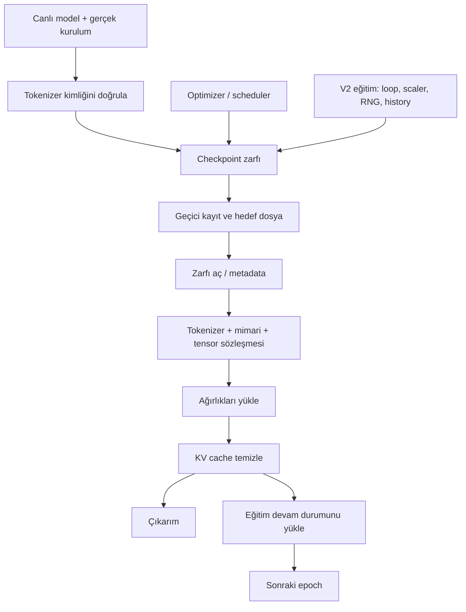

# 7. Model kimliği, checkpoint ve devam

[İçindekiler](../README.md) · [Önceki: Eğitim](06-egitim.md) · [Sonraki: Üretim](08-uretim.md)

Bir checkpoint, belirli bir anda saklanan hesap durumudur. Sadece ağırlıkları saklamak gelecekte aynı ileri geçişi kurmaya yardım eder; aynı eğitim sürecine devam etmek için optimizer'ın geçmişi ve rastgelelik durumu da gerekebilir. Üstelik “aynı ağırlık” ancak aynı mimari ve aynı token anlamları içinde aynı hesabı ifade eder.

## Model hangi bilgiyle kurulur?

[`ModelManager.initialize`](../../../model_management/model_manager.py#L312) modeli ve istendiyse optimizer, criterion, scheduler bileşenlerini kurar. Sayısal çekirdeğin oluşturulması `build_model` üzerinden yapılandırma normalleştirmesine bağlanır. [`normalize_model_config`](../../../model_management/config_schema.py) eski alanlar, düz/nested ayarlar ve uyumluluk profillerini işler. Doğrudan constructor'ın varsayılanlarını normalize edilmiş uygulama config'inin varsayılanı sanmamalıyız; [Transformer bölümü](05-transformer.md) bu ayrımı somutlaştırır.

Çekirdek gerçek kurulum bilgisini `_ctor_cfg` içinde taşır. [`model_config`](../../../model_management/checkpoint_contract.py#L27) bunu checkpoint için alır; yöneticinin sonradan değişmiş sözlüğü tek başına inşa gerçeği sayılmaz. Örneğin aynı tensor boyutlarıyla farklı head düzeni veya konum ölçeklemesi farklı hesap yapabilir. Bu yüzden boyut uyumluluğu gerekli olsa bile tek başına yeterli değildir.

| Durum | Neyi saklar? | Neye yetmez? |
|---|---|---|
| Ağırlık `state_dict`i | Parametreler ve kaydedilen buffer'lar | Mimari seçimi, token anlamları veya eğitim sırası kendiliğinden anlaşılmaz. |
| Model checkpoint'i | Zarfın içeriğine göre ağırlık, kurulum, optimizer/scheduler, epoch ve kimlik | Her save yolu tam eğitim devam durumunu içermez. |
| Etkin eğitim checkpoint'i | V2 yöneticinin loop/scaler, RNG, scheduler, history ve erken durma durumunu da içerir | Epoch ortasındaki loader konumu veya bütün dış dünya durumu saklanmış sayılmaz. |
| KV cache | Aktif üretimde yeniden kullanılacak attention ara hesabı | Model ağırlığı veya kalıcı öğrenme değildir; yükleme sonrasında temizlenir. |
| Konuşma / deneyim belleği | Ayrı katmanın olayları, bağlamı veya politika istatistikleri | Sinir ağının checkpoint'i bunları otomatik içermez. |

PyTorch'un [kaydetme ve yükleme rehberi](https://docs.pytorch.org/tutorials/beginner/saving_loading_models.html) ağırlıklar ile genel eğitim checkpoint'i ayrımını açıklar. Buradaki asıl sözleşme ise Cevahir'in hangi alanları gerçekten yazıp okuduğudur.

## Kaydetme: tek isim altında farklı kapsamlar

[`ModelManager.save`](../../../model_management/model_manager.py#L657) güncel imzasında `save_path`, anahtar sözcük olarak `epoch` ve `additional_info` alır; mutlak kayıt yolunu döndürür. Önce modeldeki tokenizer kimliğiyle bağlı tokenizer'ı karşılaştırır. Sonra `ModelSaver.save_model`e modeli, varsa optimizer/scheduler'ı ve metadata'yı aktarır. Bu çağrıya tarihsel rehberde görülen `metadata=` veya `keep_last_n=` adlarını aynen geçirmek güncel API kullanımı değildir.

[`ModelSaver`](../../../model_management/model_saver.py) geçici dosyaya yazıp `os.replace` ile hedefi değiştiren kayıt yardımcısını kullanır. Bu, yarım yazılmış dosyanın nihai adla görünmesini azaltır; elektrik kesintisi ve bütün donanım arızaları için evrensel dayanıklılık kanıtı değildir. Etkin V2 eğitimin [`CheckpointManager`](../../../training_management/v2/utils/checkpoint_manager.py) yolu ise ayrı uygulamadır: döndürme/saklama ve `last.pth` gibi eğitim kayıtlarını yönetir, kendi atomik kayıt yardımcısında önce bellekte serileştirme yapar. Büyük modelin RAM maliyeti açısından iki kaydetme yolunu özdeş sayamayız.

`E` oku yalnız o bilgiyi kaydeden eğitim yoluna aittir. Her model kayıt dosyasının RNG tuttuğu iddia edilmez.

## Yükleme: doğru sayıları yanlış anlama bağlamamak

[`ModelManager.load`](../../../model_management/model_manager.py#L694), checkpoint'i yükleyip [`unpack_checkpoint`](../../../model_management/checkpoint_contract.py#L7) ile zarfını çözer. `model_state_dict`/`state_dict` ve eski optimizer/scheduler alan adları tanınır; ham tensor sözlüğü için de uyumluluk yolu vardır. Yüklenecek model yoksa kayıtlı kurulum bilgisiyle kurar; var olan modele yüklerken mimari ve şekil denetimleri yapar.

[`validate_tokenizer_identity`](../../../model_management/checkpoint_contract.py#L67) kayıtlı kimlik varsa aynı tokenizer parmak izini ister. Aynı `vocab_size=V`, her `i` kimliğinin aynı tokenı gösterdiğini kanıtlamaz. Kimliksiz eski checkpoint'e açık uyarıyla izin verilen yol da vardır: bu uyumluluk kolaylığı, anlamın doğrulandığı demek değildir.

[`validate_model_identity`](../../../model_management/checkpoint_contract.py#L36) yalnız `D`, `V`, katman ve head sayısını değil, RoPE, MoE, normalization, residual, causal/window ve benzeri hesap seçeneklerini karşılaştırır. [`validate_state_shapes`](../../../model_management/checkpoint_contract.py#L56) yükleme bazı parametreleri değiştirmeden önce eksik/fazla anahtarları ve tensor şekillerini kontrol eder. `strict=False` her anlamsal uyumsuzluğu kabul etme izni değildir; tokenizer ve mimari sözleşmeleri ayrı kalır.

Optimizer/scheduler geri yükleme, model yöneticisinde kopyalanmış durum üzerinde önceden denenir. Bu iyi bir hata sınırıdır; bütün `load` çağrısının eksiksiz bir transaction olduğu ileri sürülmez. Modelin ilk kurulması veya bazı yan durumlar daha önce gerçekleşebilir. V2 eğitim yöneticisinin resume yolu da model ağırlığını yükledikten sonra optimizer durumunda hata verebilir. Güvenli yükleme davranışını değerlendirirken tam olarak hangi adımın atomik olduğunu söylemeliyiz.

`weights_only` sözcüğünün iki etkisini de izlemek gerekir: alttaki yükleyicinin serileştirme politikasına gider ve yönetici yolunda optimizer/scheduler geri yükleme isteğini etkiler. Güncel loader'ın güvenli varsayımları ile açıkça güvenilen tam-modül uyumluluk yolu [alt sözleşmelerde](../../architecture/LOWER_CORE_CONTRACTS.md) ve [checkpoint testlerinde](../../../tests/evolution/test_checkpoint_lifecycle.py) kayıtlıdır. Eski örneklerdeki sınırsız pickle yüklemesini güncel varsayılan gibi kopyalamayın.

## Devam etmek, yeniden başlamakla nasıl ayrılır?

Adam türü optimizer aynı ağırlıklar ve aynı batch verilse bile farklı moment durumuyla farklı adım atabilir. Dropout başka rastgele sayılar kullanırsa gradient farklılaşabilir. Warmup sayacı sıfırlanırsa öğrenme oranı farklı olur. Tam eğitim devamı bu nedenle yalnız `model.load_state_dict` değildir.

[`TrainingManager._checkpoint_extra_state`](../../../training_management/v2/core/training_manager.py#L274) scheduler, loop/scaler, en iyi validation kaybı, erken durma sayacı ve Python/NumPy/PyTorch/CUDA RNG durumlarını toplar. [`resume_from_checkpoint`](../../../training_management/v2/core/training_manager.py#L293) kimlikleri ve tensorları kontrol eder; model, optimizer, history ve ek durumu yükler. Bir sonraki başlangıç `saved_epoch + 1`dir. `train()` burada ek epoch'ları yürütür. Eski kayıtta ek durum yoksa tam devamın mümkün olmadığı uyarısını verir.

Bu **epoch sınırında devam** sözleşmesidir. Epoch ortasında hangi batch'in işlendiğini eksiksiz kaydeden bir sistem değildir. Aynı makine, aygıt, veri, sıra ve desteklenen operasyon koşullarında yapılan dropout devam testi güçlü bir regresyon kontrolüdür; farklı donanımlarda bit düzeyinde eşitlik garantisi değildir.

[`TrainingServiceV3._find_checkpoint`](../../../training_system/v3/core/training_service_v3.py#L545) otomatik aramada `last.pth`i `best.pth`ten önce değerlendirir. “En son devam noktası” ile “validation ölçütüne göre en iyi nokta” farklı amaçlardır. Çıkarım için model seçerken hangi kaydı kullandığınızı ayrıca kaydetmelisiniz.

## Kullanım modunu öğrenmeyle karıştırmamak

`eval()` dropout gibi katmanların davranışını değiştirir, fakat kendi başına autograd'ı kapatmaz. Gradyan kaydını kapatmak da tek başına `eval()` ile aynı şey değildir. [`ModelManager.forward`](../../../model_management/model_manager.py#L486), `inference=True` yolunda bu kullanım düzenini yönetir ve önceki modu geri alır. Ağırlıklar aynıyken cache ve rastgelelik yüzünden çalışma davranışı değişebilir; bunun eğitim olup olmadığını kalıcı durum değişimine bakarak ayırırız.

Bu ayrım araştırmaya da uzanır: [sonlu durum deneyindeki](../../research/living_learning_state_2026_09_20/REPORT_TR.md) “çalışan grafiği saklama” ile “sonraki deneyimde grafiği tekrar öğrenebilmek için kanıtı saklama” aynı kapsam değildir. Transformer checkpoint'i ile bu küçük deneyin öğrenme durumu farklı mekanizmalardır; ortak soru, gelecekte hangi işlemleri sürdürebilmek için neyin korunması gerektiğidir.

## Kontrol ve eski belgeler

[Checkpoint yaşam döngüsü testleri](../../../tests/evolution/test_checkpoint_lifecycle.py) mimari/tokenizer uyuşmazlığı, farklı kayıt yolları ve hatadan önce durum koruma sınırlarını; [eğitim sözleşmesi testleri](../../../tests/evolution/test_training_contracts.py) etkin resume davranışını; [runtime yaşam döngüsü testleri](../../../tests/evolution/test_runtime_lifecycle.py) çalışma sırasında geçici durumun yönetimini denetler. Testlerin tamamını genel dil kalitesi veya sonsuz süre güvenilirlik belgesi olarak okumayız.

[Model yönetimi rehberi](../../modules/model_management/README.md) tarihsel ayrıntılarıyla korunmuştur. Bazı örneklerdeki `setup_tensorboard` güncel `configure_tensorboard` adına, save argümanları güncel imzaya uymayabilir; loss'u ikinci kez kaydıran eski örnek etkin döngüyle karıştırılmamalıdır. [Yaşam döngüsü konsolidasyon kaydı](../../architecture/LIFECYCLE_CONSOLIDATION.md) değişikliklerin gerekçelerini taşır. Kitap bu belgeleri silmek yerine hangi noktada kodla yeniden karşılaştırılacaklarını gösterir.

[Sonraki: Üretim](08-uretim.md) · [İçindekiler](../README.md)
