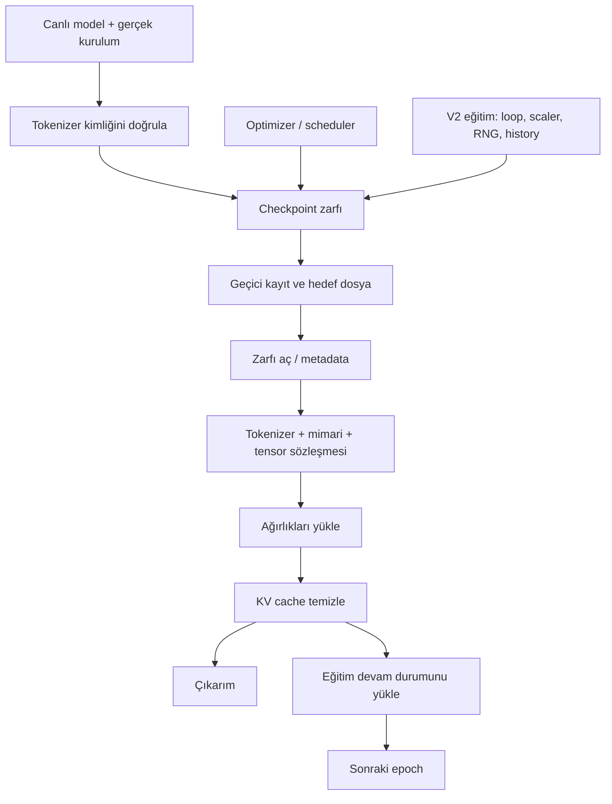

# 7. Model kimliği, checkpoint ve devam

[İçindekiler](../README.md) · [Önceki: Eğitim](06-egitim.md) · [Sonraki: Üretim](08-uretim.md)

Bir checkpoint, belirli bir anda saklanan hesap durumudur. Sadece ağırlıkları saklamak gelecekte aynı ileri geçişi kurmaya yardım eder; aynı eğitim sürecine devam etmek için optimizer'ın geçmişi ve rastgelelik durumu da gerekebilir. Üstelik “aynı ağırlık” ancak aynı mimari ve aynı token anlamları içinde aynı hesabı ifade eder.

Bu bölümün hedefi bir dosyayı kaydetmenin ötesindedir: hangi gelecekteki işlemi yeniden üretmek istediğimizi tanımlayıp, bunun için gereken durumu ayıracağız. Ön koşul [parametre güncellemesi bölümüdür](06-egitim.md). Kaynak inceleme ve CPU örneklerinin tarihi **21 Eylül 2026**'dır. “Yüklendi” mesajını modelin kimliğinin, eğitim devamının ve dosya bütünlüğünün aynı anda doğrulandığı anlamında kullanmayacağız.

## Model hangi bilgiyle kurulur?

[`ModelManager.initialize`](../../../model_management/model_manager.py#L312) modeli ve istendiyse optimizer, criterion, scheduler bileşenlerini kurar. Sayısal çekirdeğin oluşturulması `build_model` üzerinden yapılandırma normalleştirmesine bağlanır. [`normalize_model_config`](../../../model_management/config_schema.py) eski alanlar, düz/nested ayarlar ve uyumluluk profillerini işler. Doğrudan constructor'ın varsayılanlarını normalize edilmiş uygulama config'inin varsayılanı sanmamalıyız; [Transformer bölümü](05-transformer.md) bu ayrımı somutlaştırır.

Çekirdek gerçek kurulum bilgisini `_ctor_cfg` içinde taşır. [`model_config`](../../../model_management/checkpoint_contract.py#L27) bunu checkpoint için alır; yöneticinin sonradan değişmiş sözlüğü tek başına inşa gerçeği sayılmaz. Örneğin aynı tensor boyutlarıyla farklı head düzeni veya konum ölçeklemesi farklı hesap yapabilir. Bu yüzden boyut uyumluluğu gerekli olsa bile tek başına yeterli değildir.

| Durum | Neyi saklar? | Neye yetmez? |
|---|---|---|
| Ağırlık `state_dict`i | Parametreler ve kaydedilen buffer'lar | Mimari seçimi, token anlamları veya eğitim sırası kendiliğinden anlaşılmaz. |
| Model checkpoint'i | Zarfın içeriğine göre ağırlık, kurulum, optimizer/scheduler, epoch ve kimlik | Her save yolu tam eğitim devam durumunu içermez. |
| Etkin eğitim checkpoint'i | V2 yöneticinin loop/scaler, RNG, scheduler, history ve erken durma durumunu da içerir | Epoch ortasındaki loader konumu veya bütün dış dünya durumu saklanmış sayılmaz. |
| KV cache | Aktif üretimde yeniden kullanılacak attention ara hesabı | Model ağırlığı veya kalıcı öğrenme değildir; yükleme sonrasında temizlenir. |
| Konuşma / deneyim belleği | Ayrı katmanın olayları, bağlamı veya politika istatistikleri | Sinir ağının checkpoint'i bunları otomatik içermez. |

PyTorch'un [kaydetme ve yükleme rehberi](https://docs.pytorch.org/tutorials/beginner/saving_loading_models.html) ağırlıklar ile genel eğitim checkpoint'i ayrımını açıklar. Buradaki asıl sözleşme ise Cevahir'in hangi alanları gerçekten yazıp okuduğudur.

### Parametre, buffer, çalışma modu ve dış durum

**Parametre**, optimizer'a verilebilen öğrenilebilir tensördür; dondurulması onun kayıttan çıkarıldığı anlamına gelmez. **Buffer**, parametre olmayan fakat modülle birlikte yönetilen tensördür. PyTorch `state_dict`, parametreler ile kalıcı olarak kaydedilmiş buffer'ları içerir; `persistent=False` buffer'lar dahil değildir. Bu tanım her Python alanının serileştirildiği anlamına gelmez. [PyTorch, Serialization semantics](https://docs.pytorch.org/docs/stable/notes/serialization.html).

Cevahir'in sinüsoidal/RoPE tablolarının kaydedilmeyen buffer olması, bunları yeniden üretmek için kurulum bilgisinin önemini artırır. `model.training`, dış tokenizer nesnesi, Python/NumPy RNG durumları veya DataLoader'ın okuma konumu sıradan model `state_dict`inden otomatik geri gelmez. Weight tying de yalnız eşit iki sayı tablosu değildir: input embedding ile output projeksiyonunun aynı parametre nesnesini paylaşması gerekir. Aynı değerlerle başlatılmış iki bağımsız tablo, sonraki optimizer adımında farklılaşabilir.

Model kimliğini üç düzeyde okuyabiliriz: **yapısal kimlik**, hangi işlemlerin ve boyutların kurulduğu; **sayısal kimlik**, hangi parametre/buffer değerlerinin kullanıldığı; **anlamsal kimlik**, giriş/çıkış indislerinin hangi tokenlara karşılık geldiği. Bunlara yürütme ortamı ve deney verisi eklenmeden bütün araştırma koşulları tanımlanmış olmaz. Aynı dosya adı bu düzeylerin hiçbirini tek başına güvenceye almaz.

### Tokenizer parmak izinin kapsamı

[`tokenizer_digest`](../../../training_system/cache_identity.py#L27), kimlik sürümü, token→indis sözlüğü, varsa merge dosyasının byte özeti ve BPE yapılandırmasını düzenli JSON'a çevirip SHA-256 hesaplar. Sözlük büyüklüğü aynı kalırken iki tokenın indisleri yer değiştirebilir; embedding satırları aynı olsa bile metnin anlamlandırılması değişir. Bu yüzden `vocab_size` kontrolü parmak izinin yerini tutmaz.

Parmak izi yalnız içine alınan alanları temsil eder. Tokenizer kodunun gelecekteki bütün davranış değişikliklerini, eğitim metninin tamamını veya modelin yazılım bağımlılıklarını kendiliğinden kapsamaz. Ayrıca merge dosyası byte düzeyinde özetlendiği için yalnız satır sonu dönüşümü bile özeti değiştirebilir. Böyle bir eşleşmeme mutlaka dilsel davranışın değiştiğini ispatlamaz; kaydın byte sözleşmesinin değiştiğini gösterir. Tekrarlanabilir deneyde kaynak kodu sürümü, veri bölümü ve tokenizer kimliği birlikte tutulur.

## Kaydetme: tek isim altında farklı kapsamlar

[`ModelManager.save`](../../../model_management/model_manager.py#L657) güncel imzasında `save_path`, anahtar sözcük olarak `epoch` ve `additional_info` alır; mutlak kayıt yolunu döndürür. Önce modeldeki tokenizer kimliğiyle bağlı tokenizer'ı karşılaştırır. Sonra `ModelSaver.save_model`e modeli, varsa optimizer/scheduler'ı ve metadata'yı aktarır. Bu çağrıya tarihsel rehberde görülen `metadata=` veya `keep_last_n=` adlarını aynen geçirmek güncel API kullanımı değildir.

[`ModelSaver`](../../../model_management/model_saver.py) geçici dosyaya yazıp `os.replace` ile hedefi değiştiren kayıt yardımcısını kullanır. Bu, yarım yazılmış dosyanın nihai adla görünmesini azaltır; elektrik kesintisi ve bütün donanım arızaları için evrensel dayanıklılık kanıtı değildir. Etkin V2 eğitimin [`CheckpointManager`](../../../training_management/v2/utils/checkpoint_manager.py) yolu ise ayrı uygulamadır: döndürme/saklama ve `last.pth` gibi eğitim kayıtlarını yönetir, kendi atomik kayıt yardımcısında önce bellekte serileştirme yapar. Büyük modelin RAM maliyeti açısından iki kaydetme yolunu özdeş sayamayız.



`E` oku yalnız o bilgiyi kaydeden eğitim yoluna aittir. Her model kayıt dosyasının RNG tuttuğu iddia edilmez.

### İki farklı atomiklik sınırı

[`_torch_save_atomic`](../../../model_management/model_saver.py#L96) benzersiz bir komşu geçici dosyaya yazar, `flush` ve dosya `fsync` çağrısından sonra `os.replace` yapar. Bu yöntem nihai ada kısmen yazılmış içerik sunmama amacındadır. Klasör metadata'sının kalıcılığı, dosya sistemi özellikleri ve aygıt arızası ayrıca değerlendirilir. Atomik ad değiştirme; model, optimizer, tokenizer ve deney günlüğünün hepsinin tek transaction ile kaydedildiğini göstermez.

V2 [`CheckpointManager._atomic_save`](../../../training_management/v2/utils/checkpoint_manager.py#L343), önce `BytesIO` içinde serileştirir, sonra `dst_path + ".tmp"` dosyasına yazar. Dolayısıyla serileştirilmiş kopya RAM'de de bulunur; aynı hedefe eşzamanlı yazan iki sürecin geçici dosya adı da ayrışmaz. Bu metot tek yazıcılı kullanım kapsamında okunmalıdır. Üstelik [`_update_alias`](../../../training_management/v2/utils/checkpoint_manager.py#L364), `last.pth`/`best.pth` kopyasını doğrudan `shutil.copy2` ile günceller. Ana checkpoint'in atomik yazılması bu kopyalama adımının da atomik olduğunu kanıtlamaz. Kitap çalışan işlemi esas alır; yorumdaki “replace” sözcüğünü ek bir güvence saymaz.

### Checksum neyi doğrular, neyi doğrulamaz?

[`ModelSaver.save_checkpoint`](../../../model_management/model_saver.py#L218) ile `ModelManager.save` aynı yol değildir. İlki final dosya için `.sha256` yan dosyası üretir; yöneticinin kullandığı `save_model` bu yan dosyayı üretmez. `save_checkpoint` içindeki `metadata.sha256` alanı ise hash henüz eklenmeden yapılan **ilk serileştirmenin** özetidir. Hash alanı eklendikten sonraki final dosyanın özetiyle aynı olması beklenmez. Final byte karşılaştırması için yan dosya kullanılır.

[`_verify_sha256`](../../../model_management/model_loader.py#L114), yan dosya mevcut ve okunabilirken bütünlüğü karşılaştırır; farklı byte'larda hata verir. Yan dosya yoksa veya okunamazsa kontrol atlanır. Dolayısıyla bu fonksiyonun `True` dönmesi her zaman “özet doğrulandı” demek değildir. V2 `resume_from_checkpoint` doğrudan `torch.load` kullanır; burada anlatılan yan dosya kontrolünü otomatik çağırmaz.

SHA-256, eldeki dosyanın beklenen byte'larla eşleşmesini sınar. Dosya ve yan dosya birlikte değiştirilirse aynı kaynak kişiye ait olduklarını kanıtlamaz; imza veya güvenilir yayın kaydı başka bir problemdir. Özet eşleşmesi model mimarisinin doğru olduğuna, token indislerinin değişmediğine veya yayımlanan deneyin bilimsel geçerliliğine de karar vermez. Byte bütünlüğü, yazarlık ve deney doğrulaması ayrı iddialardır.

## Yükleme: doğru sayıları yanlış anlama bağlamamak

[`ModelManager.load`](../../../model_management/model_manager.py#L694), checkpoint'i yükleyip [`unpack_checkpoint`](../../../model_management/checkpoint_contract.py#L7) ile zarfını çözer. `model_state_dict`/`state_dict` ve eski optimizer/scheduler alan adları tanınır; ham tensor sözlüğü için de uyumluluk yolu vardır. Yüklenecek model yoksa kayıtlı kurulum bilgisiyle kurar; var olan modele yüklerken mimari ve şekil denetimleri yapar.

[`validate_tokenizer_identity`](../../../model_management/checkpoint_contract.py#L67) kayıtlı kimlik varsa aynı tokenizer parmak izini ister. Aynı `vocab_size=V`, her `i` kimliğinin aynı tokenı gösterdiğini kanıtlamaz. Kimliksiz eski checkpoint'e açık uyarıyla izin verilen yol da vardır: bu uyumluluk kolaylığı, anlamın doğrulandığı demek değildir.

[`validate_model_identity`](../../../model_management/checkpoint_contract.py#L36) yalnız `D`, `V`, katman ve head sayısını değil, RoPE, MoE, normalization, residual, causal/window ve benzeri hesap seçeneklerini karşılaştırır. [`validate_state_shapes`](../../../model_management/checkpoint_contract.py#L56) yükleme bazı parametreleri değiştirmeden önce eksik/fazla anahtarları ve tensor şekillerini kontrol eder. `strict=False` her anlamsal uyumsuzluğu kabul etme izni değildir; tokenizer ve mimari sözleşmeleri ayrı kalır.

Optimizer/scheduler geri yükleme, model yöneticisinde kopyalanmış durum üzerinde önceden denenir. Bu iyi bir hata sınırıdır; bütün `load` çağrısının eksiksiz bir transaction olduğu ileri sürülmez. Modelin ilk kurulması veya bazı yan durumlar daha önce gerçekleşebilir. V2 eğitim yöneticisinin resume yolu da model ağırlığını yükledikten sonra optimizer durumunda hata verebilir. Güvenli yükleme davranışını değerlendirirken tam olarak hangi adımın atomik olduğunu söylemeliyiz.

`weights_only` sözcüğünün iki etkisini de izlemek gerekir: alttaki yükleyicinin serileştirme politikasına gider ve yönetici yolunda optimizer/scheduler geri yükleme isteğini etkiler. Güncel loader'ın güvenli varsayımları ile açıkça güvenilen tam-modül uyumluluk yolu [alt sözleşmelerde](../../architecture/LOWER_CORE_CONTRACTS.md) ve [checkpoint testlerinde](../../../tests/evolution/test_checkpoint_lifecycle.py) kayıtlıdır. Eski örneklerdeki sınırsız pickle yüklemesini güncel varsayılan gibi kopyalamayın.

### `strict`, sayı türü ve cihaz aynı denetim değildir

`strict=True` yüklenen anahtarların modelin beklediği anahtarlarla uyuşmasını ister; uyumlu anahtarın farklı boyutu yine hatadır. `strict=False`, eksik/fazla anahtarların bir kısmına izin veren kısmi yükleme seçeneğidir; aynı isimli key için her boyut farkını kabul eden bir dönüşüm değildir. PyTorch'un `assign=False` varsayılanında hedef modülün tensör özellikleri korunur. [PyTorch, Module.load_state_dict](https://docs.pytorch.org/docs/stable/generated/torch.nn.Module.html#torch.nn.Module.load_state_dict).

Cevahir'in `validate_state_shapes` denetimi dtype eşitliğini zorunlu tutmaz. Örneğin kaynak float64 ağırlıkları aynı şekilli float32 hedefe `strict=True` ile yüklenebilir; değerler hedef türüne kopyalanır. Daha yüksek hassasiyetli dosya yüklemek hedef modeli kendiliğinden daha yüksek hassasiyetli yapmaz. Küçük örnekte tam temsil edilebilen `1.25` kullanılması bütün değerler için kayıpsız dönüşüm anlamına gelmez.

`map_location="cpu"`, serileştirilmiş depolamanın nereye açılacağını seçer; mimariyi seçmez, `eval()` yapmaz ve her girdiyi otomatik doğru cihaza taşımaz. Sonraki işlemler modelin cihazı, giriş tensörünün cihazı ve optimizer durumunun tutarlılığını gerektirir. `assign=True` gibi parametre nesnelerini değiştirebilen farklı yükleme yollarında optimizer kurma sırası önem kazanır; Cevahir'in burada incelenen normal yolu `assign` belirtmez.

`weights_only=True` adı da dosyadaki optimizer sözlüğünün okunmasının yasak olduğu anlamına gelmez: PyTorch tarafında izin verilen serileştirme nesnelerini daraltan yükleme politikasıdır. Cevahir `ModelManager.load` ise aynı bayrağın doğru olmasını optimizer/scheduler geri yüklemeyi atlama koşulu olarak ayrıca kullanır. `None` kütüphanenin varsayılan politikasını korurken yönetici tarafında optimizer geri yükleme dalına girebilir. PyTorch 2.6'dan itibaren uygun standart çağrıda restricted yükleme varsayılandır; tam Python modülü pickle'ı bu davranışla aynı değildir. [PyTorch, Serialization semantics — weights_only](https://docs.pytorch.org/docs/stable/notes/serialization.html#torch-load-with-weights-only-true).

## Devam etmek, yeniden başlamakla nasıl ayrılır?

Adam türü optimizer aynı ağırlıklar ve aynı batch verilse bile farklı moment durumuyla farklı adım atabilir. Dropout başka rastgele sayılar kullanırsa gradient farklılaşabilir. Warmup sayacı sıfırlanırsa öğrenme oranı farklı olur. Tam eğitim devamı bu nedenle yalnız `model.load_state_dict` değildir.

[`TrainingManager._checkpoint_extra_state`](../../../training_management/v2/core/training_manager.py#L274) scheduler, loop/scaler, en iyi validation kaybı, erken durma sayacı ve Python/NumPy/PyTorch/CUDA RNG durumlarını toplar. [`resume_from_checkpoint`](../../../training_management/v2/core/training_manager.py#L293) kimlikleri ve tensorları kontrol eder; model, optimizer, history ve ek durumu yükler. Bir sonraki başlangıç `saved_epoch + 1`dir. `train()` burada ek epoch'ları yürütür. Eski kayıtta ek durum yoksa tam devamın mümkün olmadığı uyarısını verir.

Bu **epoch sınırında devam** sözleşmesidir. Epoch ortasında hangi batch'in işlendiğini eksiksiz kaydeden bir sistem değildir. Aynı makine, aygıt, veri, sıra ve desteklenen operasyon koşullarında yapılan dropout devam testi güçlü bir regresyon kontrolüdür; farklı donanımlarda bit düzeyinde eşitlik garantisi değildir.

### İşlevsel devam ile aynı yörüngeyi sürdürme

Bir sonraki güncellemeyi soyut olarak `s_(t+1)=U(s_t,b_t,ξ_t;e)` yazalım. `s_t` parametreleri ve eğitim durumunu, `b_t` sıradaki batch'i, `ξ_t` rastgelelik tüketimini, `e` yürütme ortamını temsil etsin. Aynı ağırlıklara dönmek yalnız bu argümanlardan bir bölümünü geri getirir. Bu ayrım checkpoint'in neyi saklaması gerektiğini gelecekte yapılacak işlemden türetmemizi sağlar.

**İşlevsel devam**, kullanılabilir model durumundan eğitimi sürdürebilmektir; önceki yörüngenin aynısı olmasını istemeyebiliriz. **Sayısal olarak aynı devam** ise kesinti olmasaydı ortaya çıkacak belirli sonraki durumlarla eşleşme ister. Bu ikinci iddia için hedef tolerans, sonraki kaç adımın karşılaştırıldığı ve ortam açık olmalıdır. Aynı final accuracy'nin ölçülmesi, parametre dizilerinin aynı kaldığını göstermez.

Adam örneğinde `m_t=β₁m_(t−1)+(1−β₁)g_t`, `v_t=β₂v_(t−1)+(1−β₂)g_t²` geçmişi taşır. Aynı `θ_t` ve `g_t`, farklı `m_(t−1),v_(t−1)` ile farklı adım üretir. Adım sayacı bias düzeltmesini de etkiler. Sıfır optimizer durumuyla yükleme bir hata olmak zorunda değildir; fine-tuning başlangıcında bilinçli tercih olabilir. Fakat bunun adı önceki optimizer yörüngesinin tam devamı değildir.

| Durum bileşeni | Korunmazsa hangi hesap değişebilir? | Mevcut Cevahir kapsamı |
| --- | --- | --- |
| Parametre ve persistent buffer | Aynı girdinin ileri çıktısı | Model state dict içinde. |
| Optimizer momentleri ve grup ayarları | Aynı gradyanın güncellemesi | İlgili kayıt yolu optimizer verilirse saklar. |
| Scheduler sayacı | Sonraki öğrenme oranı | Model zarfı veya V2 extra state yoluyla. |
| GradScaler ve optimizer adımı sayacı | Karma hassasiyet ölçeği, atlanan güncelleme hesabı | V2 loop state içinde. |
| Python/NumPy/Torch/CUDA RNG | Dropout, shuffle veya dönüşüm örnekleri | V2 extra state içinde genel jeneratör durumları. |
| Sampler sırası ve epoch ortası imleci | Sıradaki batch | Genel ve eksiksiz olarak saklanmıyor. |
| Veri ve dönüşüm sürümü | Aynı indisle okunan örnek | Model checkpoint'inin kendisi veriyi içermez. |
| Birikmiş `.grad` tensörleri | Gradient accumulation ortasındaki adım | Model state dict otomatik saklamaz; mevcut devam epoch sınırındadır. |

Bağımsız oluşturulan `numpy.random.Generator`, DataLoader'ın özel `torch.Generator` nesnesi veya worker içindeki dönüşüm durumu, genel `np.random`/Torch RNG kaydıyla otomatik özdeş değildir. Çok işçili yükleyicide önceden getirilen batch'ler de henüz optimizer'a ulaşmamış olabilir. Bu nedenle epoch ortası checkpoint için yalnız `batch_index` alanı eklemek bütün veri akışının yeniden üretildiğinin kanıtı olmaz.

PyTorch'un yeniden üretilebilirlik belgesi aynı seed'e rağmen sürümler, platformlar ve CPU/GPU arasında tam eşitlik garantisi vermediğini belirtir; deterministik algoritma seçimi ayrı bir kontrol katmanıdır. [PyTorch, Reproducibility](https://docs.pytorch.org/docs/stable/notes/randomness.html). RNG durumunu saklamak gereksiz değildir; garanti kapsamını donanımdan bağımsız evrensel eşitlik olarak genişletmemek gerekir.

[`TrainingServiceV3._find_checkpoint`](../../../training_system/v3/core/training_service_v3.py#L545) otomatik aramada `last.pth`i `best.pth`ten önce değerlendirir. “En son devam noktası” ile “validation ölçütüne göre en iyi nokta” farklı amaçlardır. Çıkarım için model seçerken hangi kaydı kullandığınızı ayrıca kaydetmelisiniz.

## Kullanım modunu öğrenmeyle karıştırmamak

`eval()` dropout gibi katmanların davranışını değiştirir, fakat kendi başına autograd'ı kapatmaz. Gradyan kaydını kapatmak da tek başına `eval()` ile aynı şey değildir. [`ModelManager.forward`](../../../model_management/model_manager.py#L486), `inference=True` yolunda bu kullanım düzenini yönetir ve önceki modu geri alır. Ağırlıklar aynıyken cache ve rastgelelik yüzünden çalışma davranışı değişebilir; bunun eğitim olup olmadığını kalıcı durum değişimine bakarak ayırırız.

Bu ayrım araştırmaya da uzanır: [sonlu durum deneyindeki](../../research/living_learning_state_2026_09_20/REPORT_TR.md) “çalışan grafiği saklama” ile “sonraki deneyimde grafiği tekrar öğrenebilmek için kanıtı saklama” aynı kapsam değildir. Transformer checkpoint'i ile bu küçük deneyin öğrenme durumu farklı mekanizmalardır; ortak soru, gelecekte hangi işlemleri sürdürebilmek için neyin korunması gerektiğidir.

## Gerçek sınıflarla geçici CPU deneyi

[`book_lifecycle_walkthrough.py`](../../../scripts/book_lifecycle_walkthrough.py) yalnız geçici bir klasörde küçük Cevahir modelleri kaydeder; çalışma sonunda bu örnek dosyaları kaldırır. Sonuçları [`lifecycle_walkthrough.json`](../evidence/lifecycle_walkthrough.json) içerir. Mevcut eğitimli model, tokenizer varlıkları veya araştırma kayıtları kullanılmaz/değiştirilmez.

```text
python scripts/book_lifecycle_walkthrough.py
```

Deney modeli `V=16,D=8,H=2,L=1,F=16`, CPU ve dropout kapalıdır. Model yöneticisi bir AdamW adımı sonrası checkpoint yazar; aynı checkpoint bir kez optimizer durumuyla, bir kez yalnız model durumuyla yüklenir. İkinci sabit batch'te kesintisiz yol ile devam yolu karşılaştırılır. Bu, epoch yöneticisinin bütün veri/RNG geri yüklemesini sınayan bir deney değildir; optimizer geçmişinin farkını izole eder.

| 21 Eylül 2026 kaydı | Gözlenen sonuç |
| --- | --- |
| Kayıt/yükleme logitleri `[1,3,16]` | En büyük mutlak fark `0`. |
| Optimizer durumuyla bir sonraki adım | Parametrelerde en büyük fark `0`. |
| Aynı ağırlık, sıfır optimizer geçmişiyle sonraki adım | En büyük parametre farkı yaklaşık `0.00489928`. |
| Cache doluyken yükleme | Görülen token sayısı `3→0`. |
| Aynı şekil, farklı `parallel_residual` | Hata; hedef parametreleri korunuyor. |
| Aynı sözlük büyüklüğü, ters token indisleri | Hata; hedef parametreleri korunuyor. |
| `save_checkpoint` yan özeti / gömülü özeti | Final byte'larla ilki eşleşiyor, ikincisi eşleşmiyor. |
| Geçici dosyanın byte'ları sonradan değiştirilince | Yan dosya kontrolünde `CheckpointCorruptError`. |
| Float64 → float32 aynı şekilli ağırlık yükleme | `strict=True` geçiyor; hedef float32 kalıyor. |

Ortam Python `3.14.3`, PyTorch `2.10.0+cpu`; seed `20260921`'dir. Kaydedilen kayan noktalı sonuçları tekrar karşılaştırma toleransı mutlak `2×10⁻⁶`, göreli `2×10⁻⁵`'tir. Kayıtta sıfır hata bulunması her ortamda bit düzeyinde aynılık iddiası değildir. Bu deneyde `epoch=2` metadata'sı öğretim etiketidir; iki gerçek epoch eğitildiği anlamına gelmez.

## Konudan dosyaya ve metoda okuma haritası

| Soru | Gerçek giriş noktası | Sonraki sorumluluk |
| --- | --- | --- |
| Model nasıl kuruluyor? | [`ModelManager.initialize`](../../../model_management/model_manager.py#L312) | `build_model` ve normalize edilmiş kurulum. |
| Hangi kurulum kayda yazılıyor? | [`checkpoint_contract.model_config`](../../../model_management/checkpoint_contract.py#L27) | `_ctor_cfg`, etkin tying, CPU taşınabilirlik alanı. |
| Kullanıcı kaydı hangi yola gidiyor? | [`ModelManager.save`](../../../model_management/model_manager.py#L657) | `ModelSaver.save_model` ve `_torch_save_atomic`. |
| Zarf nasıl açılıyor? | [`unpack_checkpoint`](../../../model_management/checkpoint_contract.py#L7) | Yeni/eski anahtarlar ve metadata. |
| Hesap kimliği ne zaman denetleniyor? | [`ModelManager.load`](../../../model_management/model_manager.py#L694) | Tokenizer, mimari, şekil; sonra ağırlık kopyalama. |
| Bağımsız model yükleyici nerede? | [`ModelLoader.load_model`](../../../model_management/model_loader.py#L222) | Kayıtlı ayarlardan kurma ve kaynak şekillerini denetleme. |
| Eğitim devamının ek durumu nedir? | [`TrainingManager._checkpoint_extra_state`](../../../training_management/v2/core/training_manager.py#L274) | Scheduler, loop/scaler, RNG ve durma ölçütleri. |
| Epoch sınırı nerede belirleniyor? | [`resume_from_checkpoint`](../../../training_management/v2/core/training_manager.py#L293) | `saved_epoch+1`, durumların geri yüklenmesi. |

Bu zincir üzerinde “hangi bilgi var?” kadar “hangi bilgi hangi sırayla uygulanıyor?” da önemlidir. Aynı isimli `load` metotlarının bütünlüğü, atomikliği ve eğitim devam kapsamı aynı varsayılmamalıdır.

## Beş alıştırma ve çözümleri

1. **Kimlik:** İki tokenizer da 60 bin token içeriyor; yalnız iki tokenın indisleri yer değişti. Ağırlık şekilleri uygunken checkpoint aynı metin işlevini korur mu? **Çözüm:** Genel olarak hayır. İki embedding/output satırının yorumları değişir. Boyut kontrolü geçebilir; Cevahir tokenizer parmak izi farklıysa yüklemeyi reddeder.
2. **Devam:** Aynı ağırlık ve batch ile devam eden iki AdamW optimizer'dan birinin momentleri sıfır. Sonraki adımın eşit olması gerekli midir? **Çözüm:** Hayır. Güncelleme hem gradyana hem momentlere ve adım sayacına bağlıdır. Bölümün CPU örneği aynı checkpoint'ten `0.00489928` büyüklüğüne ulaşan farkı gösterir; bu sayı genel bir alt sınır değildir.
3. **Tür:** Aynı şekilli float64 tensor `strict=True` ile float32 modele yüklenirse strict kontrolü dtype uyuşmazlığını mutlaka yakalar mı? **Çözüm:** Hayır. Normal `assign=False` yolunda hedef tür korunabilir ve kaynak değerler dönüştürülebilir. Ayrı dtype eşitliği isteniyorsa o koşul ayrıca denetlenmelidir.
4. **Bütünlük:** `_verify_sha256` `True` döndü; dosyanın özetinin karşılaştırıldığını söyleyebilir miyiz? **Çözüm:** Yan dosyanın mevcut ve okunabilir olduğunu bilmeden söyleyemeyiz. Mevcut yardımcı, eksik/okunamayan yan dosyada kontrolü atlar. Eşleşen özet de tek başına yazarlık doğrulamaz.
5. **Rastgelelik:** Genel Torch RNG durumu saklandı; çok işçili loader epoch ortasından aynı örnekle sürer mi? **Çözüm:** Yeterli değildir. Sampler sırası, ayrı jeneratörler, worker dönüşümleri, imleç ve önceden getirilen örnekler ayrıca etkileyebilir. Cevahir'in mevcut sözleşmesi epoch sınırında devamdır.

## Kontrol ve eski belgeler

[Checkpoint yaşam döngüsü testleri](../../../tests/evolution/test_checkpoint_lifecycle.py) mimari/tokenizer uyuşmazlığı, farklı kayıt yolları ve hatadan önce durum koruma sınırlarını; [eğitim sözleşmesi testleri](../../../tests/evolution/test_training_contracts.py) etkin resume davranışını; [runtime yaşam döngüsü testleri](../../../tests/evolution/test_runtime_lifecycle.py) çalışma sırasında geçici durumun yönetimini denetler. Testlerin tamamını genel dil kalitesi veya sonsuz süre güvenilirlik belgesi olarak okumayız.

[Model yönetimi rehberi](../../modules/model_management/README.md) tarihsel ayrıntılarıyla korunmuştur. Bazı örneklerdeki `setup_tensorboard` güncel `configure_tensorboard` adına, save argümanları güncel imzaya uymayabilir; loss'u ikinci kez kaydıran eski örnek etkin döngüyle karıştırılmamalıdır. [Yaşam döngüsü konsolidasyon kaydı](../../architecture/LIFECYCLE_CONSOLIDATION.md) değişikliklerin gerekçelerini taşır. Kitap bu belgeleri silmek yerine hangi noktada kodla yeniden karşılaştırılacaklarını gösterir.

## Birincil kaynaklar ve sürüm notu

Bu bölümdeki genel API açıklamaları PyTorch'un resmî belgelerinden; Cevahir'e özgü sözleşmeler çalışan yerel kaynaklardan alınmıştır. Belgelerin kaynak dosyaları 21 Eylül 2026 tarihinde resmî PyTorch GitHub depolarından okunmuş, `load_state_dict` açıklaması ayrıca kurulu `2.10.0+cpu` API dokümantasyonuyla karşılaştırılmıştır. Belge bağlantısındaki `stable`/`main` daha sonra değişebilir; deney ortamı bu nedenle ayrıca kaydedilmiştir.

- PyTorch contributors. *Serialization semantics*. [Resmî belge](https://docs.pytorch.org/docs/stable/notes/serialization.html); [incelenen resmî kaynak](https://github.com/pytorch/pytorch/blob/main/docs/source/notes/serialization.md).
- PyTorch contributors. *Reproducibility*. [Resmî belge](https://docs.pytorch.org/docs/stable/notes/randomness.html); [incelenen resmî kaynak](https://github.com/pytorch/pytorch/blob/main/docs/source/notes/randomness.md).
- PyTorch contributors. *Saving and Loading Models*. [Resmî eğitim rehberi](https://docs.pytorch.org/tutorials/beginner/saving_loading_models.html); [incelenen kaynak](https://github.com/pytorch/tutorials/blob/main/beginner_source/saving_loading_models.py).
- PyTorch contributors. *Module.load_state_dict*. [Resmî API](https://docs.pytorch.org/docs/stable/generated/torch.nn.Module.html#torch.nn.Module.load_state_dict). `strict` ve `assign` ayrı sözleşmelerdir.
- PyTorch contributors. *Optimizer.load_state_dict*. [Resmî API](https://docs.pytorch.org/docs/stable/generated/torch.optim.Optimizer.load_state_dict.html). Optimizer durumunun parametre grupları ve scheduler kurulumuyla ilişkisi için; kurulu API açıklaması da incelenmiştir.

Buradaki **eğitim checkpoint'i** kesinti sonrası devam için durum kaydıdır. [Transformer bölümündeki aktivasyon checkpointing](05-transformer.md) backward sırasında ara değerleri yeniden hesaplayan bellek yöntemidir. İkisinin aynı sözcüğü taşıması, aynı amaç ve kanıt ölçütüne sahip olduğu anlamına gelmez.

[Sonraki: Üretim](08-uretim.md) · [İçindekiler](../README.md)
