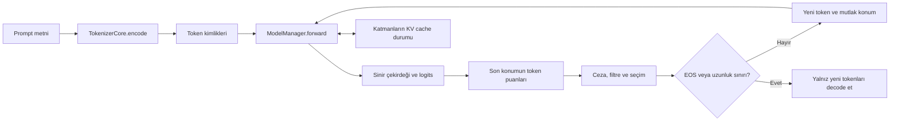

# 08 · Logitlerden cevaba: üretim ve KV cache

[İçindekiler](../README.md) · [Önceki: Model yaşam döngüsü](07-model-yasam-dongusu.md) · [Sonraki: Bellek, biliş ve araçlar](09-bellek-bilis-araclar.md)

Bir dil modeli tek ileri geçişte tamamlanmış bir cevap vermek zorunda değildir. Önceki bölümlerde kurulan ağ, token kimliklerini alır ve her konum için vocabulary büyüklüğünde bir **logit** vektörü üretir. Logit, olasılığa dönüştürülmemiş sayısal puandır. Üretim katmanının işi bu puanlardan bir token seçmek, seçimi sonraki girdiye eklemek ve durma koşuluna kadar hesaplamayı sürdürmektir. Ağ ile üretim yordamını ayırmak, aynı ağırlıklarla farklı cevap davranışlarını incelemeyi sağlar.

## Bir ileri geçiş neden bir cevap değildir?

Önek $x_{1:t}$, parametreler $\theta$, vocabulary boyutu $V$ olsun. Ağın son konum çıktısı $z_t\in\mathbb R^V$, sonraki token dağılımını tanımlar:

$$
p_\theta(x_{t+1}=i\mid x_{1:t})=
\frac{\exp(z_{t,i}/\tau)}{\sum_{j=1}^{V}\exp(z_{t,j}/\tau)},\qquad \tau>0.
$$

Bir devamın olasılığı, bu koşullu olasılıkların çarpımıdır. **Autoregressive** sözcüğü, seçilmiş çıktının sonraki hesaplamanın girdisine dönmesini anlatır. Eğitimde doğru sonraki token bilinir; üretimde sistem kendi seçiminin sonuçlarıyla ilerler. Erken bir seçim, sonraki bütün dağılımları değiştirebilir. Bu değişiklik parametre güncellemesi değildir: $\theta$ aynı kalırken koşullandırılan önek değişir.

Gerçek Cevahir yolunda döngü [CevahirModelAPI._autoregressive_generate](../../../model/cevahir.py#L569) içindedir. [ModelManager.forward](../../../model_management/model_manager.py#L486) token tensörünü cihaza taşır, çekirdeğe iletir ve `(logits, aux)` döndürür. Üretim yardımcı çıktıyı istemez; `logits[0, -1, :]` üzerinden sonraki tokenı seçer. Girdi ilk adımda `[1, T]`, logits `[1, T, V]` biçimindedir. Cache kullanılan devam adımlarında girdi `[1, 1]`, logits `[1, 1, V]` olur.



## Seçim kuralı davranışı nasıl değiştirir?

**Greedy decoding**, her adımda en yüksek puanlı tokenı seçer. Yerel olarak en yüksek puan, bütün devamlar arasında en iyi cevabı garanti etmez. **Sampling** ise bir dağılımdan örnek çeker. Sıcaklık τ küçüldüğünde dağılım sivrileşir, büyüdüğünde yayılır. Kodda sıfır sıcaklık matematiksel bölme olarak uygulanmaz; ayrı `argmax` dalıdır:

```python
if temperature == 0.0:
    next_token_id = int(torch.argmax(next_logits).item())
else:
    # Filtreler ve softmax sonrasında:
    next_token_id = int(torch.multinomial(probs, 1).item())
```

Bu kısaltılmış parça [üretim yordamındaki](../../../model/cevahir.py#L699) iki seçim dalını gösterir. Aradaki filtreler aşağıdaki sıradadır:

| Mekanizma | Çözdüğü yerel problem | Cevahir'deki davranış ve bedeli |
|---|---|---|
| Repetition penalty | Aynı tokenların tekrar baskınlaşması | Son 256 kimliğin farklı değerlerine uygulanır; pozitif logit bölünür, negatif logit çarpılır. Gerekli tekrarları da baskılayabilir. |
| Minimum yeni token | Cevabın hemen sonlanması | `min_new_tokens` dolana kadar EOS puanı eksi sonsuz yapılır. Doğruluk garantisi vermez. |
| Temperature | Dağılımın yoğunluğu | Pozitif sıcaklıkta logitleri ölçekler; sıfırda örnekleme atlanır. |
| Top-k | Düşük puanlı geniş kuyruk | En yüksek k aday tutulur; `top_k=0` filtreyi kapatır. |
| Top-p / nucleus | Her bağlamda sabit aday sayısının uygunsuzluğu | Sıralı olasılıkların toplamı eşiğe ulaşana kadar aday tutulur; eşiği aşıran token da korunur. |

Top-p burada top-k sonrasındaki dağılıma uygulanır. `top_p=0` önce `or 1.0` nedeniyle 1'e dönüşür; diğer değerler `[0.01, 1]` aralığına kırpılır. Bu yüzden arayüzde görülen bir sayıyı, uygulamanın sınır davranışını okumadan yorumlamamak gerekir. Nucleus sampling'in özgün gerekçesi, açık uçlu metinde olasılık kuyruğunu keserken çeşitliliği korumaktır; bu gerekçe Cevahir'in her görevde doğrulanmış üstünlüğü değildir. [Holtzman ve arkadaşları](https://arxiv.org/abs/1904.09751)

EOS, vocabulary'den bulunan özel bitiş tokenıdır. Seçilirse döngü sonlanır; ayrıca normal örnekleme yolunda `max_new_tokens` 0–2048 aralığına sınırlandırılır. [_generate_impl](../../../model/cevahir.py#L499), döngüden dönen toplam diziden prompt uzunluğunu çıkarır ve yalnız yeni kimlikleri `decode(..., method="bpe", remove_specials=True)` ile metne çevirir. Kullanıcıya promptun yeniden cevap diye dönmemesi bu ayrımın sonucudur.

## KV cache: öğrenilmiş bilgi değil, yeniden kullanılabilir hesap

Attention her adımda geçmiş tokenların key ve value vektörlerine ihtiyaç duyar. Geçmiş önek değişmiyorsa bunları baştan hesaplamak gereksizdir. **KV cache**, her katmanın bu ara sonuçlarını saklar. İlk geçiş **prefill** olarak bütün promptu işler; sonrakiler yalnız yeni tokenı işler. Ağ ağırlıkları, cache ve konuşma belleği farklı durumlardır: cache hesaplamayı hızlandırır, kendi başına gelecekteki oturumlara bilgi öğrenmez.

Yaklaşık saklama miktarı  $2LBH_{kv}Td_hs$ bayttır: iki tensör, L katman, B batch, $H_{kv}$ key/value başlığı, T saklanan konum, $d_h$ başlık genişliği ve eleman başına s bayt. Böylece GQA/MQA'nın daha az KV başlığı kullanmasının üretim belleğine etkisi görünür. Cache tüm attention maliyetini yok etmez; yeni query hâlâ saklanan key'lerle karşılaştırılır.

[KVCache.update](../../../src/neural_network_module/ortak_katman_module/kv_cache.py#L177), `[B, H_kv, yeni_uzunluk, d_h]` key/value tensörlerini ve token başına bir **mutlak konumu** alır. Saklanan indis ile dildeki konum aynı şey değildir. Örneğin kapasite dolup `[0,1,98,99]` konumları tutulduğunda sonraki token 100'dür; dördüncü veya beşinci dil konumu değildir. Bu ayrım RoPE ve nedensel maskeyi doğru tutar.

`eviction_strategy="sliding_window"` ile ilk sink konumları ve en yeni konumlar korunur; `"none"` ile kapasite aşımı hata verir. Sink yaklaşımının literatür dayanağı [StreamingLLM](https://arxiv.org/abs/2309.17453) çalışmasıdır. Saklama politikası, atılan bütün içeriğin hatırlandığı anlamına gelmez. Cache taşınca tam geçmişle aynı sonucun koşulsuz korunması beklenemez; karşılaştırılan pencere ve maske politikasını belirtmek gerekir.

[CevahirModelAPI.generate](../../../model/cevahir.py#L488) aynı adaptör üzerindeki üretimleri kilitler; yeni autoregressive üretim başında katman cache'leri temizlenir. Amaç ortak modelin değişebilir cache'inin istekler arasında karışmamasıdır. Bu kilit bütün eğitim, yükleme ve başka adaptörlerden erişim yollarını kapsayan genel eşzamanlılık garantisi değildir.

## Beam search ve aynı isimli farklı girişler

Birden fazla devam tutan **beam search**, tek seçime erken bağlanmayı azaltır; maliyeti aday sayısıyla büyür. Cevahir'de `num_beams>1`, [_generate_with_beam_search](../../../model/cevahir.py#L780) dalını açar. Her beam kendi bütün önekini `use_cache=False` ile yeniden hesaplar. Böylece mevcut değişebilir cache'i dallar arasında kopyalama sorunu atlanır. Ara seçimlerde toplam log olasılık, son seçimde yeni uzunluğun `0.6` kuvvetiyle normalizasyon kullanılır. Bu dal, sıcaklık/top-p örneklemesinin aynısı değildir.

İsimler de yanıltabilir. [Cevahir.generate](../../../model/cevahir.py#L1340) varsayılan olarak bilişsel akışa girer; `use_cognitive_pipeline=False` doğrudan model adaptörünü çağırır. Buna karşılık [ModelManager.generate](../../../model_management/model_manager.py#L882) eski, tek ileri geçiş ve bütün konumlarda argmax kullanan yardımcı yoldur. Tam cevap döngüsü diye bu metodu izlemek yanlış bir çağrı grafiği kurar.

## Okuyarak ve deneyerek doğrulama

[Üretim sözleşmesi testleri](../../../tests/evolution/test_config_generation.py) sıfır sıcaklıkta örnekleme yapılmamasını, EOS/minimum uzunluğu ve bağımsız beam öneklerini kontrol eder. [Attention/cache testleri](../../../tests/evolution/test_attention_cache.py) tam ve cache'li hesap eşleşmesini, sink korumasını, mutlak konumları, padding ve cache sıfırlamayı sınar. Bunlar dilsel cevap kalitesinin ölçümü değildir.

Bir inceleme alıştırması olarak aynı ağırlık, prompt ve greedy ayarla cache açık/kapalı logits'lerini karşılaştırın; ardından yalnız pencere kapasitesini değiştirin. İlk deney yeniden hesaplamanın eşdeğerliğini, ikincisi görülebilen geçmişin değişmesini araştırır. Bu iki soruyu karıştırmak hızlandırma hatasını model davranışı değişikliği sanmaya yol açar. İlgili eski mühendislik kaydı [alt çekirdek sözleşmelerinde](../../architecture/LOWER_CORE_CONTRACTS.md) korunur; çalıştırılan testin ve ayarın kapsamı her zaman ayrıca belirtilmelidir.

[İçindekiler](../README.md) · [Sonraki: Bellek, biliş ve araçlar](09-bellek-bilis-araclar.md)
