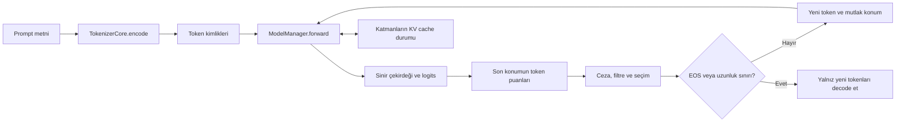

# 08 · Logitlerden cevaba: üretim ve KV cache

[İçindekiler](../README.md) · [Önceki: Model yaşam döngüsü](07-model-yasam-dongusu.md) · [Sonraki: Bellek, biliş ve araçlar](09-bellek-bilis-araclar.md)

Bir dil modeli tek ileri geçişte tamamlanmış bir cevap vermek zorunda değildir. Önceki bölümlerde kurulan ağ, token kimliklerini alır ve her konum için vocabulary büyüklüğünde bir **logit** vektörü üretir. Logit, olasılığa dönüştürülmemiş sayısal puandır. Üretim katmanının işi bu puanlardan bir token seçmek, seçimi sonraki girdiye eklemek ve durma koşuluna kadar hesaplamayı sürdürmektir. Ağ ile üretim yordamını ayırmak, aynı ağırlıklarla farklı cevap davranışlarını incelemeyi sağlar.

## Bir ileri geçiş neden bir cevap değildir?

Önek $x_{1:t}$, parametreler $\theta$, vocabulary boyutu $V$ olsun. Ağın son konum çıktısı $z_t\in\mathbb R^V$, sonraki token dağılımını tanımlar:

$$
p_\theta(x_{t+1}=i\mid x_{1:t})=
\frac{\exp(z_{t,i}/\tau)}{\sum_{j=1}^{V}\exp(z_{t,j}/\tau)},\qquad \tau>0.
$$

Bir devamın olasılığı, bu koşullu olasılıkların çarpımıdır. **Autoregressive** sözcüğü, seçilmiş çıktının sonraki hesaplamanın girdisine dönmesini anlatır. Eğitimde doğru sonraki token bilinir; üretimde sistem kendi seçiminin sonuçlarıyla ilerler. Erken bir seçim, sonraki bütün dağılımları değiştirebilir. Bu değişiklik parametre güncellemesi değildir: $\theta$ aynı kalırken koşullandırılan önek değişir.

Gerçek Cevahir yolunda döngü [CevahirModelAPI._autoregressive_generate](../../../model/cevahir.py#L569) içindedir. [ModelManager.forward](../../../model_management/model_manager.py#L486) token tensörünü cihaza taşır, çekirdeğe iletir ve `(logits, aux)` döndürür. Üretim yardımcı çıktıyı istemez; `logits[0, -1, :]` üzerinden sonraki tokenı seçer. Girdi ilk adımda `[1, T]`, logits `[1, T, V]` biçimindedir. Cache kullanılan devam adımlarında girdi `[1, 1]`, logits `[1, 1, V]` olur.



## Seçim kuralı davranışı nasıl değiştirir?

**Greedy decoding**, her adımda en yüksek puanlı tokenı seçer. Yerel olarak en yüksek puan, bütün devamlar arasında en iyi cevabı garanti etmez. **Sampling** ise bir dağılımdan örnek çeker. Sıcaklık τ küçüldüğünde dağılım sivrileşir, büyüdüğünde yayılır. Kodda sıfır sıcaklık matematiksel bölme olarak uygulanmaz; ayrı `argmax` dalıdır:

```python
if temperature == 0.0:
    next_token_id = int(torch.argmax(next_logits).item())
else:
    # Filtreler ve softmax sonrasında:
    next_token_id = int(torch.multinomial(probs, 1).item())
```

Bu kısaltılmış parça [üretim yordamındaki](../../../model/cevahir.py#L699) iki seçim dalını gösterir. Aradaki filtreler aşağıdaki sıradadır:

| Mekanizma | Çözdüğü yerel problem | Cevahir'deki davranış ve bedeli |
|---|---|---|
| Repetition penalty | Aynı tokenların tekrar baskınlaşması | Son 256 kimliğin farklı değerlerine uygulanır; pozitif logit bölünür, negatif logit çarpılır. Gerekli tekrarları da baskılayabilir. |
| Minimum yeni token | Cevabın hemen sonlanması | `min_new_tokens` dolana kadar EOS puanı eksi sonsuz yapılır. Doğruluk garantisi vermez. |
| Temperature | Dağılımın yoğunluğu | Pozitif sıcaklıkta logitleri ölçekler; sıfırda örnekleme atlanır. |
| Top-k | Düşük puanlı geniş kuyruk | En yüksek k aday tutulur; `top_k=0` filtreyi kapatır. |
| Top-p / nucleus | Her bağlamda sabit aday sayısının uygunsuzluğu | Sıralı olasılıkların toplamı eşiğe ulaşana kadar aday tutulur; eşiği aşıran token da korunur. |

Top-p burada top-k sonrasındaki dağılıma uygulanır. `top_p=0` önce `or 1.0` nedeniyle 1'e dönüşür; diğer değerler `[0.01, 1]` aralığına kırpılır. Bu yüzden arayüzde görülen bir sayıyı, uygulamanın sınır davranışını okumadan yorumlamamak gerekir. Nucleus sampling'in özgün gerekçesi, açık uçlu metinde olasılık kuyruğunu keserken çeşitliliği korumaktır; bu gerekçe Cevahir'in her görevde doğrulanmış üstünlüğü değildir. [Holtzman ve arkadaşları](https://arxiv.org/abs/1904.09751)

EOS, vocabulary'den bulunan özel bitiş tokenıdır. Seçilirse döngü sonlanır; ayrıca normal örnekleme yolunda `max_new_tokens` 0–2048 aralığına sınırlandırılır. [_generate_impl](../../../model/cevahir.py#L499), döngüden dönen toplam diziden prompt uzunluğunu çıkarır ve yalnız yeni kimlikleri `decode(..., method="bpe", remove_specials=True)` ile metne çevirir. Kullanıcıya promptun yeniden cevap diye dönmemesi bu ayrımın sonucudur.

## KV cache: öğrenilmiş bilgi değil, yeniden kullanılabilir hesap

Attention her adımda geçmiş tokenların key ve value vektörlerine ihtiyaç duyar. Geçmiş önek değişmiyorsa bunları baştan hesaplamak gereksizdir. **KV cache**, her katmanın bu ara sonuçlarını saklar. İlk geçiş **prefill** olarak bütün promptu işler; sonrakiler yalnız yeni tokenı işler. Ağ ağırlıkları, cache ve konuşma belleği farklı durumlardır: cache hesaplamayı hızlandırır, kendi başına gelecekteki oturumlara bilgi öğrenmez.

Yaklaşık saklama miktarı  $2LBH_{kv}Td_hs$ bayttır: iki tensör, L katman, B batch, $H_{kv}$ key/value başlığı, T saklanan konum, $d_h$ başlık genişliği ve eleman başına s bayt. Böylece GQA/MQA'nın daha az KV başlığı kullanmasının üretim belleğine etkisi görünür. Cache tüm attention maliyetini yok etmez; yeni query hâlâ saklanan key'lerle karşılaştırılır.

[KVCache.update](../../../src/neural_network_module/ortak_katman_module/kv_cache.py#L177), `[B, H_kv, yeni_uzunluk, d_h]` key/value tensörlerini ve token başına bir **mutlak konumu** alır. Saklanan indis ile dildeki konum aynı şey değildir. Örneğin kapasite dolup `[0,1,98,99]` konumları tutulduğunda sonraki token 100'dür; dördüncü veya beşinci dil konumu değildir. Bu ayrım RoPE ve nedensel maskeyi doğru tutar.

`eviction_strategy="sliding_window"` ile ilk sink konumları ve en yeni konumlar korunur; `"none"` ile kapasite aşımı hata verir. Sink yaklaşımının literatür dayanağı [StreamingLLM](https://arxiv.org/abs/2309.17453) çalışmasıdır. Saklama politikası, atılan bütün içeriğin hatırlandığı anlamına gelmez. Cache taşınca tam geçmişle aynı sonucun koşulsuz korunması beklenemez; karşılaştırılan pencere ve maske politikasını belirtmek gerekir.

[CevahirModelAPI.generate](../../../model/cevahir.py#L488) aynı adaptör üzerindeki üretimleri kilitler; yeni autoregressive üretim başında katman cache'leri temizlenir. Amaç ortak modelin değişebilir cache'inin istekler arasında karışmamasıdır. Bu kilit bütün eğitim, yükleme ve başka adaptörlerden erişim yollarını kapsayan genel eşzamanlılık garantisi değildir.

## Beam search ve aynı isimli farklı girişler

Birden fazla devam tutan **beam search**, tek seçime erken bağlanmayı azaltır; maliyeti aday sayısıyla büyür. Cevahir'de `num_beams>1`, [_generate_with_beam_search](../../../model/cevahir.py#L780) dalını açar. Her beam kendi bütün önekini `use_cache=False` ile yeniden hesaplar. Böylece mevcut değişebilir cache'i dallar arasında kopyalama sorunu atlanır. Ara seçimlerde toplam log olasılık, son seçimde yeni uzunluğun `0.6` kuvvetiyle normalizasyon kullanılır. Bu dal, sıcaklık/top-p örneklemesinin aynısı değildir.

İsimler de yanıltabilir. [Cevahir.generate](../../../model/cevahir.py#L1340) varsayılan olarak bilişsel akışa girer; `use_cognitive_pipeline=False` doğrudan model adaptörünü çağırır. Buna karşılık [ModelManager.generate](../../../model_management/model_manager.py#L882) eski, tek ileri geçiş ve bütün konumlarda argmax kullanan yardımcı yoldur. Tam cevap döngüsü diye bu metodu izlemek yanlış bir çağrı grafiği kurar.

## Sıcaklık ve filtreleri sayılarla izlemek

Öğretim için dört tokenlı bir sözlük ve $p=(0.50,0.30,0.15,0.05)$ seçelim. Ağın öğrenilmiş tahmini olduğunu ileri sürmeden, logitleri $z_i=\log p_i$ olarak tanımlayabiliriz; bunların softmax'ı tam bu dağılımdır. Sıcaklık değiştirilince

$$
p_i^{(\tau)}=\frac{p_i^{1/\tau}}{\sum_j p_j^{1/\tau}}
$$

elde edilir. $\tau=2$ için karekökleri normalize ederiz: yaklaşık `(0.378996, 0.293569, 0.207585, 0.119849)`. En yüksek adayın payı azalır; son adayın payı artar. Bu işlem sisteme yeni bir olgu öğretmez. Aynı bilgiyle farklı tokenların seçilme ihtimalini değiştirir. Sıcaklık doğruluk yüzdesi veya bir insan kişilik ölçüsü değildir.

Şimdi $\tau=1$ ve `top_p=0.6` kullanalım. Sıralı kümülatif toplamlar `(0.50,0.80,0.95,1.00)` olur. İlk iki aday korunur; toplamları `0.80` olduğu için yeni dağılım `(0.625,0.375,0,0)` olur. Nucleus kümesi bu örnekte iki token içerir. Başka bir promptta en yüksek olasılık `0.90` olsaydı aynı eşik yalnız bir token bırakabilirdi. Sabit k ile değişken k arasındaki fark budur.

İki filtreyi birleştirmek aynı sonucu vermek zorunda değildir. Önce `top_k=2` uygulandığında dağılım zaten `(0.625,0.375,0,0)` olur. Bundan sonra `top_p=0.6` ilk adayın `0.625` payına bakar ve yalnız onu korur: sonuç `(1,0,0,0)` olur. Cevahir'in sırası gerçekten **sıcaklık → top-k → top-p → örnekleme** şeklindedir. İki ayarı birbirinden bağımsız çeşitlilik düğmeleri olarak düşünmek bu etkileşimi kaçırır.

| Aynı başlangıç logitleri | Son dağılım | Tutulan aday sayısı |
|---|---|---|
| Sıcaklık 1, filtre yok | `0.50, 0.30, 0.15, 0.05` | 4 |
| Sıcaklık 2, filtre yok | `0.378996, 0.293569, 0.207585, 0.119849` | 4 |
| Sıcaklık 1, yalnız top-p 0.6 | `0.625, 0.375, 0, 0` | 2 |
| Sıcaklık 1, top-k 2 ardından top-p 0.6 | `1, 0, 0, 0` | 1 |

Kod `cumulative_probs > top_p` maskesini sağa kaydırır. Eşiğe **tam eşitlik** durumunda soyut “en küçük kümülatif küme” tanımıyla bir tokenlık sınır farkı oluşabilir; kayan nokta yuvarlaması da eşitliği etkileyebilir. Kitaptaki `0.6` örneği bu sınırdan uzaktır. Matematiksel yöntem ile belirli karşılaştırma operatörünün davranışını ayırmak, başka kütüphaneyle sonuç kıyaslarken gereklidir.

Bu tablo elle hesaplanmış olmakla kalmaz. [`sampling_examples`](../../../scripts/book_runtime_walkthrough.py) gerçek `CevahirModelAPI.generate` yoluna sabit logitler verir, `torch.multinomial` girişindeki dağılımı yakalar ve karşılaştırır. Yakalama sırasında seçim deterministik `argmax` ile değiştirilir. Dolayısıyla bu deney **üretim kodunun filtre hesabını** doğrular; rastgele örneklemenin frekanslarını veya eğitilmiş bir modelin dil kalitesini ölçmez. Sonuçlar [`runtime_walkthrough.json`](../evidence/runtime_walkthrough.json) içinde kayıtlıdır.

## Tekrar cezası, durma ve sayısal sınırlar

Tekrar cezası $r>1$ için, yakın geçmişte bulunan tokenın pozitif logiti $z/r$, negatif logiti $rz$ olur. Örneğin `r=2` altında `4→2` ve `−4→−8`; iki durumda da tekrar eden adayın puanı düşer. Negatif logiti de bölmek `−4→−2` yapıp tersine yükseltirdi. Cevahir son 256 kimliği `set` ile tekilleştirir: aynı token bu pencerede beş defa geçti diye ceza aynı adımda beş kez uygulanmaz. Bu, token sıklığıyla orantılı ayrı bir ceza değildir.

Ceza logit uzayında uygulandığından bir ayrıntı daha vardır. Softmax normalde bütün logitlere aynı sabiti eklemeye değişmezdir; fakat işarete bağlı ceza bu özelliği genel olarak korumaz. Bu yüzden ceza uygulanmış çıktıyı yalnız ilk olasılık vektöründen, logit temsilini bilmeden her durumda yeniden kuramayız. `r=1` etkisizdir; `0<r<1` ise bastırma yönünü tersine çevirir. Beam yolu pozitif ceza kontrolü yapar; autoregressive yol aynı doğrulamayı yapmaz. Ayar adının bütün sayısal değerler için geçerli bir sözleşme verdiği varsayılmamalıdır. CTRL raporunun örnekleme tartışması bu yöntem ailesinin tarihli bir dayanağıdır; Cevahir'in 256 tokenlık penceresi ayrıca yerel uygulama kararıdır. [Keskar ve arkadaşları, 2019, §4.1](https://arxiv.org/html/1909.05858v2#S4.SS1)

EOS normal bir seçim adayıdır, fakat seçildiğinde akışı durdurma anlamı taşır. Çalıştırılan örnekte EOS logiti `5`, diğerlerinin `0`, `min_new_tokens=2` ve sıcaklığın `0` olduğu durumda ilk iki adımda EOS maskelenir. Eşit puanlı diğer adaylardan ID `0` seçilir; üçüncü ileri geçişte EOS seçilir. Decode özel tokenı kaldırdığı için görülen cevap `"0 0"`, ileri geçiş sayısı **3** olur. Görünen token sayısı ile model çağrı sayısı bu nedenle aynı olmak zorunda değildir. `max_new_tokens=0` örneği ise hiç ileri geçiş yapmadan boş cevap döner.

Pozitif sıcaklık yolunda softmax öncesi maksimum logit çıkarılır. Matematiksel olarak oranlar değişmez; sonlu büyük değerlerde üstel hesabın taşması azaltılır. Ancak bütün adaylar sonsuz/geçersizse bu işlem tek başına geçerli dağılım kuramaz. Mevcut kod sonlu adaylar üzerinde eşit dağılıma, hiçbiri yoksa ID `0` seçimine döner. Bu bir sayısal kurtarma davranışıdır; ID `0`'ın anlam bakımından doğru cevap veya uygun bitiş olduğu kanıtı değildir. Greedy dalı aynı örnekleme fallback'inden geçmez. Hata analizi yaparken hangi dalın çalıştığı kayda eklenmelidir.

## Beam search neyi arar, neyi garanti etmez?

Bir devamın log skoru $S(y)=\sum_t\log p(y_t\mid x,y_{<t})$ olsun. Greedy yalnız o andaki en iyi seçimi tutar. Basit bir karşı örnekte ilk adımda `A=0.6`, `B=0.4`; ikinci adımda A'dan en iyi devam `0.5`, B'den en iyi devam `0.9` olsun. İki tokenlık en iyi A yolu `0.30`, B yolu `0.36` olasılığa sahiptir. İlk yerel seçim A olduğu halde daha yüksek ortak olasılıklı yol B'den geçer. Bu sayılar bir öğretim ağacıdır; Cevahir checkpoint'inden ölçülmüş dağılımlar değildir.

Beam genişliği 2 bu örnekte iki öneki koruyabilir. Fakat sonlu beam genel olarak bütün ağacı araştırmaz: erken elenen bir önek daha sonra üstün hale gelse geri getirilmeyebilir. Ayrıca en yüksek dil modeli olasılığı kullanıcının istediği en doğru, en yararlı veya en yaratıcı cevapla özdeş değildir. Arama hedefini daha iyi optimize etmek ile gerçek görev başarısını yükseltmek ayrı sorulardır. Açık uçlu metinde nucleus çalışmasının araştırdığı temel gerilimlerden biri budur. [Holtzman ve arkadaşları, ICLR 2020](https://arxiv.org/abs/1904.09751)

Cevahir ara adımlarda toplam log olasılığa göre budar, finalde $S(y)/|y|^{0.6}$ kullanır; burada uzunluk prompt hariç yeni token sayısıdır. Log skorlar çoğunlukla negatif olduğu için bu normalizasyon göreli uzunluk tercihlerini değiştirir. Final ölçütünde iyi olacak bütün adayların ara budamadan sağ çıktığını garanti etmez. Bitmiş EOS yolu sonraki turda yeniden modele verilmeden taşınır. Mevcut beam dalı top-k/top-p örnekleme dalıyla aynı deney koşulu gibi raporlanmamalıdır.

## Cache maliyeti ve endüstriyle doğru karşılaştırma

Örnek olarak `L=32`, `B=1`, `H_kv=8`, `d_h=128`, `T=4096`, eleman boyutu `s=2` bayt seçelim. Yalnız key/value depolaması

$$
2\times32\times1\times8\times4096\times128\times2
=536{,}870{,}912\ \text{bayt}=512\ \text{MiB}
$$

eder. Aynı koşullarda 32 KV başlığı 2 GiB ister. Bu örnek model ağırlıklarını, logits'i, allocator boşluklarını ve geçici attention tensörlerini saymaz; gerçek toplam aygıt belleği ölçümü değildir. GQA oranının hesaplanabilir depolama etkisidir. Prefill ile decode sürelerini ayrı ölçmek de gerekir: promptun ilk işlenmesiyle her yeni tokenın maliyeti aynı iş yükü değildir.

| Tarihli kaynak / yöntem | Ele aldığı sorun | Cevahir'e aktarılabilecek karşılaştırma |
|---|---|---|
| Fan, Lewis ve Dauphin, ACL 2018 | Hikâye üretiminde aday kuyruğundan örnekleme | Top-k için tarihli kullanım; bu repository aynı hikâye modelini uygulamıyor. |
| Keskar ve arkadaşları, CTRL, 2019 | Kontrollü üretim ve tekrar sorunu | Tekrar cezasının rolü; kontrol kodlarıyla eğitim burada gösterilmiş değil. |
| Xiao ve arkadaşları, StreamingLLM, ICLR 2024 | Sınırlı KV penceresiyle akış üretimi | Sink/pencere politikasını incelemek; atılan geçmişi geri çağırma garantisi yok. |
| Kwon ve arkadaşları, PagedAttention/vLLM, SOSP 2023 | Çok istekli sunumda KV belleğinin tahsisi ve paylaşımı | Mantıksal cache ile fiziksel bellek yönetimini ayırmak; Cevahir cache'ine PagedAttention denmiyor. |

PagedAttention'ın bloklarla bellek yönetimi ve paylaşımı, yalnız cache tutmanın ötesinde bir sunum sistemi tasarımıdır. Kaynaktaki throughput kazanımını Cevahir'in performansı diye aktaramayız; bunun için aynı model, donanım, istek dağılımı ve gecikme ölçütüyle ayrı deney gerekir. [Kwon ve arkadaşları, 2023](https://arxiv.org/abs/2309.06180)

Çalıştırılmış adaptör örneğinde iki tokenlık prompttan üç yeni token üretilir: cache açıkken giriş uzunlukları `[2,1,1]`, kapalıyken `[2,3,4]`; açık yoldaki mutlak konumlar `[0,1]`, `[2]`, `[3]` olur. Sabit logit kaynağı kullanıldığı için bu, **çağrı düzeninin** deneyidir. Gerçek attention sayısal eşdeğerliği ayrıca [sinirsel örnek kaydında](../evidence/neural_walkthrough.json) MHA/MQA/GQA için sınanmıştır. İki kanıtı birleştirmek yararlıdır; birini diğerinin yerine geçirmek değildir.

## Konudan gerçek metoda okuma haritası

| Okurun sorusu | Dosya/metot | İzlenecek davranış |
|---|---|---|
| Üretim sırasında aynı adaptör nasıl korunuyor? | [`CevahirModelAPI.generate`](../../../model/cevahir.py#L488) | Kilit, routing hazırlığı, ana üretim dalı. |
| Prompt cevaptan nerede ayrılıyor? | [`_generate_impl`](../../../model/cevahir.py#L499) | Encode, beam seçimi, yeni tokenların decode edilmesi. |
| Filtreler hangi sırada? | [`_autoregressive_generate`](../../../model/cevahir.py#L569) | Cache, tekrar cezası, EOS, sıcaklık, top-k/top-p. |
| Çoklu aday nasıl tutuluyor? | [`_generate_with_beam_search`](../../../model/cevahir.py#L780) | Ayrı önekler, cache kapalı forward, ara/final skor farkı. |
| Saklanan konum ne demek? | [`KVCache.update`](../../../src/neural_network_module/ortak_katman_module/kv_cache.py#L177) | Mutlak konum ve kapasite/eviction sözleşmesi. |
| Üretim kontrolünü nasıl çalıştırırım? | [`generation_protocol_examples`](../../../scripts/book_runtime_walkthrough.py) | Sabit girdilerle gözlenen çağrı uzunlukları ve durma. |

## Beş alıştırma ve çözümleri

1. **Filtre sırası:** `(0.5,0.3,0.15,0.05)` üzerinde yalnız top-p `0.6` ile top-k `2` ardından top-p `0.6` neden farklıdır? **Çözüm:** İkinci işlem top-k sonrası yeniden normalize edilmiş dağılımı görür; en iyi aday `0.625` ile tek başına eşiği aşar. Sonuçlar sırasıyla `(0.625,0.375,0,0)` ve `(1,0,0,0)` olur.
2. **Tekrar cezası:** `r=2` ile tekrar eden `−4` logiti neden `−2` yapılmaz? **Çözüm:** `−2` daha yüksek puandır; tekrarı güçlendirir. Kod işarete göre çarpar ve `−8` üretir. Ceza sayısı penceredeki tekrar adedine göre katlanmaz.
3. **Durma:** EOS başlangıçta en yüksek puanlıysa minimum iki yeni token hangi çağrı sayısını zorlar? **Çözüm:** Diğer adaylar sonlu ve maksimum yeterliyse iki EOS dışı seçim, sonra EOS için üçüncü ileri geçiş yapılır. Özel token kaldırılınca görünür cevap iki token olabilir.
4. **Bellek:** Yukarıdaki 512 MiB örneğinde yalnız batch 4 yapılırsa KV depolaması nedir? **Çözüm:** 2 GiB. Bu hâlâ toplam model belleği değildir. Kapasite ve dtype aynı kabul edilmiştir.
5. **Öğrenme:** Sıcaklık değiştirilince sistem daha önce üretmediği doğru cevabı verdi. Kalıcı öğrenme gösterildi mi? **Çözüm:** Hayır. Yeni davranış ortaya çıkmıştır; fakat bu deneyimdeki sonucun sonraki hesaplama kapasitesini nasıl kalıcı değiştirdiği ayrıca gösterilmelidir. [Yaşarken öğrenme araştırması](11-arastirma-laboratuvari.md) bu daha geniş soruyu açık tutar.

## Okuyarak ve deneyerek doğrulama

[Üretim sözleşmesi testleri](../../../tests/evolution/test_config_generation.py) sıfır sıcaklıkta örnekleme yapılmamasını, EOS/minimum uzunluğu ve bağımsız beam öneklerini kontrol eder. [Attention/cache testleri](../../../tests/evolution/test_attention_cache.py) tam ve cache'li hesap eşleşmesini, sink korumasını, mutlak konumları, padding ve cache sıfırlamayı sınar. Bunlar dilsel cevap kalitesinin ölçümü değildir.

Bir inceleme alıştırması olarak aynı ağırlık, prompt ve greedy ayarla cache açık/kapalı logits'lerini karşılaştırın; ardından yalnız pencere kapasitesini değiştirin. İlk deney yeniden hesaplamanın eşdeğerliğini, ikincisi görülebilen geçmişin değişmesini araştırır. Bu iki soruyu karıştırmak hızlandırma hatasını model davranışı değişikliği sanmaya yol açar. İlgili eski mühendislik kaydı [alt çekirdek sözleşmelerinde](../../architecture/LOWER_CORE_CONTRACTS.md) korunur; çalıştırılan testin ve ayarın kapsamı her zaman ayrıca belirtilmelidir.

`python scripts/book_runtime_walkthrough.py` komutu kayıtlı beş örnek grubunu yeniden denetler; bu bölüm ilk iki grubu kullanır, sonraki üçü bellek/araç bölümüne bağlanır. Kayıt ortamı Python 3.14.3, PyTorch 2.10.0+cpu'dur; sayısal karşılaştırma mutlak `2e-6`, göreli `2e-5` tolerans kullanır. Kayıt varsayılan komutla değiştirilmez. Eğitimli checkpoint veya tokenizer varlığına yazılmaz.

## Kaynakça

- Fan, A., Lewis, M. ve Dauphin, Y. (2018). *Hierarchical Neural Story Generation*. ACL, 889–898. [Özgün makale](https://aclanthology.org/P18-1082/), DOI: 10.18653/v1/P18-1082. Top-k ve hikâye üretimi bağlamı için.
- Holtzman, A., Buys, J., Du, L., Forbes, M. ve Choi, Y. (2019 ön baskı; ICLR 2020). *The Curious Case of Neural Text Degeneration*. [Makale](https://arxiv.org/abs/1904.09751). Nucleus sampling ve olasılık hedefi/üretim kalitesi ayrımı için.
- Keskar, N. S., McCann, B., Varshney, L. R., Xiong, C. ve Socher, R. (2019). *CTRL: A Conditional Transformer Language Model for Controllable Generation*. [Teknik rapor](https://arxiv.org/abs/1909.05858), özellikle §4.1. Tekrar cezası için; bütün CTRL eğitiminin uygulanmış olduğu iddia edilmez.
- Xiao, G., Tian, Y., Chen, B., Han, S. ve Lewis, M. (2023 ön baskı; ICLR 2024). *Efficient Streaming Language Models with Attention Sinks*. [Makale](https://arxiv.org/abs/2309.17453). Sink/pencere yaklaşımı için.
- Kwon, W. ve arkadaşları (2023). *Efficient Memory Management for Large Language Model Serving with PagedAttention*. SOSP. [Makale](https://arxiv.org/abs/2309.06180). vLLM sunum belleğiyle tarihli karşılaştırma için; Cevahir performans ölçümü değildir.

[İçindekiler](../README.md) · [Sonraki: Bellek, biliş ve araçlar](09-bellek-bilis-araclar.md)
