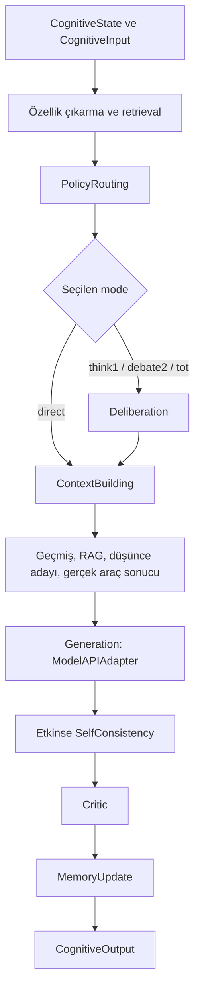

# 09 · Bellek, bilişsel işlem ve araçlar

[İçindekiler](../README.md) · [Önceki: Üretim](08-uretim.md) · [Sonraki: Uçtan uca sistem](10-uctan-uca-sistem.md)

Token üretmek, kullanıcının isteğini karşılamak için gereken işlemlerin yalnız biridir. Önceki bir mesaj gerekli olabilir; bir hesaplamanın sonucu dışarıdan alınabilir; bir taslak yeniden değerlendirilebilir. Cevahir'in bilişsel katmanı, modelin hangi bilgi ve hangi işlem sırasıyla çağrılacağını yönetir. Buradaki **cognitive processing**, gözlemlenebilir bir yazılım akışının adıdır; insan benzeri zihinsel yeteneğin kanıtı değildir.

## Context, memory ve retrieval aynı şey değildir

**Context**, o model çağrısına verilen içeriktir. **Memory**, sonraki çağrılar için tutulan durumdur. **Retrieval**, bu durumdan mevcut isteğe hangi parçaların taşınacağını seçer. Büyük bir arşiv, bütün arşivin modele görünmesi demek değildir. Ayrıca [önceki bölümün](08-uretim.md) KV cache'i metin arşivi değil attention ara hesabıdır.

| Durum | Cevahir'deki sahibi | Sonraki davranışa etkisi |
|---|---|---|
| Oturum geçmişi | `CognitiveState.history`; hizmet yolunda konuşma deposundan kurulur | Promptun önceki mesajları taşımasını sağlar. |
| Bilişsel episodik kayıtlar | `MemoryServiceV2._episodic_memory` | İstek kapsamına göre geri getirilecek konuşma parçaları sağlar. |
| Vektör deposu | `MemoryServiceV2` tarafından oluşturulan store | Embedding benzerliğine göre adayları seçer; kalıcılık seçilen backend'e bağlıdır. |
| Kullanıcı kayıtları | Chatting katmanının `MemoryStorage` bileşeni | ContextBuilder yüksek öncelikli kayıtları geçmişe ekleyebilir. |
| Model parametreleri | Sinir çekirdeği / ModelManager | Token dağılımını belirler; belleğe kayıt eklemek bunları güncellemez. |

[MemoryServiceV2.add_turn](../../../cognitive_management/v2/components/memory_service_v2.py#L134), geçmiş listesine rol/içerik ekler; ayrıca kapsam, zaman ve benzersiz kimlik taşıyan episodik kayıt oluşturur. Etkin ve kurulabilir durumdaki embedding adaptörü metni vektöre dönüştürür; vektör deposuna aynı kimlik ve kapsamla ekler. Bu adımın başarısız olması tüm konuşmayı durdurmaz; kod kelime temelli aramaya dönebilir.

Vektör retrieval'da yaygın bir benzerlik ölçüsü

$$
\operatorname{cos}(q,d)=\frac{q^\top d}{\lVert q\rVert\lVert d\rVert}
$$

olur. Bu, iki metnin aynı doğruluk değerine sahip olduğunu göstermez; embedding uzayında yakınlığını ölçer. Cevahir'in [retrieve_context](../../../cognitive_management/v2/components/memory_service_v2.py#L222) metodu sorguyu embed eder, store aramasına `filter_metadata={"scope": current_scope()}` verir ve sonuçları tekrar kapsam bakımından kontrol eder. `hybrid_search_alpha`, vektör ve kelime puanlarını ağırlıklı birleştirir. Vektör sonuçları yoksa kelime araması kullanılır. `_semantic_search` adlı eski fallback de kelime örtüşmesi hesaplar; adına bakıp sinirsel anlam araması sayılmamalıdır.

`memory.enable_vector_memory`, `embedding_provider`, `vector_store_provider`, `memory.enable_rag` ve eşik alanları [CognitiveManagerConfig](../../../cognitive_management/config.py) içinde seçilir. Factory yalnız `memory` ve `chroma` sağlayıcılarını kurar; ayar şemasında adı geçen Pinecone, Weaviate, Qdrant ve Milvus dalları henüz `NotImplementedError` verir. Varsayılanın etkin olması, dış embedding paketinin/modelinin ortamda bulunacağını garanti etmez. [MemoryVectorStore](../../../cognitive_management/v2/components/vector_store/memory_vector_store.py#L49) süreç içi depodur; kalıcı bir veritabanıyla özdeş değildir. Retrieval-augmented generation, seçilen parçaları üretimin girdisine ekleyerek parametrelerde kodlanmış bilgiyle dış kayıtları birleştirir; özgün [RAG çalışması](https://arxiv.org/abs/2005.11401) bunun ayrı bir modelleme yaklaşımı olduğunu gösterir. Cevahir'in prompt zenginleştirmesi o makalenin bütün eğitim prosedürünü uyguladığı anlamına gelmez.

Bellek bütçesi de bir mekanizma seçer. [summarize_if_needed](../../../cognitive_management/v2/components/memory_service_v2.py#L521), etkin olduğunda altıdan uzun geçmişi son üç kayda indirir; bu metot bir dil modeline özet yazdırmaz. `prune` bu uyumluluk yolunda listenin kopyasını döndürür; asıl bağlam kırpması `build_context` tarafındadır. Oturum özeti enjekte eden ayrı metotla bunları ayırmak gerekir. Eski bir bilginin kaybolması bazen retrieval başarısızlığı değil, bu görünürlük kararının sonucudur.

## Bilişsel çağrı sırası

[CognitiveManager.handle](../../../cognitive_management/cognitive_manager.py#L512), durum ve isteği doğrular, ardından orchestrator'a iletir. [CognitiveOrchestrator._build_pipeline](../../../cognitive_management/v2/core/orchestrator.py#L172) gerçek handler zincirini kurar. Akıştaki bir bileşenin bulunması, her istekte ek model çağrısı yapması anlamına gelmez.



[PolicyRouterV2.route](../../../cognitive_management/v2/components/policy_router_v2.py#L82), özelliklerden risk ve geçiş kapıları çıkarır. `_select_mode` önce `allow_inner_steps` ayarını kontrol eder; kısa sohbet ve yaratıcı içerik doğrudan dala gider. ToT etkin ve kapısı açıksa `tot`; matematik/kod, karmaşıklık ve debate ayarlarına göre `think1` veya `debate2`; diğer koşullarda risk/entropy ve önceki mod etkili olur. Bunlar kodlanmış seçim sezgiselleridir. Router ismi, kendi başına öğrenilmiş bir yönlendirme ağı bulunduğunu göstermez. Deneysel araştırma denetleyicisinin koşullu değişiklikleri [araştırma bölümünde](11-arastirma-laboratuvari.md) ayrıca ele alınır.

[DeliberationHandler._process](../../../cognitive_management/v2/processing/handlers.py#L317) `think1` için bir, `debate2` için iki aday ister. İki adayda çeşitlilik filtresi ve skor seçimi vardır; bu dal iki bağımsız kişinin karşılıklı tartışmasını simüle eden sınırsız bir sistem değildir. `tot` dalı, [TreeOfThoughts.solve](../../../cognitive_management/v2/components/tree_of_thoughts.py#L145) üzerinden düşünce yollarını değerlendirir; başlatılamaz veya işlenemezse `think1` fallback'i bulunur. [Özgün ToT yaklaşımı](https://arxiv.org/abs/2305.10601), arama ağacında aday üretme ve değerlendirmeyi birleştirir. Cevahir'de dal sayısı ve derinlik maliyeti sınırlar; dallanmanın varlığı kalite artışını tek başına kanıtlamaz.

Model belirsizliği için [CevahirModelAPI.entropy_details](../../../model/cevahir.py#L899), tokenizer'ın ID çıktısını kullanır ve cache kapalı ileri geçişin son logits'inden entropi hesaplar. `H(p)/log(V)` ile normalize eder; hesaplanamayan durumda `available=False`, nötr `value=0.5` ve gerektiğinde hata türü döner. Bu dağılım entropisidir; cevabın olgusal doğruluğunun kalibre edilmiş olasılığı değildir. `entropy_estimate` yalnız sayıyı döndürdüğünden kaynağı bilmesi gereken tüketici ayrıntılı arayüzü kullanmalıdır.

## Araç seçmek ile araç kullanmak

Bir araç, modelden farklı bir hesap veya dış bilgi kaynağı sağlayan kayıtlı fonksiyondur. Araç adını cevaba yazmak gerçek yürütme değildir. [ContextBuildingHandler._process](../../../cognitive_management/v2/processing/handlers.py#L463), seçilen araç için açık `request.metadata["tool_parameters"]` değerlerini veya çıkarılmış parametreleri alır. Sonra [ToolExecutorV2.execute](../../../cognitive_management/v2/components/tool_executor_v2.py#L139) çağrılır. Kayıt, etkinlik ve izin listesi denetlenir; fonksiyon imzası ile temel parametre türleri doğrulanır. Yalnız başarılı dönüşten sonra `context.tool_name` atanır ve sonuç prompta eklenir:

```python
result = executor.execute(selected_tool, parameters)
context.tool_name = selected_tool
context_text += f"\n\n[ARAÇ SONUCU: {selected_tool}]\n{result}"
```

Bu gerçek [kaynak parçası](../../../cognitive_management/v2/processing/handlers.py#L527), başarı bilgisinin nereden geldiğini gösterir. Varsayılan calculator sınırlı AST aritmetiği uygular: sayılar ve `+ - * /`. Arama ve dosya araçları kendiliğinden dış dünyaya bağlanmaz; çağıran tarafından kaydedilmelidir. Bir şemanın bulunması da tam bir güvenlik sınırı veya sonuç doğruluğu ispatı değildir.

Burada somut bir açık sınır vardır: [ToolPolicyV2.infer_tool_parameters](../../../cognitive_management/v2/components/tool_policy_v2.py#L184), metinden ilk iki tam sayılı işlem parçasını çıkarır. Örneğin `2+3*4` isteğinden `2+3` çıkarılabilir; ifade bulamazsa ilk iki sayıyı toplama fallback'i vardır. Calculator'ın aldığı ifadeyi doğru hesaplaması, kullanıcının istediği ifadeyi hesapladığı anlamına gelmez. Açık `tool_parameters` verilmesi bu çıkarım dalını atlar. Bu kitap turunda parser değiştirilmedi.

Ardından [GenerationHandler._process](../../../cognitive_management/v2/processing/handlers.py#L558) oluşturulan promptu `backend.generate` ile modele verir. [ModelAPIAdapter.generate](../../../cognitive_management/v2/adapters/backend_adapter.py#L101), bilişsel `decoding_config` sözleşmesini `CevahirModelAPI` arayüzüne taşır; gerçek token döngüsü önceki bölümdeki adaptörde çalışır. Araç ve retrieval bu nedenle normal cevap üretiminden önce bağlama katılır; her istekte üretimden sonra devreye giren zorunlu ayrı aşamalar değildir.

## Taslak denetimi, geri bildirim ve öğrenme sınırı

Self-consistency etkin olduğunda birden çok adayın oy/skorla seçilmesi, ek hesap karşılığında cevap seçimini değiştirir. [CriticHandler._process](../../../cognitive_management/v2/processing/handlers.py#L728) taslağı `review_detailed` veya `review` ile denetler; metin, revizyon bilgisi ve geri bildirimleri alır. [CriticV2](../../../cognitive_management/v2/components/critic_v2.py), yapılandırmaya bağlı kontroller ve yeniden üretim yapabilir. Bir modelin kendi ürettiği olumlu değerlendirme, bağımsız çevresel doğrulama sayılmaz. Aynı hatayı hem üreten hem onaylayan bir akış mümkündür.

[MemoryUpdateHandler._process](../../../cognitive_management/v2/processing/handlers.py#L796), dolu son metni geçmişe ekler ve oturum sayaçlarını günceller. Bu yol `loss.backward()` veya optimizer adımı içermez. Cevap iyileştirme, kaydı hatırlama ve ağırlık öğrenme ayrımı bu yüzden korunmalıdır. Araştırma testindeki [test_observations_do_not_self_verify](../../../tests/evolution/test_research_experience.py#L61) ile critic kaynaklarını reddeden test, bu ayrımın deneysel denetleyici tarafındaki somut karşılıklarıdır.

## Eşzamanlılık ve doğrulama

Asenkron pipeline aynı mantığı ayrı bir algoritmaya dönüştürmez. [AsyncGenerationHandler._process_async](../../../cognitive_management/v2/processing/async_handlers.py#L181) ve diğer adaptörler sync handler'ı `asyncio.to_thread` ile çalıştırır; zincirde sonraki aşama yine öncekinin sonucunu bekler. Bu, olay döngüsünü serbest bırakabilir; paylaşılan modelin cache kilidini kaldırmaz. İstek kapsamı [request_scope](../../../cognitive_management/v2/utils/request_scope.py) içindeki `ContextVar` ile kullanıcı/oturum kimliğinden kurulur. Doğrudan yerel çağrıdaki `local` varsayılanı, doğrulanmış kullanıcı izolasyonunun yerini tutmaz.

[Agent sözleşmesi testleri](../../../tests/evolution/test_agent_contracts.py) kapsamlı retrieval'ı, top-k'dan önce kapsam filtresini, gerçek araç yürütmeyi ve başarısız aracın kullanılmış sayılmamasını kontrol eder. [Runtime testleri](../../../tests/evolution/test_runtime_lifecycle.py) sync/async hook'larını ve cache hit sonrasındaki geçmiş güncellemelerini inceler. Eski [bilişsel mimari belgesi](../../modules/cognitive_management/architecture/README.md) bileşenlerin tasarım geçmişi için yararlıdır; oradaki sürüm veya yetenek etiketleri bu bölümün güncel çağrı zincirinin yerine geçirilmemelidir.

[İçindekiler](../README.md) · [Sonraki: Uçtan uca sistem](10-uctan-uca-sistem.md)
