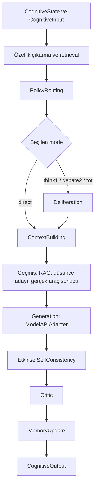

# 09 · Bellek, bilişsel işlem ve araçlar

[İçindekiler](../README.md) · [Önceki: Üretim](08-uretim.md) · [Sonraki: Uçtan uca sistem](10-uctan-uca-sistem.md)

Token üretmek, kullanıcının isteğini karşılamak için gereken işlemlerin yalnız biridir. Önceki bir mesaj gerekli olabilir; bir hesaplamanın sonucu dışarıdan alınabilir; bir taslak yeniden değerlendirilebilir. Cevahir'in bilişsel katmanı, modelin hangi bilgi ve hangi işlem sırasıyla çağrılacağını yönetir. Buradaki **cognitive processing**, gözlemlenebilir bir yazılım akışının adıdır; insan benzeri zihinsel yeteneğin kanıtı değildir.

## Context, memory ve retrieval aynı şey değildir

**Context**, o model çağrısına verilen içeriktir. **Memory**, sonraki çağrılar için tutulan durumdur. **Retrieval**, bu durumdan mevcut isteğe hangi parçaların taşınacağını seçer. Büyük bir arşiv, bütün arşivin modele görünmesi demek değildir. Ayrıca [önceki bölümün](08-uretim.md) KV cache'i metin arşivi değil attention ara hesabıdır.

| Durum | Cevahir'deki sahibi | Sonraki davranışa etkisi |
|---|---|---|
| Oturum geçmişi | `CognitiveState.history`; hizmet yolunda konuşma deposundan kurulur | Promptun önceki mesajları taşımasını sağlar. |
| Bilişsel episodik kayıtlar | `MemoryServiceV2._episodic_memory` | İstek kapsamına göre geri getirilecek konuşma parçaları sağlar. |
| Vektör deposu | `MemoryServiceV2` tarafından oluşturulan store | Embedding benzerliğine göre adayları seçer; kalıcılık seçilen backend'e bağlıdır. |
| Kullanıcı kayıtları | Chatting katmanının `MemoryStorage` bileşeni | ContextBuilder yüksek öncelikli kayıtları geçmişe ekleyebilir. |
| Model parametreleri | Sinir çekirdeği / ModelManager | Token dağılımını belirler; belleğe kayıt eklemek bunları güncellemez. |

[MemoryServiceV2.add_turn](../../../cognitive_management/v2/components/memory_service_v2.py#L135), geçmiş listesine rol/içerik ekler; ayrıca kapsam, zaman ve benzersiz kimlik taşıyan episodik kayıt oluşturur. Etkin ve kurulabilir durumdaki embedding adaptörü metni vektöre dönüştürür; vektör deposuna aynı kimlik ve kapsamla ekler. Bu adımın başarısız olması tüm konuşmayı durdurmaz; kod kelime temelli aramaya dönebilir.

Vektör retrieval'da yaygın bir benzerlik ölçüsü

$$
\operatorname{cos}(q,d)=\frac{q^\top d}{\lVert q\rVert\lVert d\rVert}
$$

olur. Bu, iki metnin aynı doğruluk değerine sahip olduğunu göstermez; embedding uzayında yakınlığını ölçer. Cevahir'in [retrieve_context](../../../cognitive_management/v2/components/memory_service_v2.py#L215) metodu sorguyu embed eder, store aramasına `filter_metadata={"scope": current_scope()}` verir ve sonuçları tekrar kapsam bakımından kontrol eder. `hybrid_search_alpha`, vektör ve kelime puanlarını ağırlıklı birleştirir. Vektör sonuçları yoksa kelime araması kullanılır. `_semantic_search` adlı eski fallback de kelime örtüşmesi hesaplar; adına bakıp sinirsel anlam araması sayılmamalıdır.

`memory.enable_vector_memory`, `embedding_provider`, `vector_store_provider`, `memory.enable_rag` ve eşik alanları [CognitiveManagerConfig](../../../cognitive_management/config.py) içinde seçilir. Factory yalnız `memory` ve `chroma` sağlayıcılarını kurar; ayar şemasında adı geçen Pinecone, Weaviate, Qdrant ve Milvus dalları henüz `NotImplementedError` verir. Varsayılanın etkin olması, dış embedding paketinin/modelinin ortamda bulunacağını garanti etmez. [MemoryVectorStore](../../../cognitive_management/v2/components/vector_store/memory_vector_store.py#L49) süreç içi depodur; kalıcı bir veritabanıyla özdeş değildir. Retrieval-augmented generation, seçilen parçaları üretimin girdisine ekleyerek parametrelerde kodlanmış bilgiyle dış kayıtları birleştirir; özgün [RAG çalışması](https://arxiv.org/abs/2005.11401) bunun ayrı bir modelleme yaklaşımı olduğunu gösterir. Cevahir'in prompt zenginleştirmesi o makalenin bütün eğitim prosedürünü uyguladığı anlamına gelmez.

Bellek bütçesi de bir mekanizma seçer. [summarize_if_needed](../../../cognitive_management/v2/components/memory_service_v2.py#L521), etkin olduğunda altıdan uzun geçmişi son üç kayda indirir; bu metot bir dil modeline özet yazdırmaz. `prune` bu uyumluluk yolunda listenin kopyasını döndürür; asıl bağlam kırpması `build_context` tarafındadır. Oturum özeti enjekte eden ayrı metotla bunları ayırmak gerekir. Eski bir bilginin kaybolması bazen retrieval başarısızlığı değil, bu görünürlük kararının sonucudur.

## Token embedding'den cümle ve belge embedding'ine

[Sinir ağı bölümünde](03-sinir-aglari.md) bir token kimliği, öğrenilmiş tablonun bir satırını seçiyordu. Bu işlemde çıktı şekli `B × T × D` idi: her konuma bir vektör düşer. Retrieval ise değişken uzunluktaki bir sorguyu veya paragrafı karşılaştırılabilir, sabit boyutlu bir vektöre dönüştürmek ister. Bir token satırıyla bütün cümlenin temsili aynı nesne değildir. Bağlamsal token durumlarının ortalamasını almak olası bir havuzlama işlemidir; hangi metinlerin yakın olması gerektiği eğitim hedefinden de etkilenir. Rastgele bir dil modelinin ortalama durumlarına “anlam vektörü” demek, retrieval kalitesini ölçmüş olmaz.

[Sentence-BERT](https://arxiv.org/abs/1908.10084), cümlelerin ayrı kodlanıp benzerliklerinin karşılaştırılabildiği temsil öğrenimini ele alır. [Dense Passage Retrieval](https://arxiv.org/abs/2004.04906) ise soru ve pasaj kodlayıcılarını ilgili pasajı ayırmak için eğitir. Bunlar aynı yöntem değildir; ortak fikir, her sorguda bütün metin çiftlerini birlikte çalıştırma zorunluluğunu azaltmaktır. Kavramsal olarak `q=f(soru)`, `d=g(pasaj)` yazılır. `f=g` seçilebilir; ayrı kodlayıcılar da kullanılabilir. Depodaki vektörlerle sorgu vektörünün boyutunun eşit olması gereklidir, fakat aynı anlamsal uzayda olmalarını tek başına garanti etmez.

Cevahir'deki [SentenceTransformersAdapter.encode](../../../cognitive_management/v2/components/embedding_adapter.py#L155), seçilmiş dış modele `normalize_embeddings=True` verir. [BaseEmbeddingAdapter.encode_single](../../../cognitive_management/v2/components/embedding_adapter.py#L92) tek metni bu arayüzden geçirir. Bu adaptör, çekirdeğin `LanguageEmbedding` tablosunu otomatik olarak yeniden kullanmaz. Model değiştirildiğinde eski kayıtların yeniden kodlanması gerekip gerekmediği değerlendirilmelidir: aynı boyutlu iki farklı embedding modeli de farklı koordinat sistemleri üretebilir. Bu bölümdeki küçük vektör hesabı elle belirlenmiş temsil kullanır; herhangi bir dış embedding modelinin Türkçe retrieval başarısı ölçülmüş değildir.

## Benzerlik puanı, kapsam ve aday seçimi

[MemoryVectorStore._cosine_similarity](../../../cognitive_management/v2/components/vector_store/memory_vector_store.py#L83), yukarıdaki ham kosinüsü doğrudan döndürmez. Sıfır olmayan vektörler için `s=(1+cos(q,d))/2` dönüşümünü uygular. Böylece dik vektörlerin puanı `0.5`, zıt yönlülerin `0`, aynı yönlülerin `1` olur. Sıfır norm durumunda kod özel olarak `0` döndürür. Bu nedenle bir eşik, hangi sağlayıcının hangi puan sözleşmesini kullandığıyla birlikte okunmalıdır.

Örneğin `q=(1,0)`, bizim kaydımız `a=(0.8,0.2)`, başka oturumun kaydı `b=(1,0)` olsun:

$$
\cos(q,a)=\frac{0.8}{\sqrt{0.68}}\approx0.9701425,
\qquad s(q,a)\approx0.98507125,
\qquad s(q,b)=1.
$$

Global `top_k=1` alıp sonradan kapsam filtresi uygulamak yalnız `b` kaydını seçer ve onu eleyince boş sonuç bırakır. Önce kapsam filtresi uygulamak `a` kaydını doğru aday kümesinde birinci yapar. [MemoryVectorStore.search](../../../cognitive_management/v2/components/vector_store/memory_vector_store.py#L182) filtreyi puanlama ve top-k'dan önce uygular. Bu sıralama hem görünürlük sınırını hem uygun kayıtların geri getirilmesini etkiler. Buradaki `memory` sağlayıcısı adayları tek tek tarar; yaklaşık en yakın komşu indeksi değildir. Puanlama maliyeti, taranan aday sayısı `N` ve boyut `D` için `O(ND)` düzeyindedir; ayrıca sonuçları sıralar.

## Hybrid retrieval neyi birleştirir?

[MemoryServiceV2._combine_search_results](../../../cognitive_management/v2/components/memory_service_v2.py#L302), aynı içerik metni bulunan sonuçları birleştirir. İki listede bulunan bir kayıt için

$$s_h=\alpha s_v+(1-\alpha)s_k$$

hesaplanır. `s_v=0.9`, `s_k=0.2`, `alpha=0.7` ise `s_h=0.69` olur. Yalnız vektör listesinde bulunan kayıt `alpha*s_v` alır. Dolayısıyla bu formül, önceki aday seçiminin ve eksik bileşenlerin etkisini de taşır; bütün arşiv için iki puanın eksiksiz hesaplandığı varsayılmamalıdır.

Kelime puanı tam bir BM25 uygulaması değildir. [_keyword_search](../../../cognitive_management/v2/components/memory_service_v2.py#L414), sorgu sözcüklerinin içerikte bulunma oranını ve ilk eşleşmenin konumunu kullanır. Alt dize araması sözcük sınırı eşleşmesiyle aynı değildir. Ayrıca vektör puanını `[0,1]` aralığına taşımak iki puanı kalibre edilmiş olasılıklar yapmaz. `alpha=0.7`, “cevap yüzde yetmiş anlamsal olarak doğrudur” demek değildir. İçeriğe göre birleştirme aynı metnin farklı köken kayıtlarını da tek sonuca indirebilir; kanıtın kaynağını inceleyen uygulama bu ayrıntıyı hesaba katmalıdır.

Retrieval değerlendirmesinde ilgili kaydın ilk `k` içinde bulunması, getirilen kaydın güncelliği ve son cevabın doğruluğu ayrı ölçümlerdir. Birincisi iyi olduğu halde üretici kaydı yanlış yorumlayabilir. Birbirine benzeyen yanlış kayıtlar yüksek puan alabilir. Deneyde sorgu kümesi, ilgili kayıt etiketleri, kapsam ve eşik sabitlenmeden yalnız ortalama benzerlik puanının artmasını başarı saymak yeterli değildir.

## RAG: dış kayıt, üretim ve eğitim ilişkisi

Özgün RAG modellemesinde getirilen pasaj `z`, üretim dağılımında bir ara değişkendir; dizi düzeyindeki fikir yaklaşık olarak `p(y|x)=sum_z p(z|x)p(y|x,z)` biçiminde yazılır. Makale, getirici ve üreticiyi içeren ince ayar yaklaşımını ve pasajın dizi veya token düzeyinde kullanılmasını inceler. Cevahir'in [RAGEnhancer.enhance_context](../../../cognitive_management/v2/components/rag_enhancer.py#L74) metodu ise seçilen kayıtları metin halinde mevcut bağlama ekler. Bu yolda pasajlar üzerinden öğrenilen marjinal olasılık toplamı veya ortak RAG eğitimi yoktur. Kavram benzerliği, uygulamaların matematiksel eşdeğerliği anlamına gelmez. [Lewis ve diğerleri, 2020](https://arxiv.org/abs/2005.11401).

Bağlama sığan kayıt ile üreticinin etkili kullandığı kayıt da ayrılır. [Lost in the Middle](https://arxiv.org/abs/2307.03172), incelediği soru yanıtlama ve anahtar-değer görevlerinde ilgili bilginin konumunun performansı etkileyebildiğini gösterir. Bu sonuç bütün modeller ve görevler için aynı düşüşü garanti etmez; Cevahir için ölçülmesi gereken bir etkeni işaret eder. Kayıt sayısı, sırası, yinelenen içerik ve bağlam kırpması birlikte kaydedilmelidir. Daha uzun prompt, daha doğru cevap için yeter koşul değildir.

## Bilişsel çağrı sırası

[CognitiveManager.handle](../../../cognitive_management/cognitive_manager.py#L512), durum ve isteği doğrular, ardından orchestrator'a iletir. [CognitiveOrchestrator._build_pipeline](../../../cognitive_management/v2/core/orchestrator.py#L172) gerçek handler zincirini kurar. Akıştaki bir bileşenin bulunması, her istekte ek model çağrısı yapması anlamına gelmez.



[PolicyRouterV2.route](../../../cognitive_management/v2/components/policy_router_v2.py#L82), özelliklerden risk ve geçiş kapıları çıkarır. `_select_mode` önce `allow_inner_steps` ayarını kontrol eder; kısa sohbet ve yaratıcı içerik doğrudan dala gider. ToT etkin ve kapısı açıksa `tot`; matematik/kod, karmaşıklık ve debate ayarlarına göre `think1` veya `debate2`; diğer koşullarda risk/entropy ve önceki mod etkili olur. Bunlar kodlanmış seçim sezgiselleridir. Router ismi, kendi başına öğrenilmiş bir yönlendirme ağı bulunduğunu göstermez. Deneysel araştırma denetleyicisinin koşullu değişiklikleri [araştırma bölümünde](11-arastirma-laboratuvari.md) ayrıca ele alınır.

[DeliberationHandler._process](../../../cognitive_management/v2/processing/handlers.py#L317) `think1` için bir, `debate2` için iki aday ister. İki adayda çeşitlilik filtresi ve skor seçimi vardır; bu dal iki bağımsız kişinin karşılıklı tartışmasını simüle eden sınırsız bir sistem değildir. `tot` dalı, [TreeOfThoughts.solve](../../../cognitive_management/v2/components/tree_of_thoughts.py#L145) üzerinden düşünce yollarını değerlendirir; başlatılamaz veya işlenemezse `think1` fallback'i bulunur. [Özgün ToT yaklaşımı](https://arxiv.org/abs/2305.10601), arama ağacında aday üretme ve değerlendirmeyi birleştirir. Cevahir'de dal sayısı ve derinlik maliyeti sınırlar; dallanmanın varlığı kalite artışını tek başına kanıtlamaz.

Model belirsizliği için [CevahirModelAPI.entropy_details](../../../model/cevahir.py#L899), tokenizer'ın ID çıktısını kullanır ve cache kapalı ileri geçişin son logits'inden entropi hesaplar. `H(p)/log(V)` ile normalize eder; hesaplanamayan durumda `available=False`, nötr `value=0.5` ve gerektiğinde hata türü döner. Bu dağılım entropisidir; cevabın olgusal doğruluğunun kalibre edilmiş olasılığı değildir. `entropy_estimate` yalnız sayıyı döndürdüğünden kaynağı bilmesi gereken tüketici ayrıntılı arayüzü kullanmalıdır.

### Entropi ile doğruluk arasındaki karşı örnek

İki olası token için `p=(0.99,0.01)` dağılımının normalize entropisi yaklaşık `0.0808`'dir. En olası token yanlış bilgiyi başlatıyorsa düşük entropiye rağmen cevap yanlış olabilir. `p=(0.5,0.5)` için normalize entropi `1`'dir; iki token aynı doğru cevabın farklı ifade biçimlerini başlatabilir. Bu örnekler, sonraki token kararsızlığıyla bilgi doğruluğunun farklı değişkenler olduğunu gösterir. Router'ın sayısal eşikleri yerel mühendislik kararlarıdır; dosya yorumunda bir makalenin adının bulunması, belirli eşik değerinin o makalede doğrulandığını kanıtlamaz. Özellikle `available=False` değerini gerçek ölçüm gibi yorumlamak, başarısız ölçümü davranış kararına gizlice taşır.

### Çok adaylı seçim ve ortak hata

[Self-consistency çalışması](https://arxiv.org/abs/2203.11171), örneklenmiş akıl yürütme yollarından ulaşılan cevapları bir araya getirir. Yerel [_majority_select](../../../cognitive_management/v2/processing/handlers.py#L92) ise aday metinlerin bigram örtüşmelerini karşılaştırıp ortalama benzerliği yüksek adayı seçer. Bu, son cevapların anlamsal eşitliğine göre oy saymakla aynı değildir. `_score_select`, backend skoruna göre seçim yapar; `hybrid` dalı iki yöntemi birleştirir. Yerel `agreement_score` alanı bir doğruluk olasılığı olarak kalibre edilmiş değildir.

Basit bir düşünce deneyinde üç bağımsız adayın her biri `p=0.7` olasılıkla doğru ikili cevabı veriyorsa çoğunluğun doğruluğu `3p²(1-p)+p³=0.784` olur. Adaylar tamamen aynı hatayı paylaşıyorsa üç kez örneklemek doğruluğu `0.7`'den artırmaz. Bu hesap Cevahir ölçümü değildir; bağımsızlık varsayımının neden belirleyici olduğunu gösterir. Aynı model, aynı yanlış retrieval kaydı ve aynı değerlendirme ölçütü ortak hatayı koruyabilir.

[TreeOfThoughts._expand_node](../../../cognitive_management/v2/components/tree_of_thoughts.py#L280) her genişletmede `branching_factor+1` aday üretmeye çalışır; seçilen dallar sonraki seviyeye taşınır. Aday üretme ve değerlendirme çağrıları ayrı maliyetlerdir. Skorlama başarısız olursa kelime örtüşmesi, uzunluk ve adım belirteçlerinden oluşan sezgisel değerlendirme kullanılabilir. Bu durumda daha çok dal, dış dünyadan daha çok bağımsız doğrulama anlamına gelmez. ToT'nin [özgün araştırmadaki](https://arxiv.org/abs/2305.10601) sonuçları, yerel uygulamaya ölçüm yapılmadan aktarılmamalıdır.

## Araç seçmek ile araç kullanmak

Bir araç, modelden farklı bir hesap veya dış bilgi kaynağı sağlayan kayıtlı fonksiyondur. Araç adını cevaba yazmak gerçek yürütme değildir. [ContextBuildingHandler._process](../../../cognitive_management/v2/processing/handlers.py#L463), seçilen araç için açık `request.metadata["tool_parameters"]` değerlerini veya çıkarılmış parametreleri alır. Sonra [ToolExecutorV2.execute](../../../cognitive_management/v2/components/tool_executor_v2.py#L139) çağrılır. Kayıt, etkinlik ve izin listesi denetlenir; fonksiyon imzası ile temel parametre türleri doğrulanır. Yalnız başarılı dönüşten sonra `context.tool_name` atanır ve sonuç prompta eklenir:

```python
result = executor.execute(selected_tool, parameters)
context.tool_name = selected_tool
context_text += f"\n\n[ARAÇ SONUCU: {selected_tool}]\n{result}"
```

Bu gerçek [kaynak parçası](../../../cognitive_management/v2/processing/handlers.py#L527), başarı bilgisinin nereden geldiğini gösterir. Varsayılan calculator sınırlı AST aritmetiği uygular: sayılar ve `+ - * /`. Arama ve dosya araçları kendiliğinden dış dünyaya bağlanmaz; çağıran tarafından kaydedilmelidir. Bir şemanın bulunması da tam bir güvenlik sınırı veya sonuç doğruluğu ispatı değildir.

Kaynak incelemesinde somut bir hata bulundu: önceki `8fb26e3` sürümünde [ToolPolicyV2.infer_tool_parameters](../../../cognitive_management/v2/components/tool_policy_v2.py#L184), `2+3*4` isteğini `2+3` olarak kesiyordu; ifade bulamazsa ilk iki sayıyı kendiliğinden topluyordu. [Düzeltme öncesi çalıştırma kaydı](../evidence/runtime_walkthrough_before_tool_fix.json) bu negatif sonucu korur. Bu kitap turunda hata düzeltildi: çıkarıcı tek ve tam bir aritmetik parçayı AST ile doğrular; parantez, ondalık, tekli işaret ve bilimsel gösterim korunur. Desteklenmeyen, eksik veya birden fazla ifade varsa işlem uydurulmaz. Açık `tool_parameters` bu çıkarım dalını atlar ve yürütücü tarafından ayrıca denetlenir. Bu küçük tanıyıcı doğal dildeki bütün matematik sorularını çözmez; örneğin virgüllü ondalık veya cümle sonu noktalaması açık ifade gerektirebilir.

Ardından [GenerationHandler._process](../../../cognitive_management/v2/processing/handlers.py#L558) oluşturulan promptu `backend.generate` ile modele verir. [ModelAPIAdapter.generate](../../../cognitive_management/v2/adapters/backend_adapter.py#L101), bilişsel `decoding_config` sözleşmesini `CevahirModelAPI` arayüzüne taşır; gerçek token döngüsü önceki bölümdeki adaptörde çalışır. Araç ve retrieval bu nedenle normal cevap üretiminden önce bağlama katılır; her istekte üretimden sonra devreye giren zorunlu ayrı aşamalar değildir.

### Araç doğruluğunu üç aşamada okumak

İstek `x`, parametre çıkarıcısı `P`, araç `T` ve üretici `G` olsun. Gerçek akış kabaca `G(x,T(P(x)))` biçimindedir. Doğru araç, yanlış parametreyi de doğru hesaplayabilir. Düzeltme öncesinde `x=2+3*4` için çıkarıcı `P(x)=2+3` üretiyor, araç sonucu `"5"` oluyordu. Açık parametre `operation=2+3*4` olduğunda aynı araç `"14"` döndürüyordu. Güncel çıkarıcı her iki yolda da tam ifadeyi taşır ve sonuç `"14"` olur; [güncel yürütme kaydı](../evidence/runtime_walkthrough.json) bunu doğrular. Yürütücünün iki çağrısı da istisna üretmeden tamamlandığından `success_count` ikisini de başarılı sayar. Bu sayaç kullanıcı niyetinin karşılandığını ölçmez; fonksiyonun başarılı döndüğünü ölçer. Üreticinin sonucu yanıta doğru taşıması üçüncü ayrı denetimdir.

[ReAct](https://arxiv.org/abs/2210.03629), modelin akıl yürütme ve çevreyle eylem adımlarını dönüşümlü kullanmasını inceler. Buradaki handler zincirinde bir araç sonucunun prompta eklenmesi, otomatik olarak böyle bir tekrar planlama döngüsü kurmaz. [Toolformer](https://arxiv.org/abs/2302.04761), hangi API'nin ne zaman ve hangi argümanlarla çağrılacağını öğrenmek için eğitim verisi ve bir eğitim yaklaşımı sunar. Cevahir'in kayıtlı fonksiyonları, seçme sezgiselleri ve düzenli ifade çıkarıcısı o eğitim mekanizması değildir. Bu karşılaştırma araç fikrini küçültmez; hangi yeteneğin koddan, hangisinin eğitimden geldiğini görünür kılar.

## Taslak denetimi, geri bildirim ve öğrenme sınırı

Self-consistency etkin olduğunda birden çok adayın oy/skorla seçilmesi, ek hesap karşılığında cevap seçimini değiştirir. [CriticHandler._process](../../../cognitive_management/v2/processing/handlers.py#L728) taslağı `review_detailed` veya `review` ile denetler; metin, revizyon bilgisi ve geri bildirimleri alır. [CriticV2](../../../cognitive_management/v2/components/critic_v2.py), yapılandırmaya bağlı kontroller ve yeniden üretim yapabilir. Bir modelin kendi ürettiği olumlu değerlendirme, bağımsız çevresel doğrulama sayılmaz. Aynı hatayı hem üreten hem onaylayan bir akış mümkündür.

[MemoryUpdateHandler._process](../../../cognitive_management/v2/processing/handlers.py#L796), dolu son metni geçmişe ekler ve oturum sayaçlarını günceller. Bu yol `loss.backward()` veya optimizer adımı içermez. Cevap iyileştirme, kaydı hatırlama ve ağırlık öğrenme ayrımı bu yüzden korunmalıdır. Araştırma testindeki [test_observations_do_not_self_verify](../../../tests/evolution/test_research_experience.py#L61) ile critic kaynaklarını reddeden test, bu ayrımın deneysel denetleyici tarafındaki somut karşılıklarıdır.

Bir sistemin gelecekteki davranışı ağırlıkları değişmeden de değişebilir: yeni bir kayıt daha sonra geri getirildiğinde cevap değişir. Bu, parametre dışı bir durum güncellemesidir ve geniş bir öğrenme tanımında dikkate alınmalıdır. Ancak yaşam boyu öğrenme iddiası için durumun ne kadar sürdüğü, hangi deneyimle değiştiği, yanlış kaydın nasıl düzeltildiği ve yeni duruma ne ölçüde genellendiği gösterilmelidir. “Optimizer yoksa hiçbir öğrenme yoktur” sonucu da “kayıt varsa genel öğrenme çözülmüştür” sonucu da buradan çıkmaz.

Üç sınama bu ayrımı somutlaştırır. Süreç yeniden başlatılınca etkinin korunması **kalıcılığı**; farklı ifadeli ve önce görülmemiş ilgili girdilere aktarılması **genellemeyi**; hatalı kaydın etkisinin sınırlandırılıp düzeltilebilmesi **kontrolü** sınar. Aynı sorunun aynı kaydı tekrar getirmesi üçünü birden kanıtlamaz. Bellekte yanlış bir asistan cevabı yeniden görülüp kaynakmış gibi kullanılırsa hata kendi tekrarından güç alabilir. Kayıt eklemek ile çevresel doğrulamayı ayıran araştırma sözleşmesi bu yüzden önemlidir. [Araştırma laboratuvarı](11-arastirma-laboratuvari.md), bu mekanizmaların genel yaşayan öğrenme problemini henüz çözmediğini korur.

## Eşzamanlılık ve doğrulama

Asenkron pipeline aynı mantığı ayrı bir algoritmaya dönüştürmez. [AsyncGenerationHandler._process_async](../../../cognitive_management/v2/processing/async_handlers.py#L181) ve diğer adaptörler sync handler'ı `asyncio.to_thread` ile çalıştırır; zincirde sonraki aşama yine öncekinin sonucunu bekler. Bu, olay döngüsünü serbest bırakabilir; paylaşılan modelin cache kilidini kaldırmaz. İstek kapsamı [request_scope](../../../cognitive_management/v2/utils/request_scope.py) içindeki `ContextVar` ile kullanıcı/oturum kimliğinden kurulur. Doğrudan yerel çağrıdaki `local` varsayılanı, doğrulanmış kullanıcı izolasyonunun yerini tutmaz.

[Agent sözleşmesi testleri](../../../tests/evolution/test_agent_contracts.py) kapsamlı retrieval'ı, top-k'dan önce kapsam filtresini, gerçek araç yürütmeyi ve başarısız aracın kullanılmış sayılmamasını kontrol eder. [Runtime testleri](../../../tests/evolution/test_runtime_lifecycle.py) sync/async hook'larını ve cache hit sonrasındaki geçmiş güncellemelerini inceler. Eski [bilişsel mimari belgesi](../../modules/cognitive_management/architecture/README.md) bileşenlerin tasarım geçmişi için yararlıdır; oradaki sürüm veya yetenek etiketleri bu bölümün güncel çağrı zincirinin yerine geçirilmemelidir.

## Çalıştırılabilir örnek ve çözümlü alıştırmalar

[Çalıştırılabilir eşlikçi](../../../scripts/book_runtime_walkthrough.py) ile [sonuç kaydı](../evidence/runtime_walkthrough.json), elle seçilmiş iki boyutlu vektörlerle gerçek retrieval metodunu ve gerçek calculator yürütücüsünü denetler. Bu küçük örnekler büyük bir dil modelinin genel başarı ölçümü değildir. Dış embedding modeli indirmeden mekanizma ve sözleşme sınırını görünür kılar.

### Alıştırma 1 — Kapsam filtresinin sırası

Yukarıdaki `a` ve `b` kayıtlarında `top_k=1` ve geçerli kapsam yalnız `a` için uygunsa sonuç ne olmalıdır? **Çözüm:** Önce kapsam kısıtlanır, sonra adaylar sıralanır; `a`, yaklaşık `0.98507125` store puanıyla döner. `0.9701425` ham kosinüstür. Önce global top-k almak uygun kaydı aday kümesinden çıkardığı için sonradan filtrelemek yeterli değildir.

### Alıştırma 2 — Hybrid puan

İki listede bulunan `A` için `s_v=0.9`, `s_k=0.2`; yalnız vektör listesinde bulunan `B` için `s_v=0.95` olsun. `alpha=0.7` ile hangisi öne geçer? **Çözüm:** `A=0.69`, `B=0.665`; `A` seçilir. Bu, `A`'nın yüzde 69 doğru olduğu anlamına gelmez. Aday listelerinin nasıl oluştuğu da sıralamanın parçasıdır.

### Alıştırma 3 — Üç adayın oybirliği

Üç aday aynı yanlış cevabı veriyorsa oybirliği dış kanıt olur mu? **Çözüm:** Hayır. Uyum yalnız çıktıların ilişkisidir. Bağımsız ve başarı olasılığı `0.7` olan ikili adaylar varsayımında çoğunluk `0.784` verir; tam ilişkili adaylarda artış yoktur. Yerel bigram merkez seçiminin bu teorik çoğunluk hesabını uyguladığı da varsayılamaz.

### Alıştırma 4 — Başarılı ama yanlış araç çağrısı

Düzeltme öncesi kayıtta `2+3*4` çıkarımla ve açık parametreyle iki kez yürütülüyor. `success_count=2` ise iki kullanıcı isteği doğru karşılanmış mıdır? **Çözüm:** Hayır. Eski çıkarıcıdan gelen `2+3` sonucu `"5"`, tam ifade sonucu `"14"` idi. Yeni sürüm bu örneği düzeltir, fakat sayacın anlamı değişmez: istisnasız dönüşleri sayar. Parametre çıkarma, araç yürütme ve nihai yanıtın uygunluğu ayrı değerlendirilmelidir.

### Alıştırma 5 — Bir kayıt yeni kapasite midir?

Sistem bir düzeltmeyi kaydedip aynı soruya doğru cevap veriyor. Yaşarken öğrenmenin genel ilkesi kanıtlandı mı? **Çözüm:** Yalnız dar bir durum değişimi gözlendi. Yeni ifadeye aktarım, yeniden başlatma sonrası etki, yanlış düzeltmeye dayanıklılık ve eski yeteneklere etkisi henüz bilinmiyor. Parametre değişmemesi kazanımı yok saymayı gerektirmez; tek kayıtla davranış değişmesi de kalıcı ve genellenebilir kapasite artışını kanıtlamaz.

## Birincil kaynaklar

Aşağıdaki yıllar ilk arXiv sürümünü belirtir. [Kaynak inceleme kaydı](../evidence/academic_memory_sources.json), erişim tarihini ve okunan yerel sembolleri saklar; atıf, Cevahir için ölçülmemiş başarı sonucu aktarmaz.

1. Reimers, N.; Gurevych, I. (2019). [Sentence-BERT: Sentence Embeddings using Siamese BERT-Networks](https://arxiv.org/abs/1908.10084).
2. Karpukhin, V. ve diğerleri (2020). [Dense Passage Retrieval for Open-Domain Question Answering](https://arxiv.org/abs/2004.04906).
3. Lewis, P. ve diğerleri (2020). [Retrieval-Augmented Generation for Knowledge-Intensive NLP Tasks](https://arxiv.org/abs/2005.11401).
4. Wang, X. ve diğerleri (2022). [Self-Consistency Improves Chain of Thought Reasoning in Language Models](https://arxiv.org/abs/2203.11171).
5. Yao, S. ve diğerleri (2022). [ReAct: Synergizing Reasoning and Acting in Language Models](https://arxiv.org/abs/2210.03629).
6. Schick, T. ve diğerleri (2023). [Toolformer: Language Models Can Teach Themselves to Use Tools](https://arxiv.org/abs/2302.04761).
7. Yao, S. ve diğerleri (2023). [Tree of Thoughts: Deliberate Problem Solving with Large Language Models](https://arxiv.org/abs/2305.10601).
8. Liu, N. F. ve diğerleri (2023). [Lost in the Middle: How Language Models Use Long Contexts](https://arxiv.org/abs/2307.03172).

[İçindekiler](../README.md) · [Sonraki: Uçtan uca sistem](10-uctan-uca-sistem.md)
