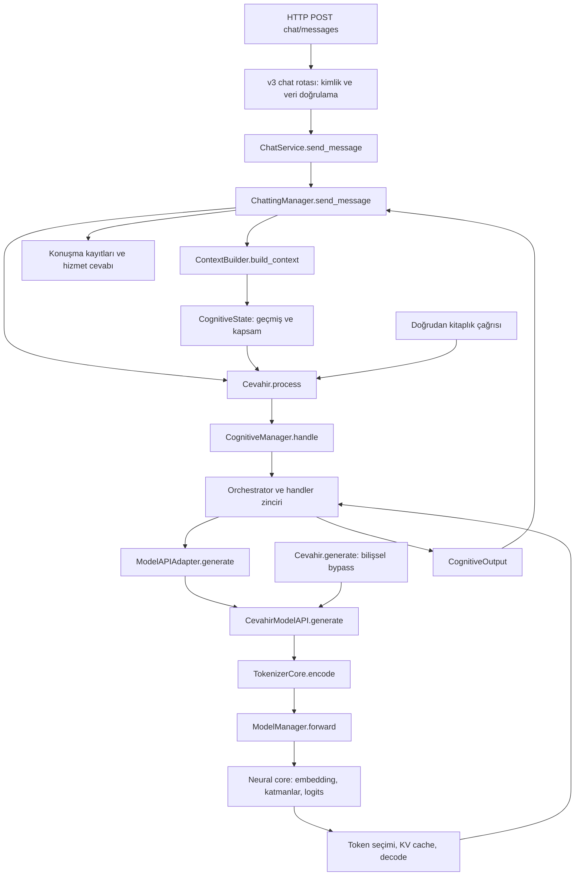

# 10 · Bir mesajın sistem boyunca yolculuğu

[İçindekiler](../README.md) · [Önceki: Bellek, biliş ve araçlar](09-bellek-bilis-araclar.md) · [Sonraki: Araştırma laboratuvarı](11-arastirma-laboratuvari.md)

Artık metnin sayılara nasıl dönüştüğünü, ağın nasıl eğitildiğini ve tokenların nasıl üretildiğini biliyoruz. Bir sistem bu mekanizmaların yan yana dizilmesinden fazlasıdır: **hangi bileşenin hangi durumu sahiplendiği** ve **bir çıktının sonraki bileşen için ne anlama geldiği** açık olmalıdır. Yoksa doğru bir attention hesabı bile yanlış tokenizer kimliği, yanlış oturum geçmişi veya paylaşılan cache nedeniyle yanlış kullanılır.

Bu bölüm üç gerçek giriş yolunu ayırır. Cevahir kitaplık arayüzü, sohbet/veritabanı yöneticisi ve HTTP hizmeti birbirini her durumda aynı sırayla çağırmaz. Diyagram bir tasarım temennisi değil, kaynakta bulunan bağlantıların haritasıdır.

## Kurulum ile istek işleme farklı evrelerdir

[Cevahir.__init__](../../../model/cevahir.py#L1006), tokenizer, ModelManager, model adaptörü ve isteğe göre cognitive manager bağlantılarını kurar. Dışarıdan hazırlanmış bileşenler de verilebilir. [_init_model](../../../model/cevahir.py#L1142), model ayarlarını ve yükleme tercihini ele alır; [_init_cognitive](../../../model/cevahir.py#L1191), `CevahirModelAPI` üzerinden model erişimi sağlayan bilişsel yöneticiyi oluşturur. Kurulumda mimari boyut seçmek veya checkpoint yüklemek, her kullanıcı mesajında tekrar yapılacak işlem değildir.

HTTP tarafında [api.app_factory.create_app](../../../api/app_factory.py#L191), Cevahir ve ChattingManager örneklerini kurar veya dışarıdan alır; ardından servisleri ve rotaları bağlar. `create_cevahir_instance` içindeki model ayarları ortak `normalize_model_config` yolundan geçer. `CEVAHIR_MODEL_PROFILE="legacy_api"`, eski API boyutlarını açık uyumluluk tercihi olarak seçer; her arayüz için farklı gizli bir varsayılan mimari sayılmamalıdır. Ortam, tokenizer dosyaları ve checkpoint seçimi yine kurulumun parçalarıdır.



Diyagramdaki geri ok, aynı çağrının sonucunun dönmesini gösterir. Özellikle `Cevahir → ChattingManager` zorunlu bir çağrı yoktur: **ChattingManager, sahip olduğu Cevahir örneğini çağırır.** Doğrudan Cevahir kullanımı, SQL konuşma kaydını kendiliğinden oluşturmaz.

## Örnek mesaj: girişten bağlama

Kullanıcı mevcut oturumuna “Önceki hesaplamayı 12 ile yeniden yap” gönderdiğini düşünelim. [v3 chat rotası](../../../api/routes/v3/chat.py#L33) doğrulanmış kullanıcı kimliğini kullanır; JSON'dan `session_id` ve `message` alır. [ChatService.send_message](../../../api/services/chat_service.py#L39), bunları değiştirmeden [ChattingManager.send_message](../../../chatting_management/chatting_manager.py#L111) metoduna iletir. Servis katmanı modelin token seçimini uygulamaz; iletişim sözleşmesini ve hataların taşınmasını düzenler.

ChattingManager önce oturum erişimini ve mesaj uzunluğunu doğrular. Sonra [ContextBuilder.build_context](../../../chatting_management/components/context_builder.py#L79) geçmişi kurar. `_get_recent_history`, yapılandırılmış sayıda yakın mesaj alır, en yeni sonek bütçeye sığana kadar seçer ve kronolojik sıraya döndürür. Burada token sayısı gerçek tokenizer çalıştırılarak ölçülmez; toplam karakter sayısının dörde bölünmesiyle yaklaşık hesaplanır. Dolayısıyla `max_context_tokens`, bu seviyede kesin token sınırı değildir. Bunun değiştirilmesi eski mesajların görünürlüğünü ve son prompt uzunluğunu değiştirir.

Mevcut mesaj bu geçmişe hemen eklenmez; bilişsel promptta zaten ayrı kullanıcı girdisi olarak bulunacaktır. Üretimden sonra geçmişe eklenmesi, aynı mesajın promptta iki kez yer almasını önler. Kullanıcı belleği etkinse `_get_memory_context` yüksek öncelikli kayıtları alır. Metodun `query` parametresi vardır ama bu SQL seçiminde sorgu embedding'i hesaplanmaz; bunu önceki bölümün vektör retrieval'ıyla karıştırmamak gerekir.

## Bağlamdan model çağrısına

[Cevahir.process](../../../model/cevahir.py#L1621) boş bırakılan state yerine yeni `CognitiveState` kurar; `text` ve ek alanlardan `CognitiveInput` oluşturur ve manager'a iletir. Kaynaktaki esas bağlantı küçüktür:

```python
if state is None:
    state = CognitiveState()

input_msg = CognitiveInput(user_message=text, **kwargs)
output = self._cognitive_manager.handle(state, input_msg)
```

Bu çağrıda state'i yeniden kullanmak geçmişi sürdürür; her tur yeni state vermek farklı bir yaşam döngüsüdür. `kwargs`, CognitiveInput alanları olmalıdır; rastgele bir model ayarının burada otomatik kabul edildiği varsayılmamalıdır. Açık üretim ayarları için `Cevahir.generate` ve `DecodingConfig` yolu ayrıca vardır.

Orchestrator, [önceki bölümdeki](09-bellek-bilis-araclar.md) strateji ve bağlam zincirini çalıştırır. Hesap makinesi gerçekten seçilip yürütülürse sonuç prompta girer. Model çağrısı şu sınırları geçer:

| Çağıran → alıcı | Girdi | Çıktı ve sonraki kullanım |
|---|---|---|
| `GenerationHandler` → `ModelAPIAdapter.generate` | Context metni, decoding ayarları | Backend farklarını gizleyen metin üretim çağrısı. |
| Adaptör → `CevahirModelAPI.generate` | Prompt, `DecodingConfig` | Kilitlenen, tokenizer ve autoregressive döngüyü yöneten çağrı. |
| `TokenizerCore.encode` → üretim yordamı | Prompt metni | Token listesi ve kimlikler; kimliklerden `[1,T]` tensörü kurulur. |
| Üretim yordamı → `ModelManager.forward` | Token tensörü, cache konumu, inference bayrağı | Çekirdek logits'i; son konum seçime gider. |
| Çekirdek → üretim yordamı | Embedding ve Transformer hesabı | Vocabulary boyutunda puanlar; seçilen token yeni girdiye döner. |
| `TokenizerCore.decode` → bilişsel akış | Yalnız üretilmiş kimlikler | Taslak metin; gerekirse seçim/critic aşamalarına gider. |

`inference=True`, ModelManager içinde gradyan kaydını kapatır ve ileri geçişi evaluation davranışında çalıştırır. Bu, eğitimdeki loss–backward–optimizer yolunu çağırmaz. Çekirdek hesabı ile token seçimi ayrı olduğu için kötü cevapta hangi katmanın inceleneceği ayrıca belirlenmelidir: yanlış bağlam, araç sonucu, logits veya decoding ayarı farklı nedenlerdir.

## Dönüş yolu ve kayıt sahipliği

Pipeline sonunda [build_output](../../../cognitive_management/v2/processing/pipeline.py#L261), `CognitiveOutput` üretir: son metin, kullanılan mod, başarılı araç adı, critic bilgileri, retrieval kaynakları ve işlem metaverileri. ChattingManager buradan `output.text` alır; kullanıcı ve asistan mesajlarını konuşma deposuna ekler, oturum etkinliğini günceller, cevap sözlüğünü servise döndürür. Bilişsel bellek güncellemesi ile veritabanındaki mesaj kaydı farklı sahiplerde gerçekleşir.

Bu ayrım hata sınırlarını da belirler. Kod sırasına göre cevap üretildikten sonra kayıt yapılır. Dolayısıyla SQL kayıt hatası, modelin hiç çalışmadığını göstermeyebilir. Aynı isteğin tekrar gönderilmesi için uçtan uca idempotent işlem garantisi bu çağrı sırasından çıkarılamaz. Bir model cevabının hesaplanması, geçmişe alınması ve HTTP istemcisine teslim edilmesi üç ayrı olaydır.

## Bir checkpoint hangi hayatı taşır?

Checkpoint modelin ağırlıklarını ve biçime göre optimizer/scheduler ile metadata'yı taşır. [ModelManager.save](../../../model_management/model_manager.py#L657) ve [load](../../../model_management/model_manager.py#L694), tokenizer kimliği ve model şekil sözleşmelerine bağlanır. Parametre matrisinin şeklinin uyumlu olması tek başına yeterli değildir: aynı token numarasının farklı anlama geldiği tokenizer ile yüklemek aynı modeli çalıştırmak değildir.

Konuşma veritabanı, request cache, KV cache, vektör store ve deneysel experience snapshot'ı otomatik olarak tek model checkpoint'inin içinde değildir. “Sistemi kaydettim” ifadesinin kapsamı bu yüzden belirtilmelidir. Yeniden açılan sistemin aynı cevabı veya aynı sonraki öğrenmeyi üretmesi, hangi durumların taşındığına bağlıdır. [Yaşam döngüsü uzlaştırma kaydı](../../architecture/LIFECYCLE_CONSOLIDATION.md), bu sahipliklerin ve tokenizer kimliğinin mühendislik geçmişini korur; [model yaşam döngüsü bölümü](07-model-yasam-dongusu.md) kayıt/yükleme ayrıntılarını açar.

## Eşzamanlılık ve okurun denetim rotası

Tek adaptörde üretim kilidi vardır; async handler'lar thread üzerinden aynı mantığı çalıştırır. Bunlar eşzamanlı eğitim/yükleme, bir modele bağlı birden fazla adaptör veya bütün depolar için atomik işlem garantisi değildir. İstek cache anahtarları da yalnız mesaj metninden ibaret olamaz: geçmiş, kullanıcı/oturum kimliği, decoding ve bellek revizyonu cevabı değiştirebilir. [request_scope](../../../cognitive_management/v2/utils/request_scope.py) bu bağlamı oluşturur; [agent sözleşmesi testleri](../../../tests/evolution/test_agent_contracts.py) geçmiş ve kimlik ayrımlarını kontrol eder.

[API sözleşmesi testleri](../../../tests/evolution/test_api_contracts.py), farklı uygulama factory'lerinin rota bağımsızlığını ve gerçek SQLite oturum sahipliğini sınar. [Runtime yaşam döngüsü testleri](../../../tests/evolution/test_runtime_lifecycle.py) checkpoint biçimlerini ve cache hit sonrasında geçmiş güncellemelerini ele alır. Bunların varlığı bütün dağıtım koşullarında ölçülmüş hizmet güvenilirliği değildir; okuyucu her testin fixture ve iddiasını incelemelidir.

Kaynak okuma alıştırması olarak bir mesajı yukarıdaki tabloda yürütün; her sınırda metin, kimlik listesi, tensör veya durum nesnesinden hangisinin taşındığını yazın. Sonra aynı mesajı `Cevahir.generate(..., use_cognitive_pipeline=False)` ile düşünün: geçmiş oluşturma, araç, retrieval ve critic yolları atlanır. Bu kontrollü fark, ağırlıklar değişmeden neden farklı davranış elde edildiğini açıklar. Sıradaki araştırma bölümü daha zor soruyu sorar: bu yaşantıların gelecekteki hesaplama kapasitesinde kalıcı, kontrollü ve genellenebilir değişiklik üretmesi hangi ek koşulları gerektirir?

[İçindekiler](../README.md) · [Sonraki: Araştırma laboratuvarı](11-arastirma-laboratuvari.md)
