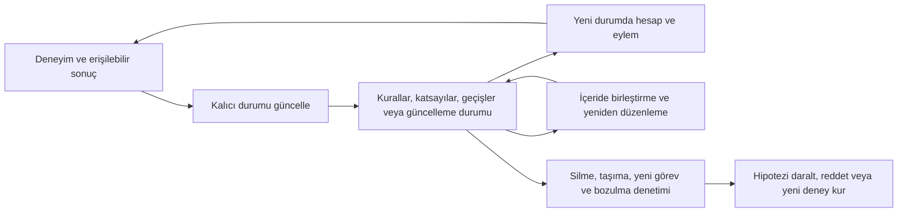

# 11 · Araştırma laboratuvarı: çalışırken öğrenmek ne demektir?

[İçindekiler](../README.md) · [Önceki: Uçtan uca sistem](10-uctan-uca-sistem.md) · [Sonraki: Açık sorular ve katkı](12-acik-sorular.md)

**Ana araştırma problemi hâlâ çözülmedi:** Bir yapay sistem, çalıştığı süre boyunca yaşadığı deneyimler nedeniyle gelecekteki hesaplama ve davranış kapasitesini nasıl kalıcı, kontrollü ve genellenebilir biçimde değiştirebilir? Cevahir'in araştırma kaydı bu sorunun bazı parçalarını çalışan düzeneklerle ele alıyor. Ayrı küçük deneylerin başarısı, tek bir genel öğrenicinin başarısı olarak toplanmıyor.

Önceki bölüm çalışan yazılımın sınırlarını izledi. Burada sınırın ötesindeki iddiaları izliyoruz: hipotez hangi müdahaleyle sınandı, hangi güçlü alternatifle karşılaştırıldı, sonuç hangi koşulda bozuldu? Kitap eski raporların yerine geçmez. [İlk tur](../../research/living_learning_2026_09_20/REPORT_TR.md), [kapsamın yeniden açılması](../../research/living_learning_reassessment_2026_09_20/REPORT_TR.md), [ortak yaşam](../../research/living_learning_joint_2026_09_20/REPORT_TR.md), [öğrenilmiş güncelleme](../../research/living_learning_update_2026_09_20/REPORT_TR.md) ve [öğrenilmiş durum yordamı](../../research/living_learning_state_2026_09_20/REPORT_TR.md), yöntem ve negatiflerin ayrıntılı kaynaklarıdır.

## 1. Eğitim, edinim, konsolidasyon ve çıkarım

Bu araştırmada `TRAINING ≠ ACQUISITION ≠ CONSOLIDATION ≠ INFERENCE` ayrımı, dört zorunlu modül veya birbirini dışlayan dört zaman dilimi önermiyor. **Training**, örnekler ve hedefler üzerinden bir modelin ayarlandığı mühendislik sürecidir. **Acquisition / edinim**, deneyim nedeniyle daha önce bulunmayan kullanılabilir ilişki veya becerinin kazanılmasıdır; gradyanla eğitim bunun bir mekanizması olabilir. **Consolidation / konsolidasyon**, edinilmiş içeriğin korunması, birleştirilmesi veya daha kolay yürütülebilir hale getirilmesidir. **Inference / çıkarım**, mevcut durumu kullanarak cevap veya eylem hesaplamaktır. Sürekli bir sistemde bu işlevler iç içe geçebilir.

Bir mesajı kaydetmek edinimi kanıtlamaz. Bir checkpoint'in değişmesi de iyileşme kanıtı değildir. Aynı başlangıçtan iki sistem alınır; biri ilgili deneyimi yaşar. Geçici bağlam temizlenir, aynı görülmemiş sorgular ve cevaplama bütçesiyle karşılaştırılır. Edinilmiş durumun silinmesi kazanımı kaldırıyor ve aktarılması davranışı taşıyorsa nedensel iddia güçlenir. Ölçümün basit biçimi:

$$
G_{Q,B}(E)=R_{Q,B}(s_0)-R_{Q,B}(s_E).
$$

Burada (Q) yeni görev dağılımı, (B) cevaplama bütçesi, (R) kayıp, (s_E) deneyim sonrası durumdur. Pozitif fark yalnız bu koşullarda yararı gösterir. Uzun yaşam maliyeti için deneyim toplama, güncelleme, saklama ve cevaplama birlikte sayılmalıdır. Bütün dünyalarda sıfır hata isteyen bir ölçüt kullanıcı tarafından verilmedi; aşırı garantilerin imkânsızlığını göstermek gerçek araştırma sorusunu çözmez.

## 2. Ana sistemdeki araştırma kancası neyi gösteriyor?

[Experience-conditioned computation kaydı](../../research/EXPERIENCE_CONDITIONED_COMPUTE.md), uygulanmış üç mekanizmayı tanımlar: ortak istek bütçesi, dış geri bildirimle strateji tercihi ve açık MoE yönlendirme girdisi. [ResearchController.route](../../../cognitive_management/research/controller.py#L82), bilişsel özelliklerden karşılaştırma profili kurar; [ExperienceStore.recommend](../../../cognitive_management/research/experience.py#L262) aynı kapsam/model/tokenizer kimliğindeki gerçekten uygulanmış stratejileri karşılaştırır. `shadow` öneriyi kaydeder, `adaptive` yeterli destek varsa seçimi değiştirir; varsayılan `off`tur.

`observe` sonucu kendiliğinden doğrulamaz. `feedback`, kullanıcı veya bağımsız değerlendirme kaynaklarını kayda bağlar; critic puanı dış doğrulama kabul edilmez. Aynı örnek tekrarları destek sayısını şişirmemelidir. Silme ve düzeltme sonrasında tercih yeniden hesaplanır. Buradaki muhafazakâr destek cezası kalibre edilmiş istatistiksel güven aralığı değildir. [Tablo replay deneyi](../../../benchmarks/research/experience_replay.py), sabit politika, deneyim tercihi ve bozulmuş geri bildirim koşullarını karşılaştırır; gerçek dil modeli kalitesi ölçmez.

MoE girdisi `router_logits + routing_bias` biçimindedir. Bu sürüm alanlara verilen sabit profili seçer; deneyimden uzman anlamları veya genel beceriler öğrendiği gösterilmedi. Mühendislik sözleşmesinin test edilmiş olması ile araştırma hipotezinin gerçek görevlerde doğrulanması ayrıdır. Sonraki bağımsız küçük deneyler bu çalışan kancalara yeni üstünlük atfetmeden temel soruyu açtı.

## 3. İlk elenen iddia: temsil tanığı yeni bilgi sağlar mı?

Başlangıç temsili iki geçmişi aynı anahtara indiriyor, sonuçları farklıysa bir **yetersizlik tanığı** bulunur. Böyle tanıklarla adayları filtrelemenin daha az gözlemle öğrenme sağlayacağı düşünüldü. [witness_audit.search](../../../research/representation_discovery/witness_audit.py#L234), aynı aday dili ve sırasıyla filtreli/filtersiz arama yapar; ikisi de kalan adayları bütün veride tutarlılık sınamasından geçirir.

Tam tutarlılık (C_D(R)), gerçek çelişki tanıklarını ayırmayı (W_D(R)) zaten gerektirir:

$$
C_D(R)\Rightarrow W_D(R),\qquad
\{R:C_D(R)\}=\{R:W_D(R)\land C_D(R)\}.
$$

On beş karşılaştırmanın tamamında aday kümeleri, seçilen temsil, tahmin ve çekimserlikler aynıydı. Filtre hesap sırasını değiştirebildi; yeni ayırt edici bilgi üretmedi. [Negatif sonuç](../../research/REPRESENTATION_WITNESS_AUDIT.md) korundu. Bu, temsil öğrenmenin değersizliği değil, aynı mekanizmayı yeni isimle araştırma yeniliği saymamanın örneğidir.

## 4. Deneyimden yürütülebilir kurala, kuraldan derlemeye

[affine_lifecycle.Learner.observe](../../../research/living_learning/affine_lifecycle.py#L46), verilen araç kimliği ve doğru `(x,y)` gözlemlerinden sonlu alanda (f(x)=ax+b\pmod{101}) kuralını çıkarır. İki farklı girdi katsayıları belirler; üçüncü girdi tutarlılık kontrolüdür. [predict](../../../research/living_learning/affine_lifecycle.py#L82) yeni girdilerde kuralları yürütür; ham deneyim arşivini gerektirmez. `persistent/restore`, edinilmiş kural ve bağımlılık sürümlerini taşır.

Her dünya için 25 başlangıçta toplam 49.000 yeni sorgu doğruydu; durum silinince cevaplanabilirlik kayboldu. Ancak aynı ham kayıtlardan aynı çıkarımı yapan güçlü rakip de eşit başarıya ulaştı. Sonuç, katsayı temsilinin yeni dış bilgi yarattığı iddiasını desteklemez.

[consolidate](../../../research/living_learning/affine_lifecycle.py#L98), mevcut kuralları cebirsel birleştirir. Yeni dış etiket almadan 84 birleştirme işlemi, bir çağrılık bütçede 1.176 sorguyu erişilebilir yaptı. İlk ihtiyaçta derleyen güçlü alternatifle toplam iş yine eşitti: 1.260. Böylece **bilgi kazanımı** ile **eldeki bilginin sınırlı hesapta kullanılabilir olması** ayrıldı. Bir kurala çelişen güvenilir gözlem geldiğinde bağımlı derlemelerin iptali, konsolidasyonun düzeltilebilirlik yükümlülüğüdür. Ayrıntı: [affine deney raporu](../../research/living_learning_2026_09_20/AFFINE_EXPERIMENT.md).

## 5. Sapma, hangi koşulda öğrenmeye yardım ediyor?

Öğrenilmiş başarısızlık yeniden denemeyi kapatırsa, çevrenin değiştiği ve değişmediği dünyalar aynı pasif gözlemleri verebilir. [closed_loop_experiment.simulate](../../../research/living_learning/closed_loop_experiment.py#L48), ilgili deneme, kaçınma ve ilgisiz hareketi ayırır. Yirmi adımlık deterministik sayaç, 240 kalıcı değişim zamanının tamamını en çok 19 adım gecikmeyle buldu. Rastgelelik zorunlu değildi; ilgisiz hareket aynı bilgiyi sağlamadı.

Fakat sekiz adımlık geçici fırsatta daha çok değişim saptayan planlayıcının toplam faydası negatif olabildi. [unknown_change_experiment.posterior](../../../research/living_learning/unknown_change_experiment.py#L28) ve `mixture_plan`, verilmiş üç değişim modeli arasında başarısız denemelerle beklentiyi güncelledi; bazı maliyetlerde yarar, bazı alt dünyalarda zarar bulundu. Bunlar [kanıta erişim araştırmasıdır](../../research/living_learning_2026_09_20/UNKNOWN_CHANGE.md). Kullanıcının düzeltmesiyle yeniden sınama ana problemin yerine konmadı; edinim, temsil, koruma ve gelecekte öğrenebilirlik yeniden merkeze alındı.

## 6. Edinmek, korumak ve taşımak aynı başarı değil

Temsil büyümesi deneyinde [Learner.candidates/discover/observe](../../../research/living_learning_reassessment/representation_growth.py#L91), hazır çarpma dilinden özellikler edinir. Yirmi yaşamda altı özellik dokuza çıktı; 6.000/6.000 ayrılmış girdi çözüldü. Aynı etkinleştirme politikalı sabit geniş model hem sonucu hem hesap sayaçlarını eşitledi. Öncül görev çıkarılınca büyüyen yöntem 0/2.000, sabit geniş model 2.000/2.000 yaptı. **Yapının büyümesi tek başına üstünlük değildir.** [Deney ayrıntıları](../../research/living_learning_reassessment_2026_09_20/REPRESENTATION_GROWTH.md)

[credit_assignment.Model.receive](../../../research/living_learning_reassessment/credit_assignment.py#L82), gecikmiş etiketi verilen deneyim kimliğiyle eşler; gradient, replay veya RLS güncellemesine gönderir. Hedef değişmemişken doğru yeni öğrenme, eski geçerli bölgenin MSE'sini `.000905 → .216505` yükseltti. Küçük replay `.000957`, yeterli istatistikli RLS `.000070` elde etti. Fakat hedef gerçekten değişince güncel hata basit güncellemede `.001106`, replay'de `.181190`, unutmasız RLS'de `.509150` oldu. Ham replay korumanın tek yolu değildi; koruma her zaman doğru davranış da değildi. [Kredi ve interference raporu](../../research/living_learning_reassessment_2026_09_20/CREDIT_ASSIGNMENT.md)

[state_transport.coordinate_run](../../../research/living_learning_reassessment/state_transport.py#L59) tersinir temsil değişimini sınar. (z=Ax) ise bugünkü tahmini korumak için (v=A^{-T}w) yeterlidir. Sonraki gradient yolunu da korumak için güncelleme matrisi (P_z=A^{-T}PA^{-1}) taşınmalıdır. Yalnız ağırlık taşıma bugünkü cevabı koruyup yarınki öğrenmeyi değiştirdi. Ayrı [lossy_migration_witness](../../../research/living_learning_reassessment/state_transport.py#L120), eski yeterli istatistiğin yeni özellik için gereken geçmiş ayrımını silmiş olabileceğini gösterir.

Bir özetin güncellenebilir olması için temel koşul:

$$
c(h)=c(h')\Rightarrow c(hz)=c(h'z)
$$

olur. Aynı mevcut durum ve aynı yeni deneyim, tek bir sonraki duruma gitmelidir. Bu gerekli/yeterli işlevsel koşul, özetin verimli biçimde nasıl öğrenileceğini söylemez. Ortalama örneğinde `(0,2)` ve `(1)` aynı bugünkü ortalamayı verir; yeni `4` sonrası sonuçlar `2` ve `2.5` olur. Bugünkü cevap, gerekli geçmiş sayısını taşımamıştır. [İspat ve kapsam](../../research/living_learning_reassessment_2026_09_20/STATE_TRANSPORT.md)

## 7. Aynı yaşamda ve hazır görev kimliği olmadan

[joint_stream.Learner.observe](../../../research/living_learning_joint_2026_09_20/joint_stream.py#L164), tek katsayı vektörü, en fazla beş özellik ve 128 örnekle 1.792 adımlık yaşamı işler. Görev adı verilmez; sağ bölgedeki ilişki değişirken soldaki geçerlidir. Bölgesel belleği kullanan büyüyen yöntemin son MSE'si solda `.000478`, sağda `.000417` oldu. Sabit geniş rakip aynı sonuca ortalama 320 yerine 112 doğrusal çözümle ulaştı.

Yalnız son örnekleri saklayan pencere eski sol beceriyi bozdu; bütün geçmişi tutan istatistik sağdaki eski yanlış kuralı sürdürdü. Bölgesel yenileme bu dünyaya uygundu. Sol dünya da görünmeden değişirse aynı kanıt bunu bildiremez. Düzenli yanlış etiketler ise sağ hatayı `.000464 → .132789` yükseltti. Sonradan yanlış etiket dönemini kaldıran kontrol ayrı kayıttır; sonuç sonrası tasarlanması bağımsız doğrulama diye sunulmaz. [Ortak yaşam raporu](../../research/living_learning_joint_2026_09_20/JOINT_STREAM.md)

[temporal_relation.RLS.phi/observe](../../../research/living_learning_joint_2026_09_20/temporal_relation.py#L41), hazır 0–6 gecikme dilinde şu ilişkiyi öğrenir:

$$
y_t=.2+1.1u_{t-2}-.7u_{t-5}+\xi_t.
$$

Bağımsız girdilerde yeni geçmiş MSE'si `.00001344`, yalnız güncel girdi kullanan rakipte `.569447` idi. Buna karşılık sürekli dönüşümlü girdilerde son 200 servis adımı hatası `.00000318` iken, bağımsız yeni geçmişlerde `.415140` çıktı. Gözlenen akış birçok gecikmeyi ayıramamıştı. Hazır deneyim kimliği kaldırıldı; hazır zaman dili ve öngörü varsayımları kaldırılmadı. Bu sonuç nedensel sorumluluğun keşfi değildir. [Zamansal ilişki raporu](../../research/living_learning_joint_2026_09_20/TEMPORAL_RELATION.md)

## 8. Deneyim, sonraki öğrenme biçimini değiştirebilir mi?

[learned_update.Learner.observe](../../../research/living_learning_update_2026_09_20/learned_update.py#L77), tahmin katsayılarını ve 64 adımlık bloklarda güncelleme matrisi (P)'yi değiştirir:

$$
w_{t+1}=w_t+Px_t(y_t-x_t^Tw_t),\qquad
\frac{\partial w_{t+1}}{\partial y_t}=Px_t.
$$

Yirmi dört kaynak yaşamdan sonra bütün eski tahmin katsayıları sıfırlandı; yalnız P'nin üç sayısı 384 yeni yaşama taşındı. İlk cevaplar aynıydı. Benzer değişim geometrisinde öğrenilmiş sabit kural MSE `.005199`, yeni başlayan meta-öğrenici `.008774` yaptı. Yönler tersine dönünce `.034495` karşısında `.008623` ile zarar ortaya çıktı. Bilinmeyen başlangıç ilişkisinde üstünlük yoktu; geçmişten seçilmiş basit skaler kural daha iyiydi.

`task_run` aynı yeni gözlemleri yöntemlere verir; [analytic_risk.finite_risk](../../../research/living_learning_update_2026_09_20/analytic_risk.py#L80) sabit matrisler için ayrı ikinci-moment hesabıyla beklenen hatayı denetler. Meta-türev blok içinde koşulludur; bütün geçmiş değişen matrislerden geçen tam türev iddiası yoktur. Bu [deney](../../research/living_learning_update_2026_09_20/EXPERIMENT.md), öğrenme oranını deneyimden edinmenin [IDBD gibi bilinen çalışmalarla](https://cdn.aaai.org/AAAI/1992/AAAI92-027.pdf) ilişkili olduğunu açıkça kabul eder. Yeni temel yasa değil, **bugünkü eşit cevapların yarın eşit öğrenme demek olmadığının** nedensel tanığıdır.

## 9. Geçmişi işleyen yordamın edinilmesi

Son tamamlanmış ailede öğrenici, uzunluğu 1–12 olan 256 ikili dizinin yalnız terminal etiketlerini alır. [LearningState.predictions](../../../research/living_learning_state_2026_09_20/recurrent_state.py#L101) etiketten önce cevap verir; [observe](../../../research/living_learning_state_2026_09_20/recurrent_state.py#L110) belirli sayıda örnekten sonra [state_merging.fit](../../../research/living_learning_state_2026_09_20/state_merging.py#L122) çağırır. Bu yordam önek ağacı oluşturur, tutarlı durum birleştirmeleri dener ve yürütülebilir geçiş grafiği döndürür. Yeni dizi sembol başına bir geçişle işlenir; eski arşiv tahmin sırasında okunmaz.

Sabit deterministik hedef için gereken ayrım yalnız şimdiki cevap değildir:

$$
h\sim h'\quad\Longleftrightarrow\quad
\text{her izinli }u\text{ için }f(hu)=f(h'u).
$$

Bu, gelecekteki devamlar açısından eşdeğer geçmişleri aynı duruma koyma fikridir; otomata ve yinelenen öngörü-durumu kuramıyla ilişkilidir. [Literatür denetimi](../../research/living_learning_state_2026_09_20/STATE_DISCOVERY_LITERATURE.md) bilinen yöntemlerle eşleşmeyi ve yenilik iddiasının sınırını korur.

On altı üç-durumlu hedefin hepsi, boş olmayan kullanım alanının bütününde doğru öğrenildi. Doğru üç-durum sınırını bilen güçlü aday-eleme rakibi aynı başarıya daha az servis hatasıyla ulaştı. Ayrı parite ve dört-durum koşulları, sabit son-sembol penceresinin veya yanlış durum sınırının yetersizliğini gösterdi. Fakat 32 bozuk etiket verilince üç durumlu dünyalar için 36–42 durumlu yanlış yapılar çıktı; sekiz yaşamın hiçbirinde doğru kurala eşdeğerlik yoktu. Eğitim tutarlılığı yapı doğruluğu demek değildi.

İlk tam-dil sonuç **14/16** olarak korunur. [evidence_audit.nonempty_witness](../../../research/living_learning_state_2026_09_20/evidence_audit.py#L19), iki farkın yalnız eğitimde/kullanımda bulunmayan boş dizi olduğunu ayırdı; bu yüzden kullanım alanı sonucu **16/16**dır. Değerlendirme alanı sessizce değiştirilmedi. Güvenilir dış etiket düzeltmeleriyle onarım, sistemin yanlış etiketleri kendi bulduğu anlamına gelmez.

Çalışma grafiği yaklaşık üç durumken yeniden öğrenmek için 256 dizi, ortalama 2.094 sembol tutuldu. Yeni süreçte yalnız grafik ve mevcut durumla yürütme korunabildi; **öğrenmeye devam etmek için arşiv de taşındı**. Küçük çıkarım durumu, küçük ve yeterli öğrenme belleği değildir. [Deney ve maliyetler](../../research/living_learning_state_2026_09_20/EXPERIMENT.md)

## 10. Araştırma statüsü ve devam sözleşmesi

`Experience threads`, `stacks` ve `pathways` bu kitapta uygulanmış yeni mimari parçalar olarak sunulmaz. Kaynakta deneyim kayıtları, gecikme tamponları, bağımlı derlemeler ve durum grafikleri vardır; bunları bu adlarla yeniden etiketlemek yeni sonuç üretmez. **Plasticity**, burada yeni deneyimlerden öğrenebilme kapasitesini anlatan araştırma kavramıdır; genel plastisite koruma modülü gösterilmedi. Aynı şekilde hata nedenini fiziksel olarak teşhis etmek ile daha iyi öngörü edinmek farklı hedeflerdir. [Tanımlanabilirlik karşı örnekleri](../../research/living_learning_state_2026_09_20/FAILURE_IDENTIFIABILITY.md) hedef değişimi ve geri bildirim bozulmasının aynı gözlemleri üretebildiğini gösterir.

Ortaklaşan bulgular; kalıcı durumun nedensel etkisi, bilgi ile hesap bütçesinin ayrılığı ve bugünkü yeterliliğin gelecekteki edinim/düzeltme yeterliliği olmamasıdır. Fakat ayrı iyi güncellemeler birlikte iyi olmayabilir: (R(a,b)=(a+b-1)^2) için başlangıç `(0,0)` iken ayrı ayrı `a=1.5` ve `b=1.5` riski `1→.25` düşürür; birlikte risk `4` olur. Küçük deneyleri birleştirmek için yeni denetim gerekir.

Eski sonuçların yeniden üretim kayıtları [ilk tur](../../../research/living_learning/results/verification.json), [yeniden değerlendirme](../../../research/living_learning_reassessment/results/verification.json), [ortak yaşam](../../../research/living_learning_joint_2026_09_20/results/verification.json), [güncelleme](../../../research/living_learning_update_2026_09_20/results/verification.json) ve [durum yordamı](../../../research/living_learning_state_2026_09_20/results/verification.json) altında bulunur. Son turun 74 eski dosyayı koruma denetimi, o turun kaydıdır; bu kitap yazılırken deneyler yeniden çalıştırılmış gibi sunulmaz. Tekrar üretim uygulama güvenini artırır; genellik veya özgünlük sertifikası değildir.

Geniş açık, deneyimden yararlı ayrım edinmek; geçerli bilgiyi korurken yanlışını düzeltebilmek; gelecekteki öğrenmeye yetecek durumu sonlu kaynakla taşımak ve bütün bunları kendi eylemlerinin ürettiği veride sürdürebilmektir. Ne yeniden sınama, ne güncelleme matrisi, ne otomata çıkarımı bu bütünün yerine geçirilir. [Sonraki bölüm](12-acik-sorular.md), yeni çalışmaların bu birikimi nasıl koruyarak ilerleyeceğini anlatır.

[İçindekiler](../README.md) · [Sonraki: Açık sorular ve katkı](12-acik-sorular.md)
