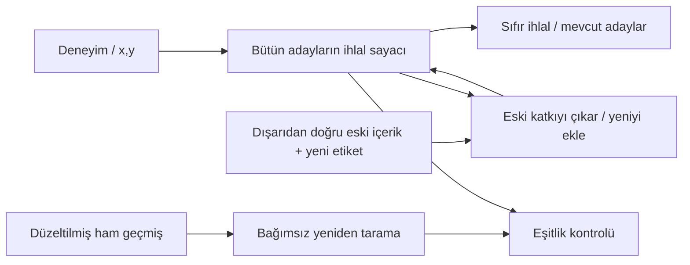

# 12. Bilmediklerimiz ve araştırmanın devamı

[İçindekiler](../README.md) · [Önceki: Araştırma laboratuvarı](11-arastirma-laboratuvari.md) · [Katkı ve bakım](../BAKIM.md)

Bu kitabın sonunda “Cevahir yaşarken öğrenmenin genel ilkesini buldu” sonucuna varamayız. Çalışan dil modeli motoru, deneyimle seçimi değişen opsiyonel politika ve bağımsız küçük öğrenme düzenekleri vardır. **Genel living-learning problemi çözülmedi.** Araştırmanın değeri, olumlu bulgular kadar nelerin birbirine eşit olmadığını somutlaştırmasındadır.

## Önceki sonuçlardan hangileri taşınabilir?

Parametre, sembolik kural, bellek, geçiş grafiği veya güncelleme matrisi farklı mekanizmalardır. Ortak bir işlevsel çerçeve yazabiliriz:

$$
a_t=C(s_t,o_t,b_t),\qquad e_t=(o_t,a_t,\text{erişilen sonuç}),\qquad
s_{t+1}=U(s_t,e_t).
$$

`o_t` gözlem, `a_t` cevap/eylem, `b_t` hesap bütçesi, `s_t` geleceğe taşınan durumdur. Bu denklem bir mimari icat etmez: herhangi bir durumlu sistemi bu biçimde yazmak mümkündür. Öğrenme iddiası için deneyimin oluşturduğu durum farkının **yeni koşullardaki yeteneği nasıl değiştirdiğini** ölçmeliyiz. Değişim tek başına yarar değildir; iyi görünen bugünkü cevap da gelecekte öğrenmenin korunmasını göstermez.

| Sonuç | Genel araştırmada rolü | Aşılmaması gereken sınır |
|---|---|---|
| Durumu silme/taşıma davranışı değiştiriyor | Deneyimin kalıcı nedensel etkisini sınama yolu | Aktarılan davranışın yararlı veya genellenebilir olduğu ayrıca ölçülür. |
| Aynı bilgi farklı bütçede farklı erişilebilirlik veriyor | Öğrenme ile derleme/konsolidasyon maliyetlerini ayırma | Affine bileştirme bütün hesap ailelerinin derleyicisi değildir. |
| Bugünkü yeterli durum yarınki güncellemeye yetmeyebilir | Öğrenme durumunu yalnız tahminle değerlendirmeme | Her görevde ham arşivin zorunlu olduğu sonucu çıkmaz. |
| Eski geçerli bilgi ile eskimiş bilgi ayrılmalı | Koruma ve düzeltmenin birlikte değerlendirilmesi | Replay veya unutma her dünyada iyi değildir. |
| Gözlemler bazı dünyaları ayıramaz | İddiaların bilgi erişimi sınırını belirtme | İmkânsız evrensel garanti göstermek gerçek araştırma görevini bitirmez. |
| İç değişken aynı dış girdide davranışı değiştirebilir | Yeni deneyim üreten hesabı ölçmeye alan açma | Rastgelelik, sapma veya biyolojik benzetme tek başına öğrenme ilkesi değildir. |

## Yeni tur: doğru bugünkü cevap, düzeltilebilir bilgi mi?

Önceki otomata deneyinde çalışma grafiği küçük kaldı; yeniden öğrenmek için arşiv korundu. Yeni [düzeltme durumu deneyi](../../research/living_learning_correction_2026_09_20/REPORT_TR.md), bu farkı bütün durumları sayılabilen küçük bir dünyada açtı.

Üç girdi üzerindeki üç hipotezin cevapları `000`, `110`, `101` olsun. `[(0,0),(1,0)]` ve `[(0,0),(2,0)]` geçmişlerinin her ikisinde yalnız `000` tutarlıdır. Aynı ilk olayın etiketi `0→1` düzeltilince birinde `101`, diğerinde `110` kalır. Bugünkü bütün tahminler ve bütün tutarlı adaylar aynı olmasına rağmen, aynı düzeltmenin doğru sonucu farklıdır. Kaybolan ayrım geçmişin başka hangi hipotezi neden dışladığıdır.

Sabit sonlu aday sınıfında her adayın ihlal sayısını tutmak yapıcı bir çözüm verir:

$$
c_h=\sum_i\mathbf1[h(x_i)\ne y_i],\quad
c'_h=c_h-\mathbf1[h(x_j)\ne y_j]+\mathbf1[h(x_j)\ne y'_j].
$$

[`CorrectionSummary.append`](../../../research/living_learning_correction_2026_09_20/correction_state.py#L46) deneyimi sayaca katar; [`replace_label`](../../../research/living_learning_correction_2026_09_20/correction_state.py#L51) gerçek eski içerik ve yeni etiketle düzeltir. Çıktıyı kullanan `survivors_mask`, sıfır ihlalli adayları çıkarır. [`replay_counts`](../../../research/living_learning_correction_2026_09_20/correction_state.py#L29) bağımsız tam geçmiş taramasıdır. Öğreniciye doğru eski içeriği sağlayan dış kayıt, çözümün açık varsayımıdır.

Üç girdideki sekiz Boolean fonksiyonun bütün 255 boş olmayan altkümesi, 1–4 olaylık bütün geçmişler ve her tek etiket çevirme için **1.507.050 sınıf–düzeltme durumu** tarandı. Sayaçlar tam taramayı her durumda eşitledi. Fakat altı `(x,y)` kutusunun sayısını tutan [`ObservationHistogram`](../../../research/living_learning_correction_2026_09_20/correction_state.py#L72) da aynı sonucu, tam sekiz aday için daha az sayaçla verdi. **Yeni veya üstün bir öğrenme algoritması bulunmadı.**

Yalnız daha önce hayatta kalan adayları tutmak, yeni doğru kümenin boş olmadığı 360.000 durumun hepsinde başarısız oldu. Etiket gerçekten ters çevrildiğinde eski adayların tümü eleneceği için bu beklenen sonuçtur; oran gerçek yaşam performansı diye yorumlanmaz. İhlal çokluğunu bir “var/yok” bitine indirip naif geri alma uygulamak ise 1.338.336 durumda yanlış aday diriltti. 18.378 ardışık ara durum ve ayrı süreçte 50 düzeltme de gerçek sayaç yönteminin tam taramayla eşitliğini doğruladı. [Sonuç dosyası](../../../research/living_learning_correction_2026_09_20/results/correction_state.json), kapsam ve paydaları birlikte saklar.

Bu tur iki yeni sınırı açık tuttu. Sadece “olay 7 düzeltildi” denirse, sayaçlar olayın eski içeriğini bulamaz; kimlik ile kanıt arasında bağ gerekir. Sonradan yeni bir hipotez eklenirse de eski adaylar için yeterli sayaçlar onun geçmiş hatalarını hesaplamaya yetmeyebilir. Üç-girdi histogramı bu özel alanda yeterlidir, bilinmeyen bir algı/temsil genişlemesi için garanti değildir. Sayaç adedi sabit olsa bile sayılar büyüdükçe gereken bit belleği büyür.

Bu sonuç, [truth maintenance](https://www.sciencedirect.com/science/article/pii/0004370279900080) ve [artan veri değişiklikleri altında türetilmiş bilgiyi koruma](https://doi.org/10.1145/170036.170066) çalışmalarına yakın bilinen bir yapıdır. Deneyin katkısı yeni bir temel yasa ilan etmek değil, Cevahir araştırmasındaki çalışma durumu–öğrenme durumu farkını düzeltme açısından kesinleştirmektir.

## Henüz araştırılmamış veya birleşmemiş yönler

**Deneyimin temsilini edinmek.** Çoğu deney `x`, doğru etiket, bölüm sınırı veya hazır özellik dilini verdi. Oysa sistem hangi olayları aynı tür sayacağını, hangi ayrımın önemli olduğunu, yeni algısal özellikleri nasıl kuracağını da öğrenmek zorunda kalabilir. Hazır çarpma özelliklerini açmak veya üç sembolde histogram tutmak bu işi genel olarak çözmez.

**Sonuç ile sorumluluğu ayırmak.** Gecikmiş etiketin doğru olay kimliğiyle eşlenmesi, yeni zamansal ilişkinin öğrenilmesi ve eylemin çevredeki sonuca nedensel katkısının çıkarılması farklı basamaklardır. Geri bildirim bozuksa daha güçlü güncelleme yanlış ilişkiyi daha hızlı kalıcılaştırabilir. Önceki [tanımlanabilirlik analizi](../../research/living_learning_state_2026_09_20/FAILURE_IDENTIFIABILITY.md) bu yüzden korunur.

**Amaç ve değer ölçütü.** Deneylerin çoğu başarı tanımını dışarıdan verdi. Yeni becerinin hangi durumda korunmaya değer olduğu, amaçlar çatıştığında nasıl değerlendirileceği ve amaç değişiminin eski bilgiyi nasıl etkileyeceği araştırılmadı. Her küçük ortam için seçilmiş loss'u genel yaşam ölçütü sayamayız.

**Sınırlı bellekte gelecek öğrenebilirliği.** Bir özet bugünkü görev için yeterli olabilir; yarınki düzeltme veya temsil genişlemesi için olmayabilir. Yeni soru “her şeyi sakla mı?” ikiliğine indirgenmemeli: hangi olası gelecek işlemler için, hangi yaklaşık doğruluk ve bellek maliyetiyle ayrımlar korunabilir? Ham replay, yeterli istatistik, kaynak bağı ve yeniden çevresel erişim aynı bilgi haklarıyla karşılaştırılmalı.

**İç durum ve deneyim üretimi.** Kullanıcının başlangıçtaki biyolojik gözlemi açık kalıyor: zamanla değişen iç durum, aynı dış koşulda farklı eylem ve dolayısıyla önceki bilginin yanlışlanabileceği yeni deneyim üretebilir. Bu farklılığın hangi kalıcı güncellemeye bağlandığı gösterilmedikçe yalnız davranış çeşitliliği ölçmüş oluruz. Deterministik yeniden sınama deneyi bir örnektir; iç durumun genel ilkesini keşfetmiş değildir.

**Değişen hesabın aynı yaşamda denetlenmesi.** Bir parametre, bellek seçimi ve güncelleme kuralı ayrı ayrı yararlı olabilir; birlikte zararlı etkileşebilir. Yeni bir birleşik deneyde tek başlangıç, ortak bilgi erişimi, ortak zaman çizgisi, eski geçerli yetenek, yeni edinim, yanlış geri bildirim, kaynak maliyeti ve yeni süreçte devam birlikte izlenmeli. Bu bir araştırma ölçütüdür; ana sisteme hazır mimari planı değildir.

## Bir sonraki iddiayı nasıl sınayacağız?

Yeni bir mekanizma için önce hangi davranışı değiştireceğini ve onu yenilik olmadan açıklayabilecek en güçlü alternatifi yazarız. Aynı deneyimi, aynı hazır dili ve aynı toplam maliyeti vermek gerekir. Sadece zayıf bir pencereyi yenmek yeterli değildir; önceki deneylerde sabit geniş model, aday eleme veya basit histogram daha iddialı yöntemi eşitledi ya da geçti.

Sonra yalnız son başarı değil öğrenme boyunca hizmet hatası, eski beceri, kalıcılık, transfer, düzeltme ve bellek/hesap maliyeti ölçülür. Test etiketleri güncelleyiciye verilmez; sonradan tasarlanan kontroller ayrı işaretlenir. Negatif sonucu eski dosyadan çıkarmak yerine yeni yorumu yeni raporla bağlarız. Bir mekanizma literatürde zaten varsa bunu adıyla söyleriz.

Araştırma bu ölçütlerden herhangi birini ele alabilir; belirli bir mimariye mecbur değildir. Ana sorunun tümü görünür kalır: **Deneyim, gelecekte yapılabilen hesabı ve davranışı nasıl kalıcı, kontrollü ve genellenebilir biçimde değiştirir?** Kitabın bakım düzeni bu soruyu çözdüğünü varsaymaz; cevapların kod, kanıt ve anlatımda aynı sınırlar içinde kalmasını sağlar.

[İçindekilere dön](../README.md) · [Kaynak haritası](../KAYNAK_HARITASI.md) · [Kitabı güncel tutmak](../BAKIM.md)
