# Cognitive Management V2 - Architecture Documentation

**Versiyon:** 2.0  
**Son Güncelleme:** 2025-01-27

---

## 📋 İÇİNDEKİLER

1. [System Overview](#system-overview)
2. [Architecture Diagrams](#architecture-diagrams)
3. [Component Diagrams](#component-diagrams)
4. [Flow Diagrams](#flow-diagrams)
5. [Sequence Diagrams](#sequence-diagrams)

---

## 🎯 System Overview

V2 Cognitive Management, büyük dil modelleri (LLM) için **endüstri standartlarında, akademik doğrulukta** bir bilişsel yönetim katmanıdır.

### Mimari Katmanlar

```
┌─────────────────────────────────────────────────┐
│         CognitiveManager (Public API)            │
│  - handle() / handle_async()                    │
│  - Enterprise Features API                      │
└─────────────────────────────────────────────────┘
                      ↓
┌─────────────────────────────────────────────────┐
│         CognitiveOrchestrator (Core)            │
│  - Request orchestration                        │
│  - Middleware chain execution                   │
│  - Pipeline processing                          │
│  - Performance monitoring                      │
└─────────────────────────────────────────────────┘
         ↓                    ↓
┌─────────────────┐  ┌──────────────────────────┐
│  Middleware     │  │   Processing Pipeline     │
│  Chain          │  │   (Chain of Responsibility)│
│  - Validation   │  │   - Feature Extraction    │
│  - Tracing      │  │   - Policy Routing        │
│  - Cache        │  │   - Deliberation          │
│  - Error        │  │   - Context Building      │
│  - Metrics      │  │   - Generation            │
└─────────────────┘  │   - Critic                │
                     │   - Memory Update         │
                     └──────────────────────────┘
```

---

## 🏗️ Architecture Diagrams

### High-Level Architecture

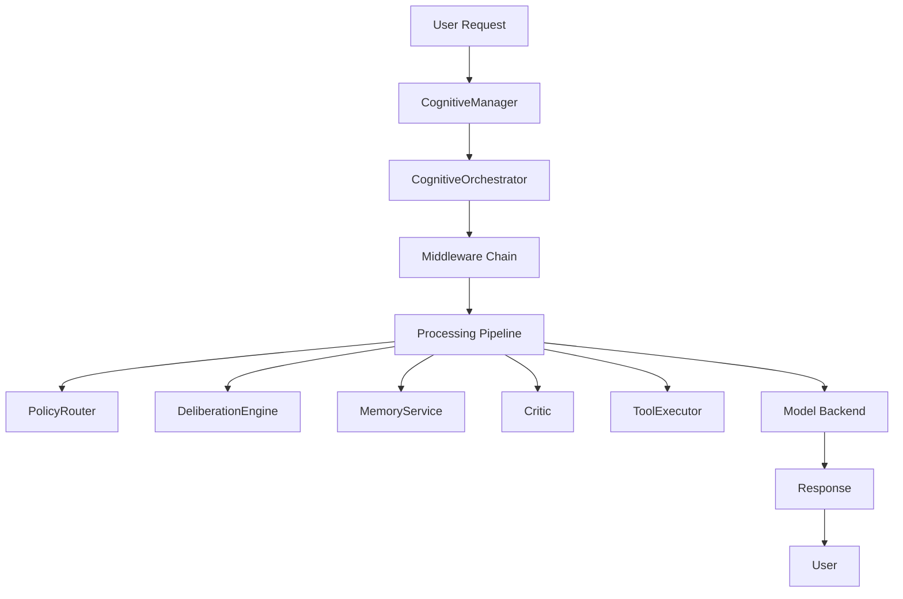

### Component Architecture

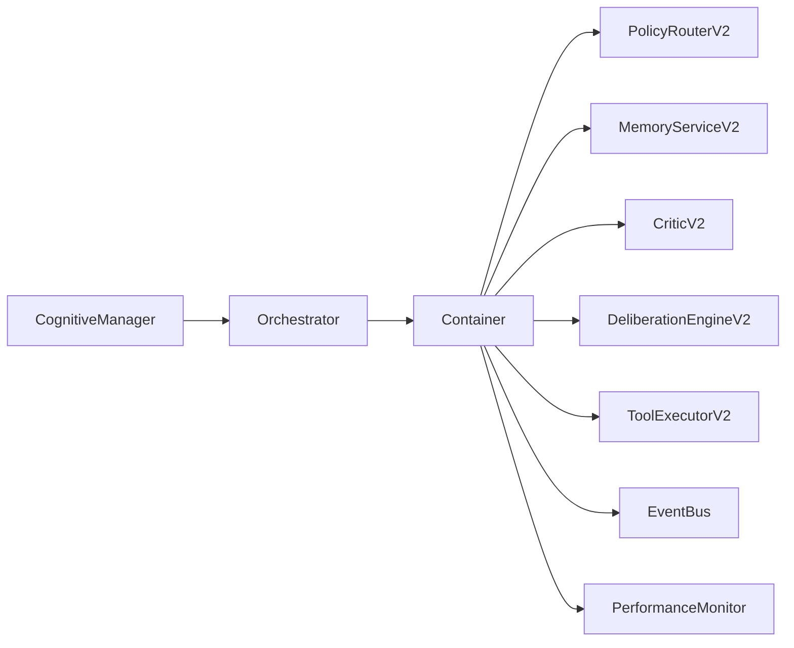

### Middleware Chain

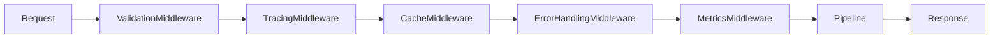

### Processing Pipeline

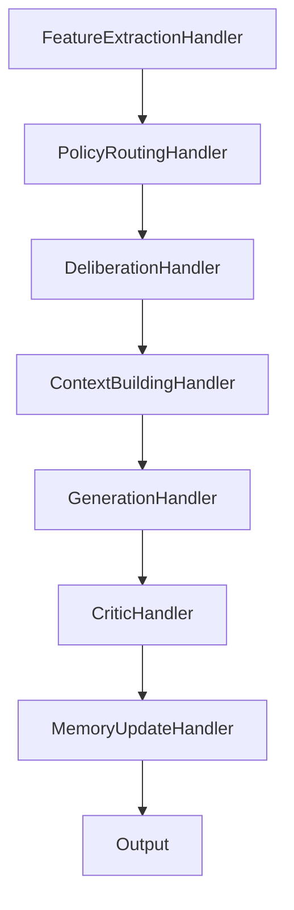

---

## 🔧 Component Diagrams

### PolicyRouterV2

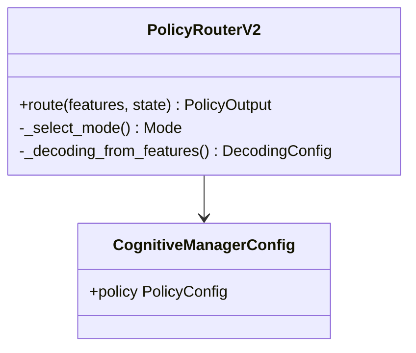

### MemoryServiceV2

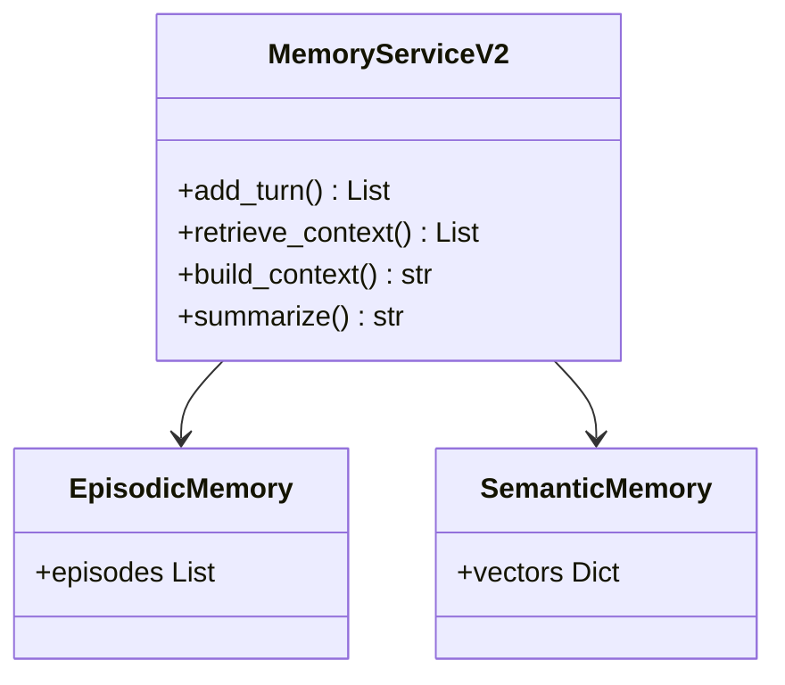

### CriticV2

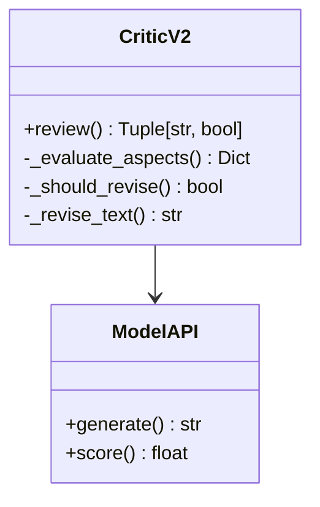

### DeliberationEngineV2

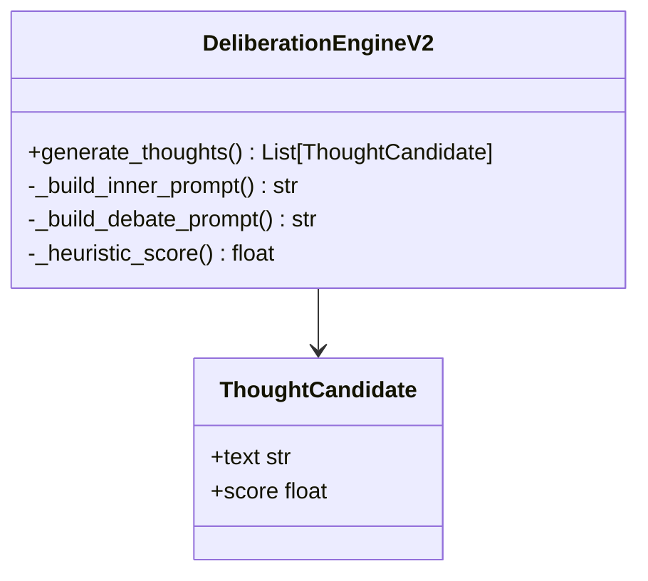

---

## 🔄 Flow Diagrams

### Request Processing Flow

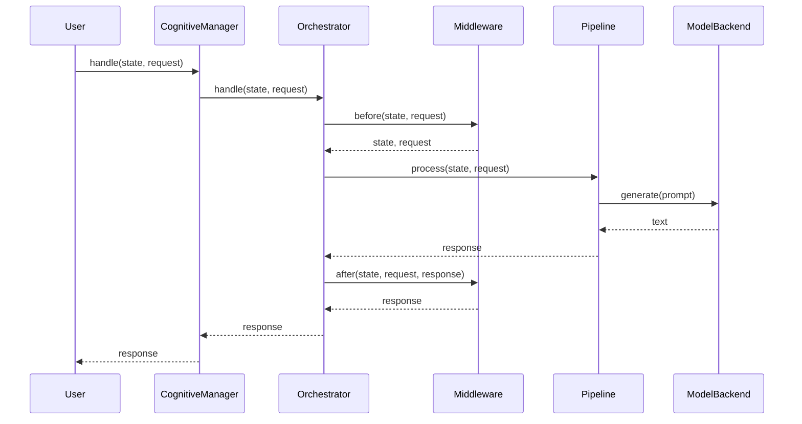

### Tool Execution Flow

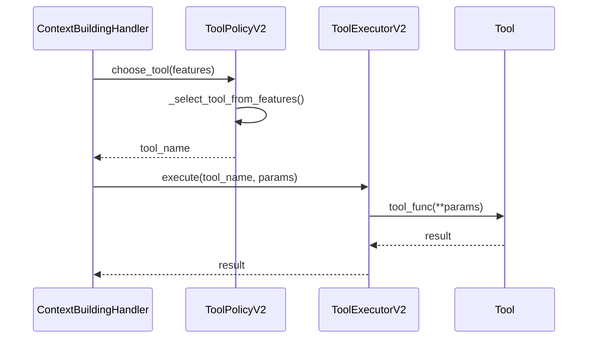

### Config Hot Reload Flow

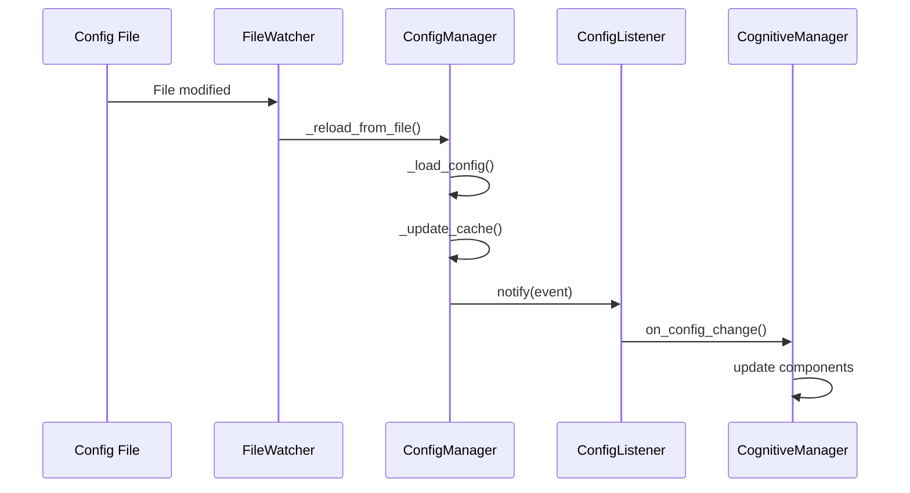

---

## 📊 Sequence Diagrams

### Think Mode (CoT) Flow

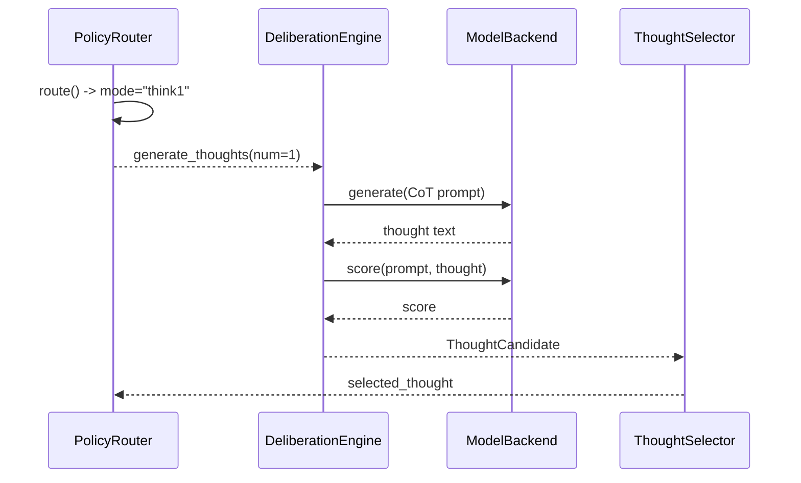

### Debate Mode (Self-Consistency) Flow

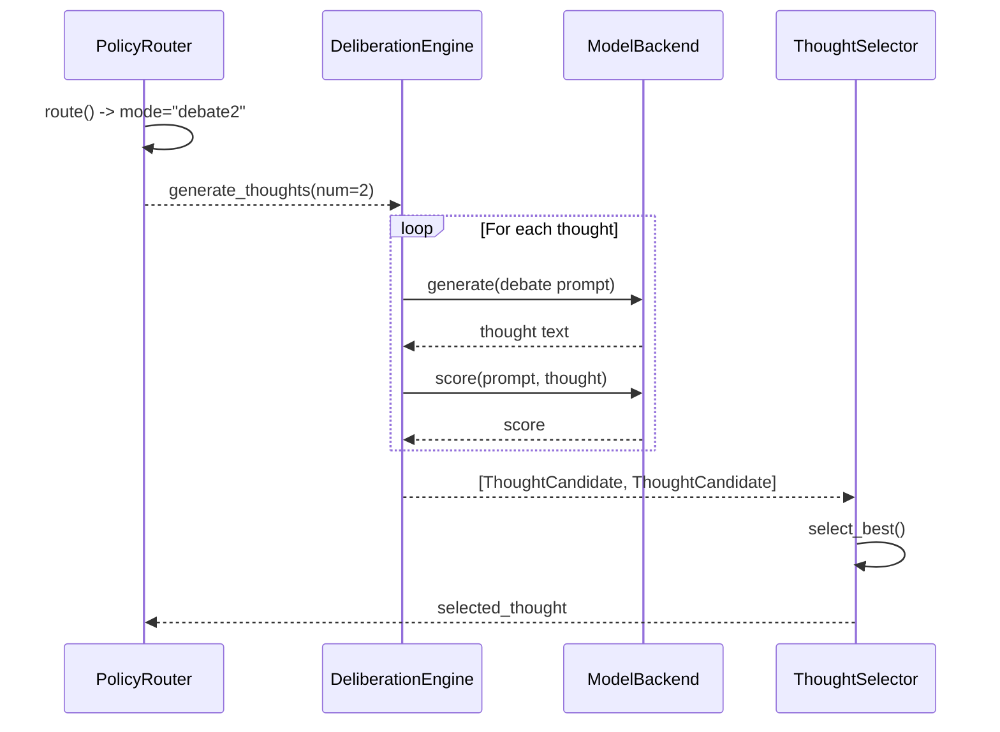

### Critic Review Flow

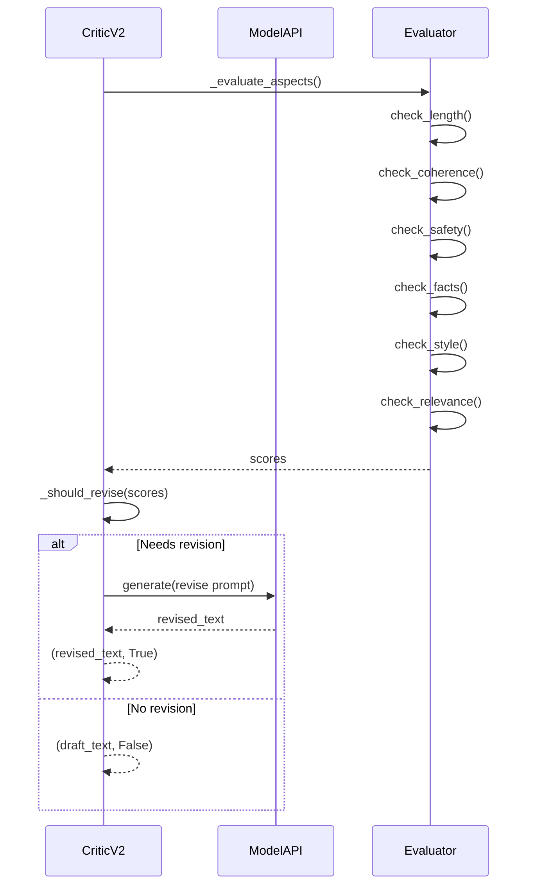

---

## 🔗 İlgili Dokümantasyon

- [API Reference](../api/README.md)
- [Usage Guides](../guides/README.md)
- [Development Guide](../development/README.md)
- [Main Documentation](../README.md)

---

**Hazırlayan:** AI Assistant (Auto)  
**Versiyon:** 2.0

