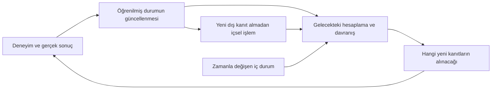

# Kalıcı yordam, aktarım ve yeniden sınama: yaşarken öğrenmenin ilk ayrıştırmaları

**Muhammed Yasin Yılmaz**

CEV-2026-03 · Sürüm 2026.09.21.3 · Yayın tarihi 2026-09-21

Araştırma raporu / ön baskı. Dış hakem değerlendirmesinden geçmemiştir.

## Özet

Sonlu affine dünyalarda deneyimden edinilen yordamın kalıcılığı, yeni girdilere aktarımı ve hesap bütçesi altında kullanımı araştırılır. Aynı çıkarım yeteneğine sahip güçlü ham-kayıt rakibi temel doğrulukta eşleşir. Önceki yaşamlardan taşınan güncelleme bilgisi aynı ailede yarar, değişen ailede zarar verebilir. Kapalı döngü deneyleri kalıcı ve geçici çevre değişimini ayırır; yeniden sınama genel yaşarken öğrenme probleminin yalnız bir alt alanıdır.

## Abstract

Finite affine worlds separate persistence, transfer and budgeted execution of experience-derived procedures. A strong raw-history baseline with the same inference capability matches accuracy. Transferred adaptation knowledge helps within a family and can hurt under shift. Closed-loop retesting is examined as one subproblem rather than a general solution to lifelong learning.

## Bulguların yorumu

Kalıcı doğru cevap, çıkarım maliyeti, güncelleme aktarımı ve değişim altında fayda aynı ölçü değildir; güçlü rakipler birçok ilk üstünlük yorumunu sınırlar.

Fonksiyon dili ve ortam aileleri verilmiştir. Beklenen faydalı yeniden sınama, yeni hesaplama dilini edinmeyi veya genel kontrollü öğrenmeyi çözmez.

## Yayın ve kanıt bilgisi

Bu makale düzenindeki edisyon, aşağıda özgün araştırma raporunun tam metnini yöntem,
sonuç, negatif kontrol ve kaynak bağlantılarıyla birlikte içerir. Orijinal dosya
[docs/research/living_learning_2026_09_20/REPORT_TR.md](../../research/living_learning_2026_09_20/REPORT_TR.md) olarak korunur. Bağlantı yolları bu
edisyonun konumuna uyarlanmıştır. Rapordaki çalışma tarihi ve geçmiş yayın durumu
ifadeleri tarihsel kayda aittir; bu edisyonun tarihi yukarıdadır.

Bu çalışma [yayın dizisi](../README.md) içindeki ayrı bir metindir. DOI, bütün
metinleri, teknik kitabı ve kodu içeren sürüm arşivini tanımlar; her makaleye ayrı
DOI verildiği anlamına gelmez. Atıfta çalışma kimliği ve sürüm DOI'si birlikte
kullanılmalıdır. Hesaplamalı denetimlerin kapsamı [doğrulama kaydında](../evidence/validation.json)
ve [yayın ilkelerinde](../PUBLISHING.md) açıklanır.

Proje ve araştırma yönü Muhammed Yasin Yılmaz'a aittir. Kod, hesaplamalı deney,
literatür incelemesi ve metin hazırlığında yapay zekâ desteği kullanılmıştır.
Bu katkı açıklaması, DOI kaydı veya otomatik testler dış bilimsel hakemlik sayılmaz.

---

## Araştırma kaydı: Cevahir — Yaşarken öğrenmenin koşulları ve sınırları

20 Eylül 2026 · Temel araştırma kaydı · Dört küçük deney ailesi çalıştırıldı · Ana sisteme entegrasyon yapılmadı

**En güçlü savunulabilir sonuç:** Bir yapay sistemin çalışırken deneyimleri nedeniyle kalıcı ve genellenebilir davranış edinmesi mümkündür. Bunun için sinir ağı ağırlıklarını ayrı bir eğitim işinde optimize etmek mantıksal zorunluluk değildir. Öğrenmenin gerekli fiziksel karşılığı, gelecekteki hesaplamayı etkileyen durumun değişmesidir; başarılı öğrenme ise bu değişimin belirlenmiş yeni görevlerde, belirlenmiş kaynak ve hata koşullarında fayda sağlamasıdır. Dosya, ağırlık veya yapı değişimi tek başına bu başarıyı kanıtlamaz.

Kullanıcının son gözlemleri soruyu genişletti: **Öğrenilmiş davranış, gelecekte hangi kanıtların alınabileceğini de değiştirir.** Bu nedenle yaşayan öğrenici yalnız eski deneyimden doğru cevap üretmeyi değil, eski öğrenmesini çürütebilecek yeni deneyimlere erişimi nasıl sürdüreceğini de hesaba katmalıdır. Bazı durumlarda içsel durum değişimi bu erişimi yeniden açabilir. Rastgelelik gerekmeyebilir; sırf farklı davranmak da yetmez.

Bu sonuçlar yeni bir evrensel öğrenme yasası değildir. Bilinen çevrimiçi çıkarım, program/işlem öğrenme, Bayes güncellemesi, derleme ve bilgi durumunu hesaba katan kontrol mekanizmaları somut varlık örnekleri verir. Bilinmeyen ve sürekli değişen bir dünyada bütün bu özellikleri sınırlı kaynaklarla birleştiren genel Cevahir mekanizması **henüz gösterilmiş değildir**.

## 1. “Yaşarken öğrenme” için önerilen bilimsel tanım

Bu araştırmada başarılı yaşarken öğrenme; **yaşanmış deneyimin, sistemin gelecekteki hesaplamasına nedensel olarak katılan, geçici bağlamın temizlenmesine dayanabilen ve görülmemiş görevlerde ölçülebilir yarar sağlayan bir değişim oluşturmasıdır.** Kalıcılık, bilginin sonsuza kadar donması değil, geçerlilik koşulları sürerken korunması ve çürütüldüğünde değiştirilebilmesidir.

İki özdeş başlangıçtan biri ilgili deneyimi yaşar, diğeri yaşamaz. Sonra aynı etiketsiz görevler, aynı cevaplama bütçesi ve aynı temiz bağlam altında değerlendirilir. Öğrenilmiş durumun silinmesi kazanımı kaldırmalı; başka örneğe aktarılması ilgili davranışı taşımalıdır. Bu nedensel kontrol, yalnız gözlemsel korelasyonla yetinmez.

\[
G_{Q,B}(E)=R_{Q,B}(s_0)-R_{Q,B}(s_E).
\]

`Q` görülmemiş değerlendirme görevleri, `B` kaynak sınırı, `R` ise `J` müdahalesiyle geçici bağlam ve ham geçmiş erişimi temizlendikten sonraki beklenen kayıptır. `G>0` bu ölçütte öğrenme kazanımıdır. Çekimserlik, başarı gerektiren küçük deneylerde doğru cevap sayılmaz. Başka ölçütlerde güvenli çekimserliğin değeri farklı tanımlanabilir.

Tekrarlanan olguyu hatırlama, yeni girişe genelleme, yeni görev ailesine aktarım, yeni işlem birleşimi ve aynı işlemi daha az hesapla yapma ayrı sonuçlardır. “Yetenek” sözcüğü bunları birbirine karıştırmak için kullanılmamalıdır. Tam formalizasyon ve koşullu ispatlar: [FOUNDATIONS.md](../../research/living_learning_2026_09_20/FOUNDATIONS.md).

## 2. Araştırmanın çıkardığı yaşam döngüsü



Bu şekil modül sayısı veya mimari reçetesi değildir. Açıklanması ve ölçülmesi gereken nedensel ilişkileri gösterir. En genel `s_{t+1}=U(s_t,deneyim)` ifadesi bu döngüyü kodlayabilir ama `U`nun ne yapacağını söylemediği için tek başına çözüm değildir. Bu çalışmada üç farklı somut güncelleme ailesi uygulandı: örneklerden fonksiyon belirleme, tutarlı hipotezler ve görevler arası önsel güncellemesi, eylemin gelecekteki bilgi durumunu değiştirmesini hesaba katan planlama.

Özellikle içsel değişim ile öğrenme güncellemesi aynı olay değildir. İç durum yeni bir denemeye yol açabilir; **öğrenilmiş iddianın düzeltilebilmesi gerçek deneme sonucunun alınmasına ve kullanılmasına bağlıdır**. Dış veri olmadan derleme ise mevcut bilgiyi daha az hesapla kullanılabilir hale getirir. Bu iki farklı içsel etkiyi tek “uyku/merak” mekanizması saymadık.

## 3. Çalıştırılmış deneyler ne gösterdi?

| Araştırma sorusu | Sonuç | Sınırı |
|---|---|---|
| Deneyim, ham kayıt olmadan yeni işlem davranışı yaratabilir mi? | 25 farklı başlangıç rastgeleliğinde, iki dünya için sistem başına 1.960 yeni girdi/işlem sorgusu tamamen doğru; her dünya için toplam 49.000 cevap. Öğrenilmiş durum sıfırlanınca hepsi çekimser. | Dört araç ve bilinen affine fonksiyon ailesi. Açık dünyada keşfedilmiş yeni temsil dili değil. |
| Kalıcı fark dosyadan öte davranışta mı? | Aynı sorgularda iki yaşam toplam 48.523/49.000 farklı cevap veriyor; kendi dünyalarında doğrular. Durum aktarımı davranışı aktarıyor. Ayrı işlemde yeniden başlatılan bir örnekte 1.960 tahmin korunuyor. | Restart yalnız bir seed'de; uzun yaşam, disk arızası veya bütün eski görevleri koruma kanıtı yok. |
| Güçlü bellek+çıkarım alternatifi elendi mi? | Hayır. Aynı ham örneklerden aynı çıkarımı yapan rakip aynı doğru cevapları buluyor. | Katsayıya dönüştürme yeni dış bilgi değildir. Yalnız zayıf exact-retrieval'ı geçmekle yeni yöntem ilan edilemez. |
| Dış veri olmadan gelecekteki kapasite değişebilir mi? | 84 iç birleştirme işlemi sonrası, bir çağrılık bütçede 1.176 sorgu çözülebiliyor; önce çekimserdi. | Güçlü, ilk istekte derleyen rakiple toplam iş eşit: 1.260. Bilgi avantajı veya uykuya özgü etki yok. |
| Yeni öğrenme eskisini bozmayabilir mi? | Bir araç düzeltilirken diğer üç kural aynı kalıyor; bağımlı birleşimler iptal edilip yeniden kuruluyor. | Doğru araç kimliği, doğru geri bildirim ve eksiksiz bağımlılık varsayımı. |
| Öğrenmeyi öğrenme mümkün mü? | 40 eşleştirilmiş seed'de, geçmişten öğrenilen önsel aynı aileden yeni görevlerde 16 sorgu başına hatayı 3,5750'ten 2,3406'ya indiriyor. | Aile değişince 3,6688'den 4,0875'e yükseltiyor. Kesin hipotez belirleme için gereken kanıt sayısı değişmiyor. |
| Öğrenilmiş kaçınma öğrenmeyi durdurabilir mi? | Evet. 181 değişen yaşamın hiçbirini yeniden denemeyen sistem fark etmiyor; ilgili olmayan yeni hareketler de fark ettirmiyor. | Beklerken çevre hakkında başka işaret yok. Pasif bilgi kaynağı varsa sonuç değişebilir. |
| Rastgelelik olmadan bu kilit açılabilir mi? | 20 adımlık deterministik iç sayaç 240 olası kalıcı değişim tarihinin tamamını en fazla 19 adım sonra saptıyor. | Kalıcı fırsat ve ilgili eyleme erişim gerekiyor. Hiç değişmeyen dünyada denemeler maliyet yaratıyor. |
| Her keşif faydalı mı? | Hayır. Sekiz adımlık geçici fırsatta bir planlayıcı daha çok değişim fark etmesine rağmen negatif toplam fayda üretiyor. | Bilgiye erişim, eylem maliyeti ve dünya modelinin doğruluğu birlikte değerlendirilmelidir. |
| Yeniden sınama beklentisi de kendi deneyimiyle değişebilir mi? | Gerçek değişim hızı bilinmeyen üç-model karışımında, kendi başarısız denemeleriyle model ağırlıkları değişiyor. Yüksek bedelde önsel-ortalama fayda 26,62145'ten 37,32359'a çıkıyor. | Aday hızlar verilmiş. Hızlı alt dünyada güncelleyen politika daha kötü; gerçek hız tek yaşamda kesin belirlenmiyor. |

Yöntemler, ham kayıtlar, bütün negatif kontroller ve tekrar üretim komutları: [affine yaşam döngüsü](../../research/living_learning_2026_09_20/AFFINE_EXPERIMENT.md), [meta-öğrenme ve olumsuz aktarım](../../research/living_learning_2026_09_20/ADAPTATION_EXPERIMENT.md), [kapalı döngü ve iç durum](../../research/living_learning_2026_09_20/CLOSED_LOOP.md), [bilinmeyen değişim beklentisini öğrenme](../../research/living_learning_2026_09_20/UNKNOWN_CHANGE.md). Bunlar **ayrı küçük düzeneklerdir**; tek bir genel sistemin bütün özellikleri aynı yaşamda sağladığını kanıtlamazlar.

## 4. Son ek sorunun doğrudan cevabı

**Öğrenilmiş davranıştan sapma, mevcut bilgiyi yanlışlayabilecek deneyim üretmenin bir parçası olabilir.** Bunun hesaplama açısından belirleyici özelliği biyolojik kimya veya rastgelelik değil, geçmiş politika altında alınamayacak ayırt edici bir sonucun erişilebilir hale gelmesidir.

Örneğin ilk başarısızlık “deneme” eylemini tamamen kapatıyorsa, engelin sonradan kalktığı ve hiç kalkmadığı dünyalar sistem için aynı gözlem geçmişini üretir. Salt iç hesap bu iki gerçek dünyayı ayıramaz. Bir iç sayaç, kaynak durumu, değişim modeli veya başka bir karar yordamı tekrar denemeyi seçebilir. Gerçek sonuç başarılı çıktığında eski öğrenme düzeltilir. **Burada öğrenmeyi mümkün kılan şey, eylem değişimiyle gerçek kanıta ulaşılmasıdır.** Aynı sıklıkta ilgisiz hareket üretmek deneyimizde hiçbir düzeltme sağlamadı.

Yeniden denemek her zaman doğru karar değildir. Denemeler pahalıysa veya fırsat çok kısaysa, bilgi edinmenin bedeli faydasını aşabilir. Model içinde gelecekteki kararları hesaba katan politika bu dengeyi kurabildi; yanlış değişim varsayımında başarısız oldu. Bu, dual control/Bayes karar süreçleriyle doğrudan ilişkili bir sonuçtur; yeni bir adla sunulmuyor. [Klenske ve Hennig, 2016](https://www.jmlr.org/papers/volume17/15-162/15-162.pdf).

Devam deneyinde yeniden sınama isteği de geçmiş sonuçlarla değişti. İlk kapalı-döngü deneyindeki tek verilmiş değişim oranı yerine, hiç değişmeme dahil üç olası model kullanıldı. Sistem kendi başarısızlıklarından hızlı değişim modellerini zayıflatıp denemeleri seyreltti. Ancak eldeki tek açılma yaşamı gerçek değişim hızını kesin belirlemez. “Öğrenmeyi yeniden sorgulayabilme”yi “her zaman daha çok deneme”yle eşitlememek gerekir. [Ayrıntı ve negatif sonuçlar](../../research/living_learning_2026_09_20/UNKNOWN_CHANGE.md).

## 5. Hangi başlangıç varsayımları düzeltildi?

**Tek olaydan büyük değişim, yeni bir fiziksel öğrenme yasası gerektirmiyor.** Olay iki açıklamayı güçlü ayırıyor ve kararın kayıp eşiğini geçiriyorsa tek gözlem gelecekteki davranışı değiştirebilir. Küçük hesapta zarar tahmini `.0545`ten `.744862`ye yükseldi ve eylem eşiğini geçti. Bu, sınıf benzerliği ve olasılıkları verilmiş bir modeldir; soba örneğinin biyolojik açıklamasını kanıtlamaz. Çok düşük olasılıklı gürültünün de sürpriz olabileceği nedeniyle yalnız “önem/sürpriz puanı” yeterli değildir.

**Öğrenme ile bellek için mutlak bir madde ayrımı kurulamaz.** Kalıcı öğrenmenin bir yerde fiziksel iz taşıması gerekir. Aynı davranış katsayı, program, graf veya bir yorumlayıcının okuduğu veriyle kodlanabilir. Bu yüzden talep “bellek kullanmasın” olarak değil, “ham olayın tekrar getirilmesine ihtiyaç duymadan, edinilmiş yapıyı yeni durumlarda kullansın” olarak sınandı.

**Eski faydalı becerileri her koşulda aynen koruma talebi fazla güçlüdür.** Aynı görünür giriş için çelişen eski/yeni doğru cevaplar varsa ayırt edici bağlam gerekir. Sonlu durumla sınırsız bağımsız bilgiyi kayıpsız korumak da mümkün değildir. Seçici koruma, geçerli bağlam ve kaynak ölçütleri belirtilmelidir.

**Sonlu toplam yanlış-deneme bedeliyle keyfi geç her değişimi keşfetme garantisi de fazla güçlüdür.** Yalnız maliyetli denemenin bilgi verdiği bir dünyada, hiç değişmeyen koşulda toplam beklenen deneme bedeli sonluysa, keyfi geç bir değişimi fark etme olasılığı sıfıra yaklaşır. Aynı rastgelelik altında iki dünya geçmişini eşleyerek bu sonuç türetildi. Bu yüzden “geçmişime mahkûm olmayayım” koşulu kaynak, zaman ve bilgi kanallarıyla birlikte belirtilmelidir. [İspat ve kapsam](../../research/living_learning_2026_09_20/UNKNOWN_CHANGE_AUDIT.md).

**Bir iç değişim, eski başarısızlığın dünya mı yoksa kendi kapasitesi yüzünden mi olduğunu kendiliğinden açıklamaz.** İki farklı kapasite/zorluk çifti aynı başarısızlık geçmişini verebilir. Kalibrasyon veya başka ayırt edici müdahale gerekir. Bu ayrımı öğrenen genel gelişimsel sistem henüz kurulmadı.

**Mevcut embedding'in dışına çıkmak otomatik hedef değildir.** Sabit temsil gerekli iki durumu ayırt edemiyorsa yetersizliği kanıtlanabilir. Ama yeni yetenek için mutlaka daha büyük embedding, Transformer'ın terk edilmesi veya hesaplanabilirliğin değişmesi gerekmez. Bu deneylerin hiçbiri mevcut Cevahir ağının matematiksel ifade sınırını ölçmedi.

## 6. Temel cevap hangi düzeyde bulundu?

**Mantıksal ve yapıcı olarak yanıtlanan bölüm:** Çalışma ve öğrenme tek yaşam sürecinde yer alabilir. Doğru aile ve geri bildirim altında örneklerden edinilen yürütülebilir kurallar yeni girişlere genellenebilir, birleştirilebilir, saklanabilir ve seçici düzeltilebilir. Bütçeye bağlı kapasite dış kanıt almadan düzenlenebilir. Eylem seçimi öğrenme verisini kısıtlayabilir; ilgili yeniden sınama bu kısıtı açabilir. Bunların hiçbirinin genel gerçekleşmesi için biyolojik kimya veya belirli bir neural architecture zorunlu değildir.

**İmkânsız veya eksik tanımlı bölüm:** Bütün olası dünyalarda her deneyimden fayda, sıfır yanlış öğrenme, sıfır unutma, sıfır risk ve sınırlı kaynakla sınırsız yeni kapasite birlikte garanti edilemez. Hedef dünya sınıfı, kanıt erişimi, değişim rejimi, kayıp ve kaynaklar belirtilmeden tek “doğru formül” seçilemez. Küçük karşı örnekler bunu somutlaştırır; yalnız literatürde benzerinin bulunamaması özgünlük kanıtı değildir.

**Açık kalan gerçek araştırma:** Başlangıçta bilinmeyen yararlı ayrımları ve davranış dillerini öğrenmek; öğrenilmiş dünya/değişim modellerini yanlışlanabilir tutmak; hatalı geri bildirimi gerçek değişimden ayırmak; eylemleri seçerken geri dönüşsüz sonuçları ve gelecekteki kanıt erişimini birlikte değerlendirmek; öğrenme yordamının kendisini güvenilir biçimde geliştirmek; bütün bunları sınırlı hesap/bellek ile geniş görevlerde birlikte sürdürmek. Bu sorunların çözüldüğü iddia edilmiyor.

## 7. Cevahir açısından çıkarım ve bir sonraki ayırt edici araştırma

Mevcut repository belgeleri, deneyimle yönlendirme ve işlem bütçesi gibi mühendislik mekanizmaları bildiriyor; gerçek görevlerde kalıcı yeni yetenek/aktarımı henüz doğrulamıyor. Önceki temsil filtresinin negatif sonucu da geçerli: aynı adaylar ve tam tutarlılık sınamasında filtre yeni tanımlayıcı bilgi sağlamaz. Bu çalışma o iddiayı yeniden adlandırarak canlandırmadı. [Önceki denetim](../../research/REPRESENTATION_WITNESS_AUDIT.md).

Şimdiki sonuç yeni bir modülü ana sisteme eklemeyi haklı çıkaran üstünlük kanıtı değildir. Sonraki ayırt edici çalışma; **görev kimliğinin, doğru kural ailesinin ve değişim zamanının verilmediği** küçük etkileşimli bir ortamda yapılmalıdır. Araç yürütücüsünün kapasitesi ile çevre koşulu ayrı değişmeli; gürültü oranı ve kaynak sınırları açık olmalı; öğrenicinin soruları/eylemleri kendi politikasından çıkmalıdır. Doğru-bağlam oracle'ı yalnız üst referans olmalı, öğreniciye sızmamalıdır.

Karşılaştırmalar hazır bir mimariyi doğrulamak için seçilmemelidir: sabit güçlü model+ham kayıt+çıkarım, çevrimiçi Bayes/değişim noktası modeli, sabit bellekli parametrik öğrenici ve program/temsil güncelleyen aday aynı erişim ve toplam maliyetle ölçülmelidir. Önce yalnız yeniden sınama, sonra yalnız temsil değişimi, sonra ikisi birlikte kapatılarak hangi mekanizmanın hangi kazanımı ürettiği ayrılmalıdır. Yeni bir adayın seçimi bu turda yapılmadı; bilinen mekanizmaların birleştirilmesine özgünlük atfedilmedi.

Bir sonraki deneyin başarısı yalnız yüksek doğruluk olmayacaktır: yeni görev riski, korunan geçerli görev riski, gerçek değişimi fark etme gecikmesi, yanlış yeniden sınama bedeli, kaynak tüketimi ve alınamayan kanıt yüzünden oluşan hatalar birlikte raporlanmalıdır. Bu daha büyük çalışma **tasarımdır, çalıştırılmış sonuç değildir**. Doğal dil ve gelecekteki görsel/ses/eylem alanları bu sözleşmeye bağlanabilir; mevcut deneyler arası duyu aktarımını göstermemiştir.

## Okuma ve yeniden üretim

- [Matematiksel temeller ve koşullu kanıtlar](../../research/living_learning_2026_09_20/FOUNDATIONS.md)
- [1–22 gözlem ve iç durum ekinin literatürle karşılaştırılması](../../research/living_learning_2026_09_20/PHENOMENA_AND_LITERATURE.md)
- [Kaynaklar ve bilinen yöntemlerden ayrım](../../research/living_learning_2026_09_20/SOURCES.md)
- [Denenen ve elenen hipotezlerin kaydı](../../research/living_learning_2026_09_20/RESEARCH_LOG.md)
- [Makineyle doğrulanan tekrar üretim kaydı](../../../research/living_learning/results/verification.json)

Repository kökünde dört küçük deney:

```text
python -m research.living_learning.affine_lifecycle
python -m research.living_learning.adaptation_experiment
python -m research.living_learning.closed_loop_experiment
python -m research.living_learning.unknown_change_experiment
python -m research.living_learning.verify_experiments
```

Hepsi standart Python kullanır. Cevahir modeli yüklenmedi, büyük eğitim yapılmadı, ana sistem değiştirilmedi, GitHub'a push yapılmadı. Bilimsel sonuçlar ile henüz sınanmamış açıklamalar araştırma kaydında ayrı tutulur.
